# Debian 7 安装 LXDE + VNC + Firefox


需要搞点挂机的东西，只需要安装firefox + flash支持 + 自动刷新扩展，本来想买个windows挂机宝之类的，后来想想现在用的vps挫是挫了一点，装个桌面环境挂挂机应该还行。

前几天找了个Gnone一键包，用着还凑合，就是现在用的VPS是在是太挫了，硬盘小，安装完硬盘快爆了，想想还是装点轻量级的。

说说我的VPS机器配置：

搬瓦工（bandwagonhost）5G PROMO V2 这款，单核OpenVZ，内存512MB，硬盘5G SSD，系统Debian 7.0 x86 。

本来已经安装lnmp环境，硬盘还剩差不多3个G，勉强还能试试。

## 安装LXDE桌面

root登陆，先更新下：

```bash
apt-get update
```
安装lxde ，当然在，这里肯定是最小化安装，多安装个nano主要是等下要编辑文件，不会vi。。。

```bash
apt-get install nano xorg lxde-core
```

安装过程中会弹出一个键盘布局选择，这里直接选默认的就行:

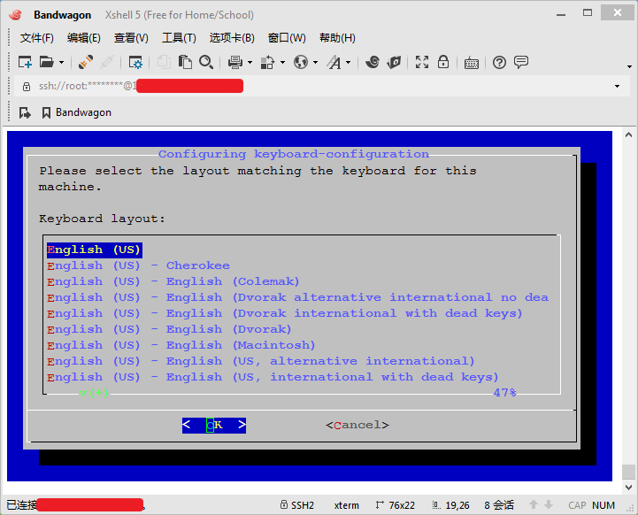

安装VNC，这里用的是tightvncserver：

```bash
apt-get install tightvncserver
```

安装完成后启动VNC:

tightvncserver :1

运行后会弹出设置密码，输入`两次`以便确认，还会提示是否设置一个仅供查看的密码，这里就不需要了，直接输入`n`，如图：

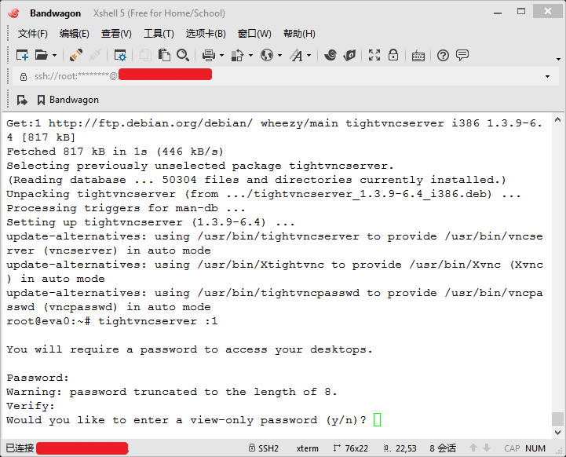

接着先暂停VNC：

```bash
tightvncserver -kill :1
```

然后编辑xstartup文件，如上所说，不会vi，还是用nano。

```bash
nano ~/.vnc/xstartup
```

在最后加上两行：

```bash
lxterminal &
/usr/bin/lxsession -s LXDE &
```

'Ctrl + X'输入`y`回车，保存退出。

完成后如图：

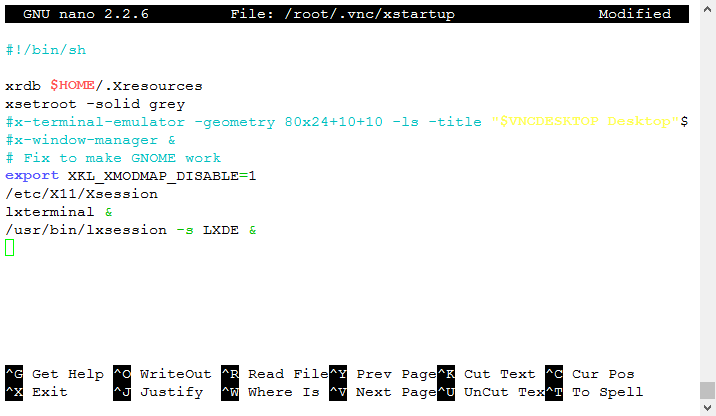

## 设置开机启动

新建一个文件`tightvncserver`：

```bash
nano /etc/init.d/tightvncserver
```

里面内容为下面，其中`800x600`为分辨率，自行修改。

```bash
#!/bin/sh
### BEGIN INIT INFO
# Provides: tightvncserver
# Required-Start: $syslog $remote_fs $network
# Required-Stop: $syslog $remote_fs $network
# Default-Start: 2 3 4 5
# Default-Stop: 0 1 6
# Short-Description: Starts VNC Server on system start.
# Description: Starts tight VNC Server. Script written by James Swineson.
### END INIT INFO
# /etc/init.d/tightvncserver
VNCUSER='root'
case "$1" in
start)
su $VNCUSER -c '/usr/bin/tightvncserver -geometry 800x600 -depth 24 :1'
echo "Starting TightVNC Server for $VNCUSER"
;;
stop)
pkill Xtightvnc
echo "TightVNC Server stopped"
;;
*)
echo "Usage: /etc/init.d/tightvncserver {start|stop}"
exit 1
;;
esac
exit 0`</pre>
```

保存后，加权限：


```bash
chmod 755 /etc/init.d/tightvncserver
```

然后：

```bash
update-rc.d tightvncserver defaults
```

再次重启VNC：

```bash
tightvncserver :1
```

到这里可以用TightVNC Viewer或者VNC-Viewer等VNC软件连接了。

我这里用的是VNC-Viewer, 可以点[这里](http://www.realvnc.com/download/viewer/ "Download VNC® Viewer")下载:

地址填上你的`ip:1`，如图：

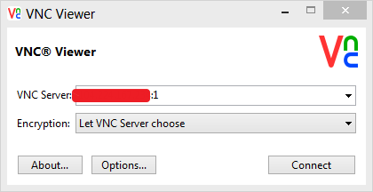

接着输入上面设置的密码后进入桌面，试着打开浏览器看看，一堆“麻将字”，很显然还需要设置中文环境。

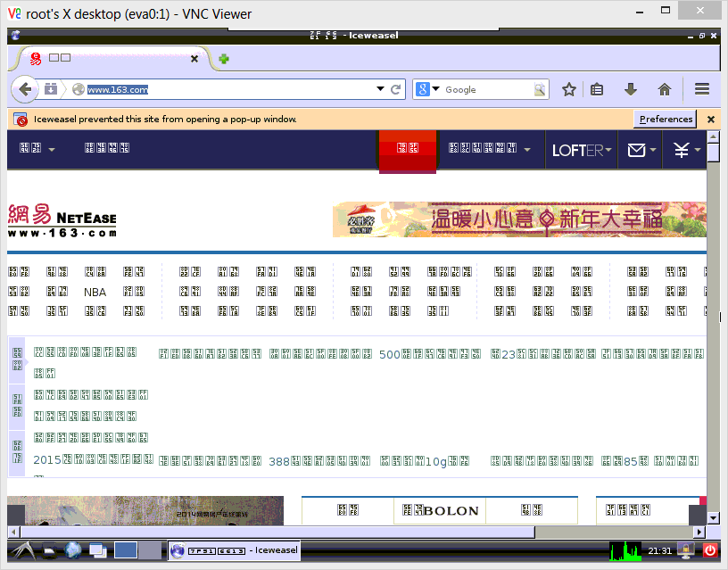

## 配置中文环境

```bash
dpkg-reconfigure locales
```

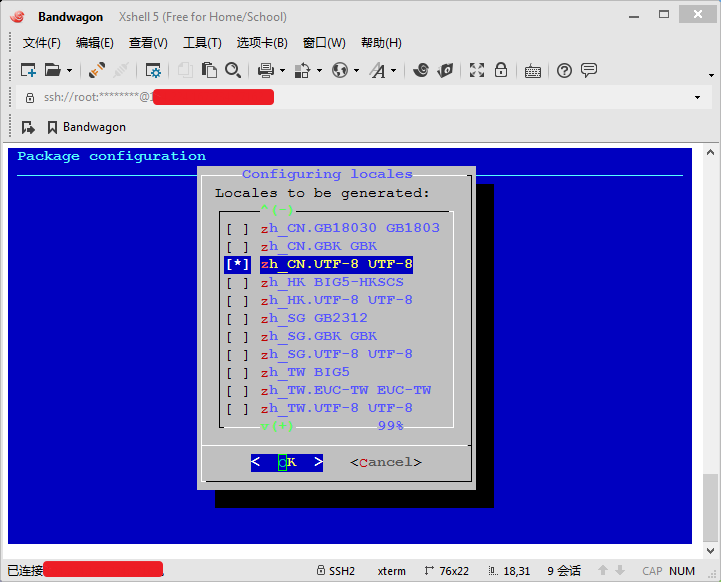

拖到下面，`空格`选中`zh_CN.UTF-8`，回车。

安装中文字体:

```bash
apt-get install ttf-arphic-ukai ttf-arphic-uming ttf-arphic-gbsn00lp ttf-arphic-bkai00mp ttf-arphic-bsmi00lp
```

重启系统一次，再次连接看看，已经是中文了：

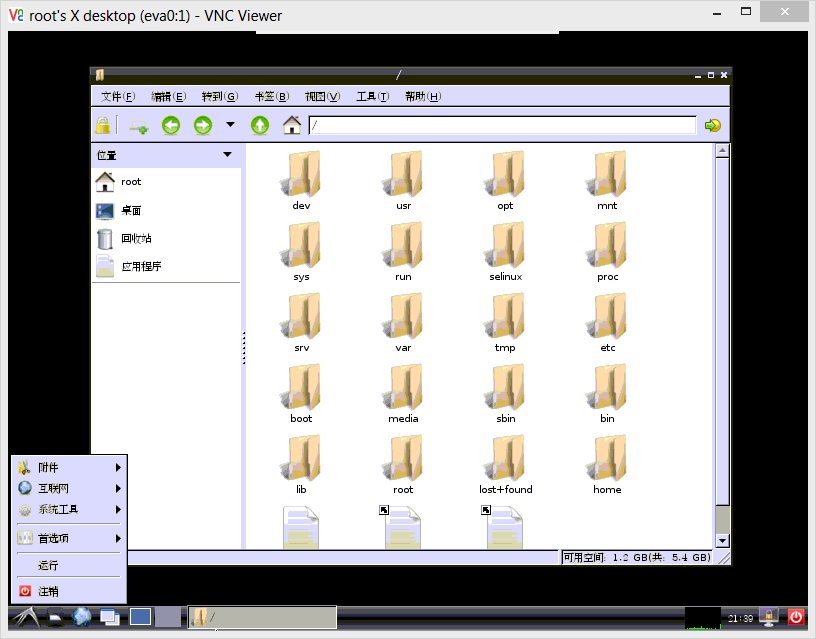


## 安裝Firefox中文版

安装桌面环境后自带iceweasel浏览器，这是重新编译后的firefox，也兼容大部分firefox插件，但是还是喜欢看着熟悉的firefox。但是默认系统源里面没有没有firefox，于是，源列表中增加Linuxmint的Debian源。

```bash
nano /etc/apt/sources.list
```

最后面增加一行：

```bash
deb http://mirrors.ustc.edu.cn/linuxmint/ debian import
```

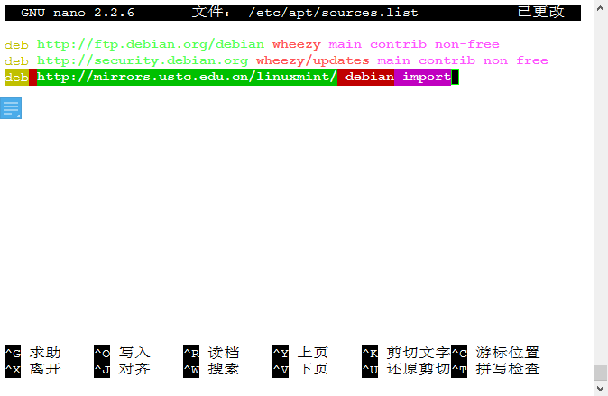

保存后安装linuxmint的公钥：

```bash
wget http://mirrors.ustc.edu.cn/linuxmint/pool/main/l/
linuxmint-keyring/linuxmint-keyring_2009.04.29_all.deb
dpkg -i linuxmint-keyring_2009.04.29_all.deb
```

更新源：

```bash
apt-get update
```

也可以移除iceweasel：

```bash
apt-get remove iceweasel
```

安装firefox中文版：

```bash
apt-get install firefox firefox-l10n-zh
```

安裝Flash支持：

```bash
apt-get install flashplugin-nonfree
```

大功告成，试试，如图：

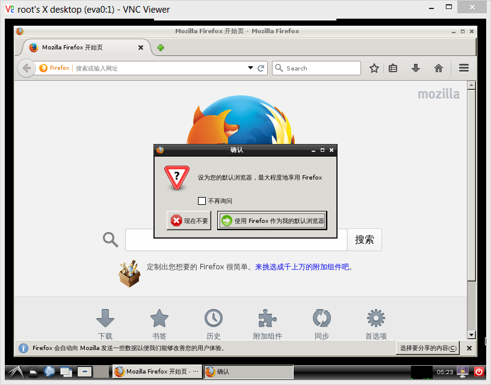

挂机需要个自动刷新插件，个人喜好是reloadevery扩展：

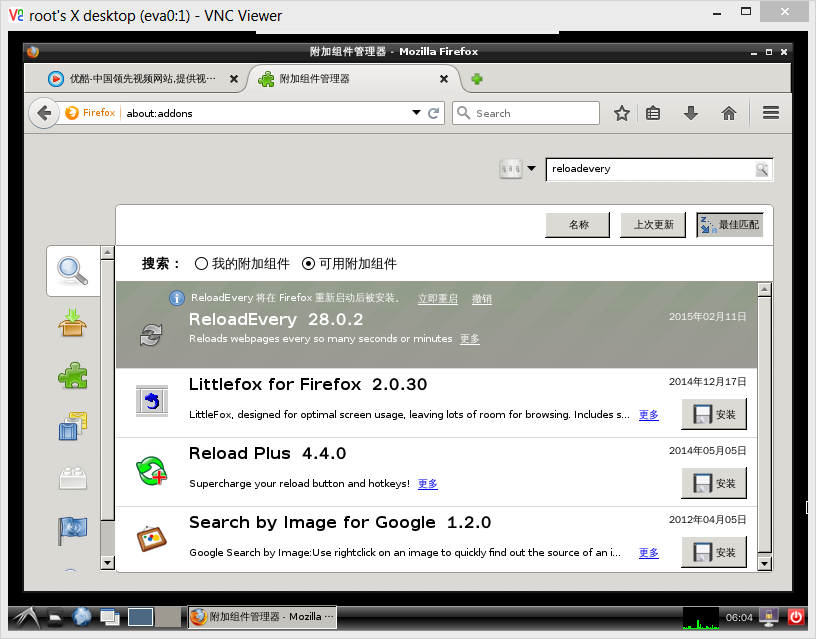

最后清理缓存：

```bash
apt-get autoremove && apt-get clean
```

最好`reboot`一次，重启之后看看搬瓦工的后台，还行，够用：

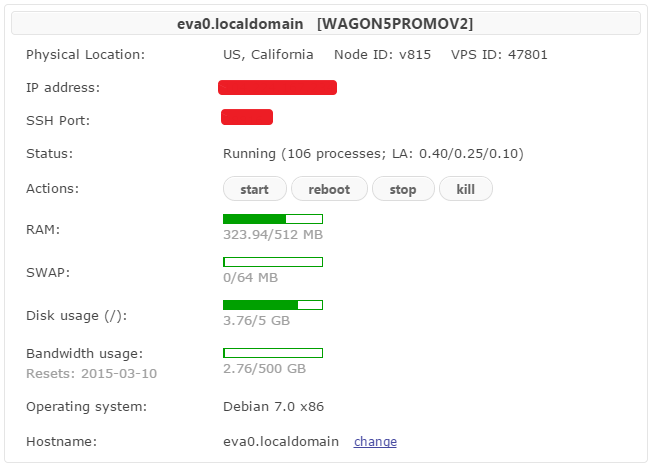

完，睡觉！


---

> 作者: [u0defined](http://clearsky.me/)  
> URL: https://clearsky.me/20150211-debian7%E5%AE%89%E8%A3%85lxde-vnc-firefox/  

