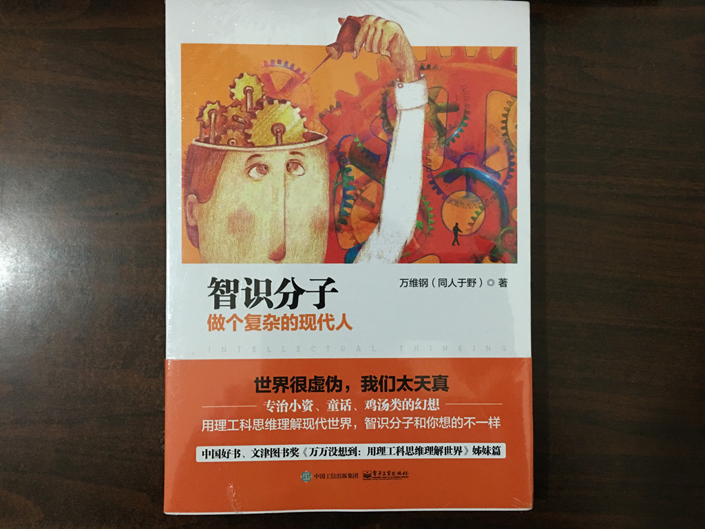
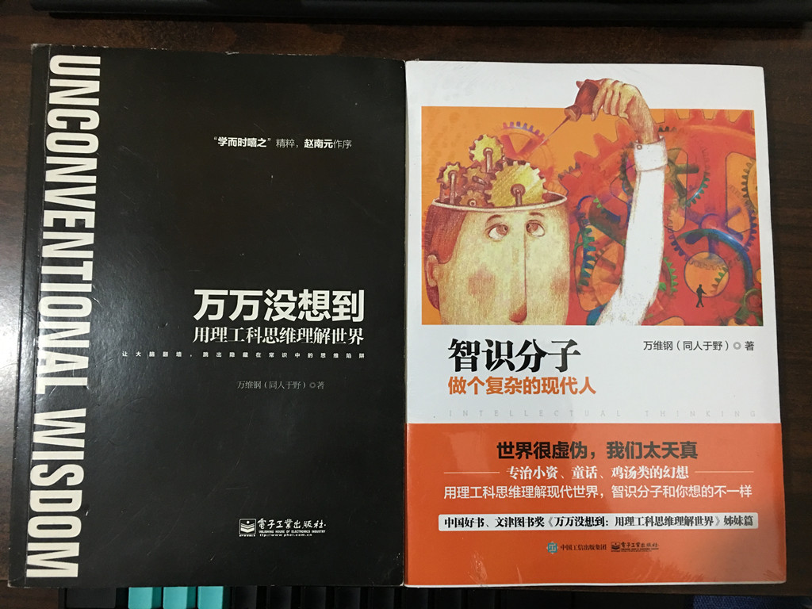

# 买了本书 - 《智识分子：做个复杂的现代人》

我的博客有个链接[学而时嘻之](http://www.geekonomics10000.com)，这是以前别人推荐的博客，第一次进去看就感觉文章挺有意思，于是一直把它放在我的链接表里面，有空就去看看，2014 年的时候作者出了一本书《万万没想到：用理工科思维理解世界》，当时就买了一本支持了一下，前天晚上上网没事做，想进去看看作者有博文更新没有，一进去就发现作者又出书了，马上狗东买了一本继续支持，狗东物流还算挺快，今晚下班回家，这本《智识分子：做个复杂的现代人》到了。

看封面包装这段**专治小资、童话、鸡汤类的幻想**就让人忍不住想看了。（笑）

两本书合照：

放在床头，每晚睡前花点时间来阅读，2015 年还信誓旦旦的要说要多读书，回头想想那惨淡的阅读量，唉，看来只能在 2016 年补了。

愿我懒惰远离我！

---

> 作者: [u0defined](http://clearsky.me/)  
> URL: https://clearsky.me/20160128-%E4%B9%B0%E4%BA%86%E6%9C%AC%E4%B9%A6-%E6%99%BA%E8%AF%86%E5%88%86%E5%AD%90%E5%81%9A%E4%B8%AA%E5%A4%8D%E6%9D%82%E7%9A%84%E7%8E%B0%E4%BB%A3%E4%BA%BA/  

