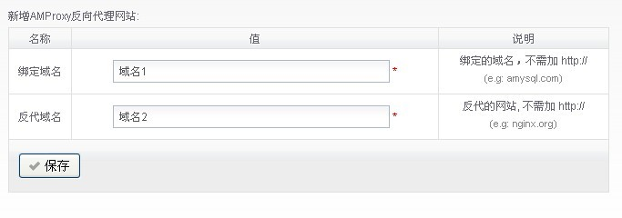

# AMH面板安装反向代理模块


过年的时候在vps上安装了amh面板，之后只是简单绑定了一个域名，和用它的备份功能做了下备份，之后的这段时间沉迷于《死亡空间3》和《杀手5》。没怎么折腾了。今天晚上值班，没事到这个面板论坛看看，发现作者发了个反向代理模块。官网地址：[[扩展 & 程序] AMh4.0 安装反代模块 AMProxy-1.0](http://amysql.com/bbs/post-192-1-1.htm "[扩展 & 程序] AMh4.0 安装反代模块 AMProxy-1.0")

## 什么是反向代理?

> 在计算机网络中，反向代理是代理服务器的一种，它从一个或多个服务器上获取资源，然后再将这些资源返回给真正的客户端，而服务端也可以通过此获取客户端的信息。与前向代理不同，前向代理作为一个媒介将互联网上获取的资源返回给相关联的客户端，而反向代理是在服务器端作为代理使用，而不是客户端。

## LNMP一键包nginx简单反向代理规则

以前用军哥LNMP一键包，网上搜的nginx反向代理最简单的一般都是下面这个：
```bash
server
    {
    listen          80;
    server_name     域名1;
    location / {
    proxy_pass          域名2;
    proxy_redirect      off;
    proxy_set_header    X-Real-IP       $remote_addr;
    proxy_set_header    X-Forwarded-For $proxy_add_x_forwarded_for;
        }
    }
```

配置完成然后刷新nginx配置就可以，表示“域名1”反向代理“域名2”。

还有个带缓存的：来自[VPSMM](http://www.vpsmm.com/blog/nginx-proxy-and-all-cache-config "Nginx反向代理&前端全缓存相关配置教程_LNMP适用")

新建两个目录：

```bash
mkdir /home/cache/path -p
mkdir /home/cache/temp -p
```

修改 `/usr/local/nginx/conf/nginx.conf `，新增以下代码：

```bash
#主要是缓存相关设置，请放置于 http{ ##这里 }中，一般加在 log_format 上面或下面均可：
client_body_buffer_size  512k;
proxy_connect_timeout    5;
proxy_read_timeout       60;
proxy_send_timeout       5;
proxy_buffer_size        16k;
proxy_buffers            4 64k;
proxy_busy_buffers_size 128k;
proxy_temp_file_write_size 128k;
proxy_temp_path   /home/cache/temp;
proxy_cache_path  /home/cache/path levels=1:2 keys_zone=cache_one:500m inactive=7d max_size=30g;
#500m是内存占用，7d是7天无访问删除，30g是缓存占具硬盘空间
```

以下为虚拟主机配置文件，可另存成 .conf 放置于 vhost 下面:

```bash
server
    {
    listen          80;
    server_name     域名1;
    location / {
    proxy_cache cache_one;
    proxy_cache_valid  200 304 3d; #正常状态缓存时间3天
    proxy_cache_key $host$uri$is_args$args;
    proxy_pass          域名2;
    proxy_redirect      off;
    proxy_set_header    X-Real-IP       $remote_addr;
    proxy_set_header    X-Forwarded-For $proxy_add_x_forwarded_for;
    expires 10d; #默认10天缓存
    access_log  /home/wwwlogs/vpsmm.log  access; #日志文件
        }
    }
```

点击几下网站，df -sh 命令，查看` /home/cache `目录大小，即可测试是否缓存成功。

现在既然装了面板，又有模块功能，那么就更简单了，按照发布地址的说明：

## 先下载AMProxy模块脚本

```bash
cd /root/amh/modules && wget http://amysql-amh.googlecode.com/files/AMProxy-1.0.zip && unzip AMProxy-1.0.zip && rm -f AMProxy-1.0.zip;
```

虽然是菜鸟新手，上面这一堆也是能理解的，其实是4条命令：

1. 进入`/root/amh/modules`目录。
2. 再下载安装包。
3. 解压
4. 删除安装包。

4条命令用 `&&` 连接起来。`&&`为逻辑“与”，老感觉理解为“与”有点拗，习惯搜索一下，这里应该是另一种含义：**如果前面的命令正确执行，那么后面的命令也将执行。否则后面的命令不执行。**

想起以前编译安装常见的：

```bash
make  && make install
```

有时看到一些文章写作：

```bash
make ; make install
```

又搜索了一下：两者区别是 `&&` 只有前面无问题才执行后面，而` ; `是无论前面结果如何都继续执行,呵呵，小记录一下~

## 下载后安装

```bash
amh module AMProxy-1.0 install;
```

或者直接后台面板模块界面直接安装。

安装完成，填写两个域名就行了。



但是这个没有缓存功能，不过论坛上作者已表示下一版本会增加。

觉得这个面板不错，还有更多模块，人懒就喜欢傻瓜化的东西。适用就行。


---

> 作者: Anonymous  
> URL: https://clearsky.me/amh-amproxy/  

