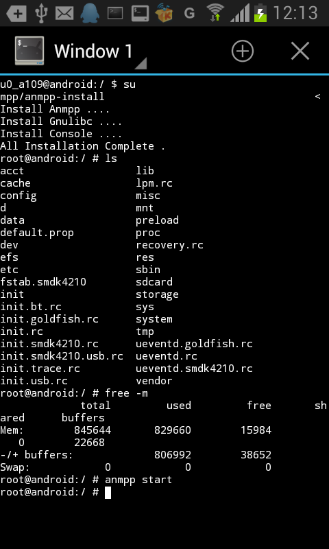

# 安装anmpp


某件事泡汤了，还是上上网好了，闲来无事忍不住找东西折腾了。

## 什么是ANMPP?

> ANMPP是`android``nginx``mysql``php-fpm``postgresql`的简写，安卓本地ANMPP集成环境，手机PHP环境系统.

直观点就是一个集成的php本地环境，只不过不是运行在pc上的，而是在安卓手机上的。

官方地址：[ANMPP.NET](http://anmpp.net/ "ANMPP官网")

大致看了下安装文档，

## 官方环境要求

1. 保证你的设备剩余磁盘120MB以上（安卓设备的/data分区)
2. 保证你的设备系统空闲5MB以上（安卓设备的/system分区）
3. 保证你的设备的内核是LINUX，并且内核版本在2.6以上（还需要一些内核模块支持）

我的是两年前买的i9100，拿来折腾了。

## 安装

先下载，[点这里](http://anmpp.net/down.php "下载ANMPP")

30多MB，下载解压,把整个`anmpp目录`复制到到手机`sdcard目录`，

安装压缩包里面`busybox.apk`和`terminal.apk（终端模拟器）`。

安装完成打开终端模拟器，先`su`回车获取root权限，然后

输入命令:

```bash
sh /mnt/sdcard/anmpp/anmpp-install
```

等待完成即可。

最好后面来个

```bash
anmpp start
```

截个图：



## 测试

完成后当然看有效果没，呵呵，最土的测试吧，默认的网页路径是`/mnt/sdcard/wwwroot`，那么随便扔个test进去，然后手机浏览器输入地址：`127.0.0.1`，看看有没有，如图：


至于其它，比如mysql之类还没仔细试试，先这样吧。


---

> 作者: [pagezen](http://clearsky.me/)  
> URL: https://clearsky.me/anmpp/  

