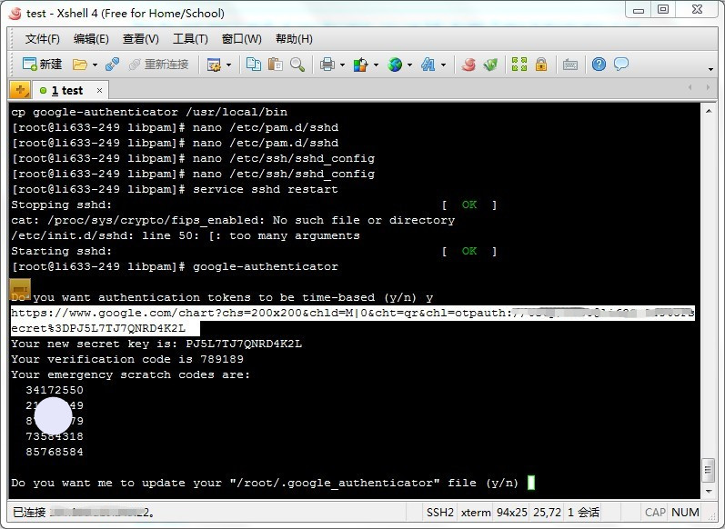
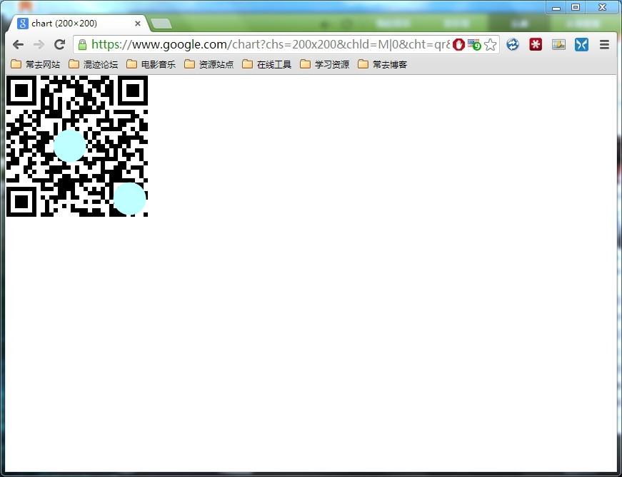
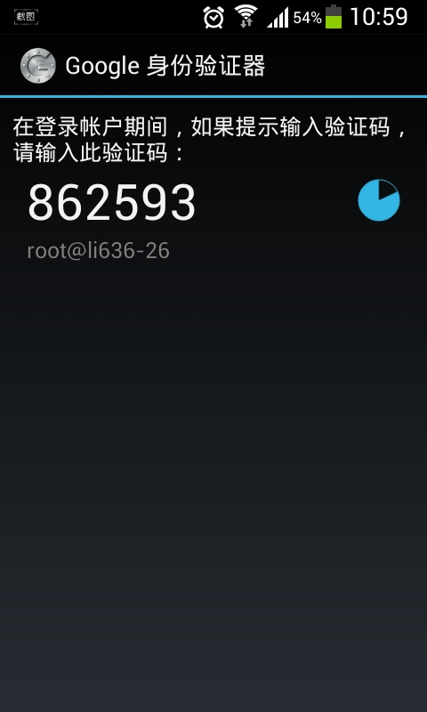
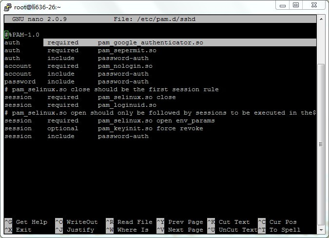
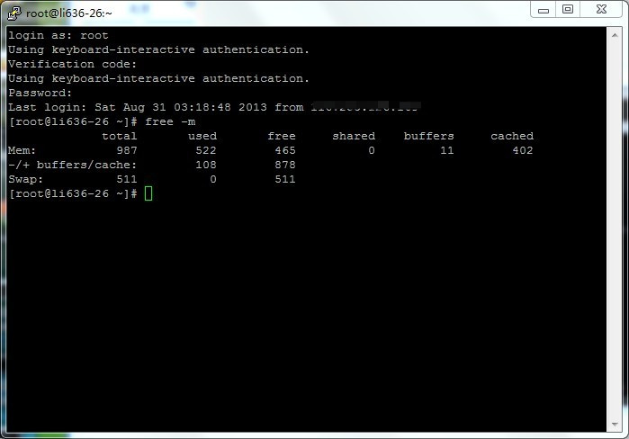

# 使用Google身份验证器加锁CentOS


_数据丢失，这篇文章是复制2013年8月快照的，感觉有用，留一下。_

* * *

挺久之前，在~~害羞哥~~那里看到这篇文章：~~用Google身份验证器给你的ubuntu加把锁~~，之前没空试试，今天折腾一下。

Ubuntu下使用google身份验证器直接看害羞哥的文章就好了。

CentOS下我搜索了一下，基本上没中文的，都是老外的文章，其实过程大同小异，我这主要是记录一下。

## 什么是google身份验证器？

网上抄的介绍~~

> Google Authenticator是谷歌推出的一款动态口令工具，解决大家的google账户遭到恶意攻击的问题，在手机端生成动态口令后，在google相关的服务登陆中除了用正常用户名和密码外，需要输入一次动态口令才能验证成功。
>
> 貌似就是动态口令令牌之类的东西，这玩意貌似能用的地方挺多了，比如Dropbox，Gmail等等。

## 安装google身份验证器？

首先root登陆你的vps，然后：

```bash
yum install pam-devel make gcc-c++ wget
```  

下载包：

```bash
wget https://google-authenticator.googlecode.com/files/libpam-google-authenticator-1.0-source.tar.bz2
```

解压：

```bash
tar -xvf libpam-google-authenticator-1.0-source.tar.bz2
```

进入这个目录：

```bash
cd libpam-google-authenticator-1.0
```
编译安装：

```bash
make &amp;&amp; make install
```

完成后运行：

```bash
google-authenticator
```

就如图了：



如上图，我拖亮那一串地址其实是个QRcode，可以把它复制到浏览器之中打开：虽然你最好把下面那一堆数字也保存下，以防万一。

至于下面的一堆提问，什么同步时间之类的，多少秒之类的，我全都选yes。



在你的手机中安装google身份验证器，我这里装是安卓版，然后扫描这个QRcode。



到这里,安装完成。

## 在centos下配置

不会vi，这里用的nano...

```bash
nano /etc/pam.d/sshd
```

加上一行:

```bash
auth       required     pam_google_authenticator.so
```

如图，注意添加的位置。这里有张忘记截图了，所以重新进去截了一张，不过用的是putty，和上面的xshell截图不太一样。



再编辑：

```bash
nano /etc/ssh/sshd_config
```

把`ChallengeResponseAuthentication no`改成`ChallengeResponseAuthentication yes`，最好还确认下这文件里面的`UsePAM yes`这一行。

好了，重启ssh.

```bash
service sshd restart
```

试一下~

你再登陆的时候就发现要输入验证码了，输入你手机上那个实时的验证码，再输入密码你才能登陆到vps。



没了，完。


---

> 作者: Anonymous  
> URL: https://clearsky.me/centos-google-authenticator/  

