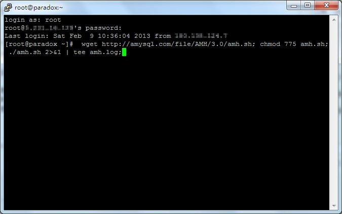
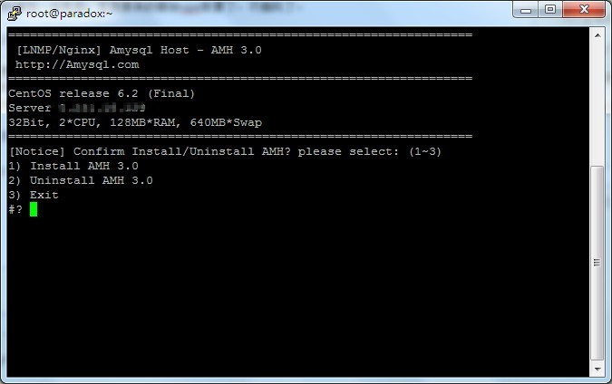
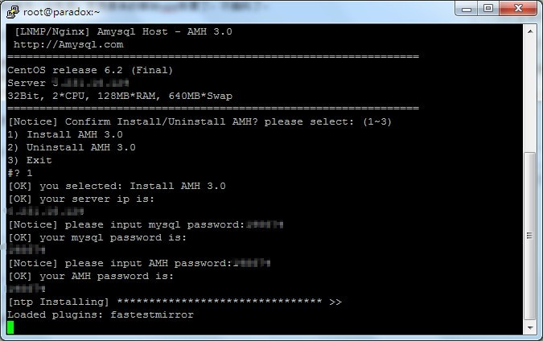
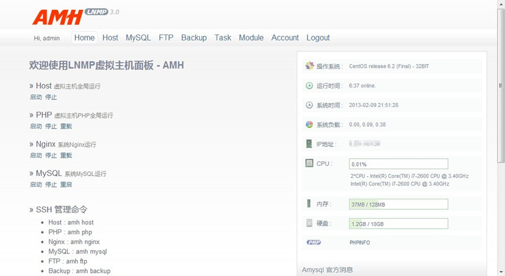
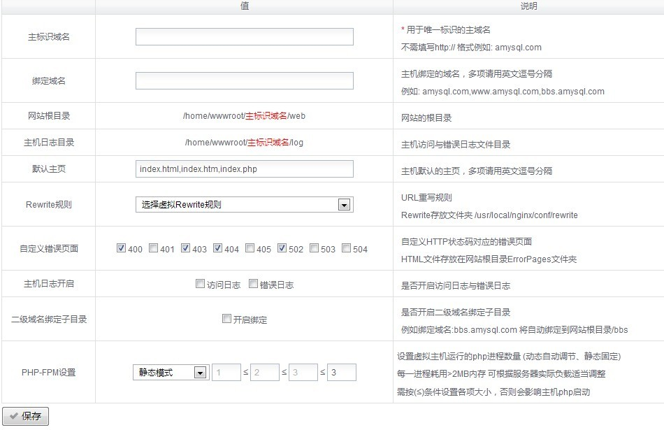
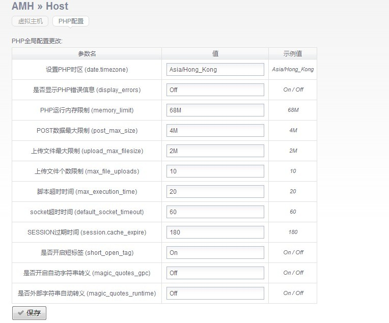
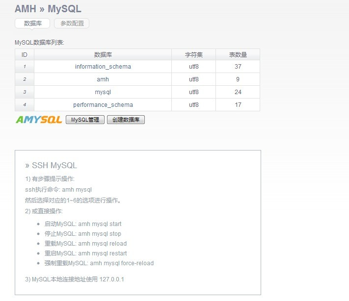
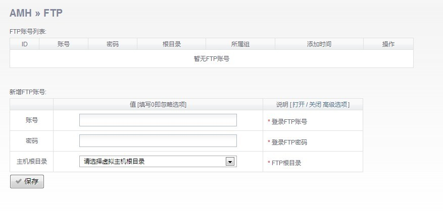
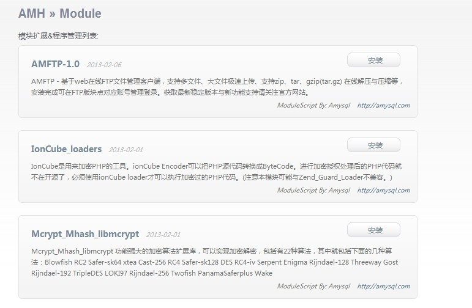
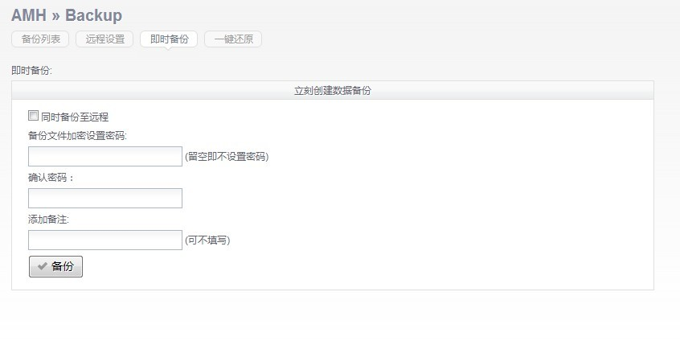

+++
title = "装个 AMH 面板"
description = "装个 AMH 面板"
tags = ["VPS"]
date = "2013-02-09 15:54:38"
categories = ["乱七八糟"]
slug = "amh"
lightgallery = true
+++

今天年三十，年夜饭时前玩一会电脑，发现原来的那台vps恢复了，不抽风了。

这里肯定是继续留在这个虚拟主机上了，不会再搬回去了。那vps就留着时不时折腾一下好了。

ssh登录上去，本来想继续用军哥的LNMP一键包，突然想装个面板玩玩好了，刚巧，以前关注过的amh面板新年刚发布了3.0版本，据说提供模块功能，看起来挺不错的，那么安装一个看看吧。原来vps的数据早已备份下来了，干脆大清理直接重装系统了，后台重装系统的时候点错了，本来是装debian的，点到centos了，无所谓了，懒得改了。

PS:最近不喜欢用Xshell了，改回用[Putty](http://www.chiark.greenend.org.uk/~sgtatham/putty/download.html "Putty官方网站")，小巧的东西比较喜欢，当然Xshell管理多台vps比较方便，不过我用不着。）

## AMH下载

```bash
wget http://amysql.com/file/AMH/3.0/amh.sh; chmod 775 amh.sh; ./amh.sh 2>&1 | tee amh.log;
```



## AMH安装

接下来是三个选项，分别是安装，卸载，退出，直接安装，选`1`.



提示输入数据库密码和amh面板管理密码。



接下来就漫长的安装过程了，估计吃完年夜饭刚刚好安装完，其实正常安装大概15-20分钟左右吧，主要是我这vps配置太搓了，看上面的截图就知道了。

先吃饭，饭后安装好继续看看好用不，好用的话还有一个域名就绑上去，再想想干点什么吧。

* * *

年夜饭回来继续~

已经安装好了，浏览器ip+端口8888，用默认的管理员帐号admin和前面设置的密码登录。

## AMH后台界面



官方的更新说明：

> 1、改进php-fpm多次加载启动(避免额外内存占用)。(Amysql用户反馈：qxwo、yzw6)
>
> 2、默认安装增加Iconv库。
>
> 3、更改amh host主机命令脚本各选项、虚拟主机删除停止对应网站php进程彻底释放内存。 (Amysql用户反馈：dbadrivers)
>
> 4、纠正Nginx SCRIPT_FILENAME变量问题。
>
> 5、自动调节Nginx worker进程数量。
>
> 6、增加MySQL面板绑定域名字段长度限制。 (Loc用户反馈: jason-HardBirch)
>
> 7、使用最新版本MySQL管理系统 AMS-1.50107
>
> 8、使用最新稳定版本Nginx-1.2.6
>
> 9、使用最新稳定版本PHP-5.3.21
>
> 10、备份恢复执行FLUSH PRIVILEGES刷新权限，避免存在权限导入失败。
>
> 10、增加各版块使用说明与纠正错字。
>
>
> (Amysql用户反馈: 天空、Nginx)
>
> 11、虚拟主机增加自定义错误默认页面400、403、502、……设置。
>
> 12、虚拟主机PHP-FPM配置控制、轻松分配PHP线程数量与内存利用分配。
>
> 13、增加PHP.ini配置参数在线设置、内存限制、错误开启、时区等、与增加amh SetParam参数命令设置。
>
> 14、增加在线模块扩展程序安装、卸载、支持自定义编写功能模块或扩展amh面板功能、与增加amh module参数命令设置。
>
> 15、增加登录面板验证码验证设置。
>
> 16、增加MySQL my.cnf配置参数在线设置、关闭开启Innodb引擎、缓存设置等选项。
>
>
> (Loc用户反馈: jumpsky)
>
> 17、增加面板绑定IP或域名。
>
> 18、增加自定义面板端口号设置。
>
> 19、增加二级域名绑定子目录设置。
>
>
> 20、增加模块脚本。
>
> eAccelerator-0.9.6.1
>
> PDO_MYSQL-1.0.2
>
> IonCube_loaders
>
> Mcrypt_Mhash_libmcrypt
>
> MySQLi
>
> phpMyAdmin-3.2.1
>
> Zend_Guard_Loader
>
> AMFTP-1.0 (文件管理模块)
>
> (用户反馈: ramonde、赵容部落、天空、winter)
>
>
> 21、面板PHP-AMP框架控制器&数据模型全部重构细分优化，更好支持后续新版本开发与新功能扩展。
>
>
> ------- 待续发布模块 -------
>
> 反向代理模块
>
> API面板控制模块

常用的功能也截图一下。

## 虚拟主机管理



## php配置



## mysql管理，这里管理系统也是作者开发的Amysql (AMS)



## FTP管理：(这个功能我基本用不到，习惯sftp了)



## 模块功能：



## 备份功能，不知道我这配置低下的vps备份的时候会不会失败~


