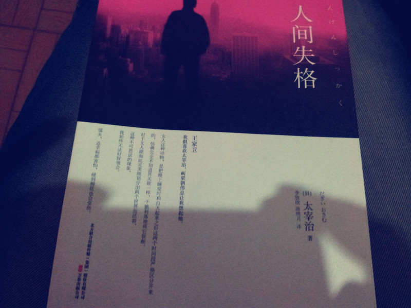

+++
title = "人间失格"
description = "人间失格"
tags = ["人间失格"]
date = "2013-04-23 20:17:21"
categories = ["生活点滴"]
slug = "nolongerhuman"
lightgallery = true
toc = false
+++

事实上这本小说2年前看过，那时候在深圳，网上下载的txt，放在较老的诺基亚手机上，屏幕小且下载的文件错字乱码一堆，粗粗看完的。上个月在豆瓣上看到书评，就x宝上买了一本，薄薄的，运费都比书贵，纸张一般吧，不过就这么点钱，我又没有藏书的习惯，无所谓了。

图片是手机随手拍的，封面上是王家卫的话：

> 我很喜欢太宰治，而梁朝伟总是让我想起他。


简介来自豆瓣：

《人间失格》是日本著名小说家太宰治最具影响力的小说作品，同时也是糸色望（注：动漫《再见！绝望先生》的主角）老师日常生活必备的读物之一。另外在日本轻小说《文学少女》第一卷中被大量提及。《人间失格》（又名《丧失为人的资格》）发表于1948年，是一部自传体的小说，纤细的自传体中透露出极致的颓废，毁灭式的绝笔之作。太宰治巧妙地将自己的人生与思想，隐藏于主角叶藏的人生遭遇，藉由叶藏的独白，窥探太宰治的内心世界，一个“充满了可耻的一生”。在发表这部作品的同年，太宰治就自杀身亡。

一个月以来，断断续续看完了，大部分的时候是晚上值班躺在床上看的。


好久没拿着纸质书看了，有点不习惯。顺带记录下里面的一些句子：


讨厌的东西不敢说讨厌，而对喜欢的东西，也不敢说喜欢，仿佛行窃一般提心吊胆，只觉得痛苦难当，陷入无法言喻的恐怖感中。总之，我甚至连二选一的能力都没有。到了后来渐渐发现，正是这种性格，才导致了自己“生活在羞耻颇多的日子里”。



无论是谁，受到别人的责难，或惹怒别人，也许都不会有好心情吧。我从发怒的人的脸上，看到了比狮子、鳄鱼、恐龙更可怕的动物的本性。平时，这种本性被隐藏起来了，一旦遇到什么机会，人类的可怕的真面目，就通过发怒出其不意地暴露了出来。好比牛在草原上躺着，原本一副沉稳的样子。突然，它甩动尾巴，一下子就打死了肚子上的牛虻。看到这幅光景，我总是感到不寒而栗，连毛发都竖起来了。一想到这种本性也许是人类生存的一种先决条件，我几乎感到绝望了



对人类过于恐惧的人反而希望亲眼看到更可怕的妖怪。这种心理像神经质，同那些对容易担惊受怕的人会祈祷暴风雨来得更猛烈些的心理一样。啊，这一群画家们，受到人类这个妖怪的攻击和威胁，终于相信了幻觉，在光天化日下，清楚地看到了群魔乱舞。并且，他们不会被这些妖怪的“扮小丑”所欺骗，努力如实表现他们所看到的一切。



比目鱼的说话方式，不，世上所有人的说话方式，都是像这样转弯抹角，模糊不清，好像带点试图逃避自己责任的微妙。而我总是对于那个几乎令人感到无益、没用的严重警戒，以及无数细小麻烦的计谋困惑、为难，我的心情变成什么样都已经无所谓了，继续看玩笑、挖苦来搪塞，或者是沉默地首肯，承受这一切，也就是说采取了失败消极额态度。



对人类过于恐惧的人反而希望亲眼看到更可怕的妖怪。这种心理像神经质，同那些对容易担惊受怕的人会祈祷暴风雨来得更猛烈些的心理一样。啊，这一群画家们，受到人类这个妖怪的攻击和威胁，终于相信了幻觉，在光天化日下，清楚地看到了群魔乱舞。并且，他们不会被这些妖怪的“扮小丑”所欺骗，努力如实表现他们所看到的一切。



酒吧的老板娘无意中说出这句话：“我们所认识的阿叶，又诚实又乖巧，要是不喝酒的话，不，即使是喝酒……也是一个神一样的好孩子呐。”


