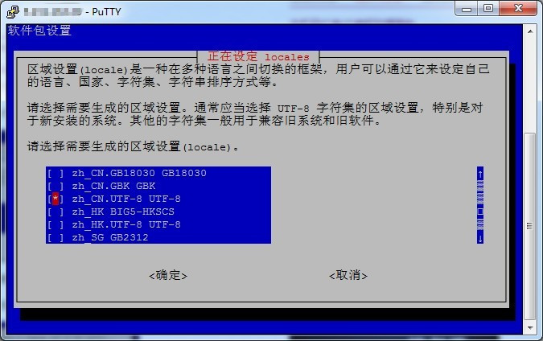
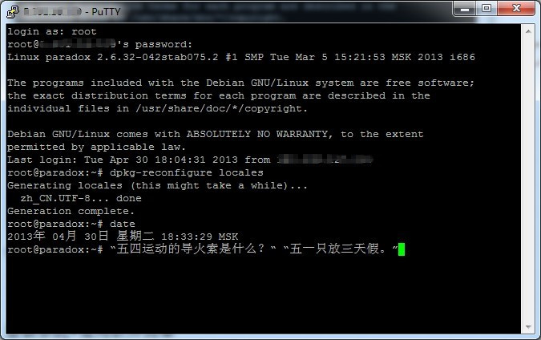

+++
title = "Debian 下 SSH 显示中文"
description = "Debian 下 SSH 显示中文"
tags = ["Debian"]
date = "2013-04-30 01:01:12"
categories = ["学习备忘"]
slug = "debian-ssh-zh-cn"
lightgallery =1
toc = false
+++

据说原来的 host1free 这个免费的vps提速了，我原来还有留着一个，不知道被删除了没。

邮件里翻出帐号信息，登陆上去看看，人品不错，还没被删，后台直接重装了 debian6。

wget试了一下，速度 600K/s 左右，还是很搓，不过比以前被限制在1M带宽以下的速度好多了，以前我记得从来没超过80K/s。

以前也想过ssh下中文显示问题，不过那时感觉也没什么影响，懒得深究。今晚乘着值班有空，放google找找答案。

翻了一下，挺简单的，整理一贴一下：ssh登陆vps，我用的是putty，先设置一下。

putty设置界面`Window`下的`Translation`，`Remote character set`那里设置为`UTF-8`，用Xshell也一样，设置字符编码为`UTF-8`。

root登陆后：

```bash
dpkg-reconfigure locales`</pre>
```



上下键选择`zh_CN.UTF-8`，`空格`选中，`tab`切换到确认，回车。我已经改过了，所以截图是中文。询问默认的系统区域设置，还是选原来的`zh_CN.UTF-8`。`tab`切换到确认，回车。

接下来，终端输入命令：


```bash
vi  /etc/environment
```

添加一行：

```bash
LC_CTYPE="zh_CN.UTF-8"
```

按下`Esc`退出编辑模式，`:wq`保存退出。

这里找资料的时候翻到`:wq`和`:x`的区别，顺便记录一下。资料来源于：[小蜗牛技术之家](http://snailwarrior.blog.51cto.com/680306/143779 "vi文件保存退出命令")

`:wq  `**强制性写入文件并退出。即使文件没有被修改也强制写入，并更新文件的修改时间。**</p>`:x `**写入文件并退出。仅当文件被修改时才写入，并更新文件修改时间，否则不会更新文件修改时间。**

重新登陆一下，输个`date`命令看看：



完成！
