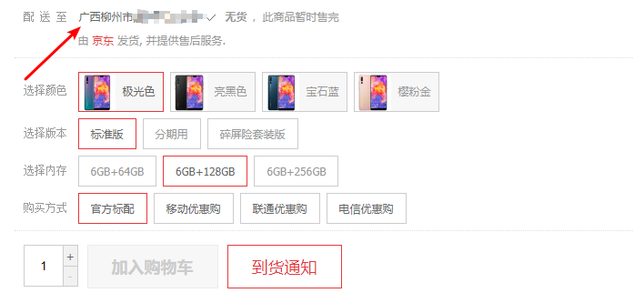
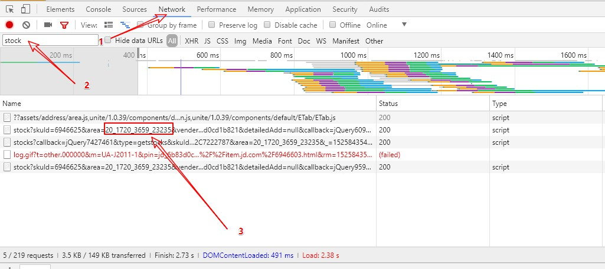
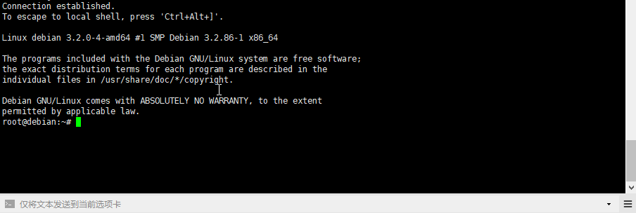
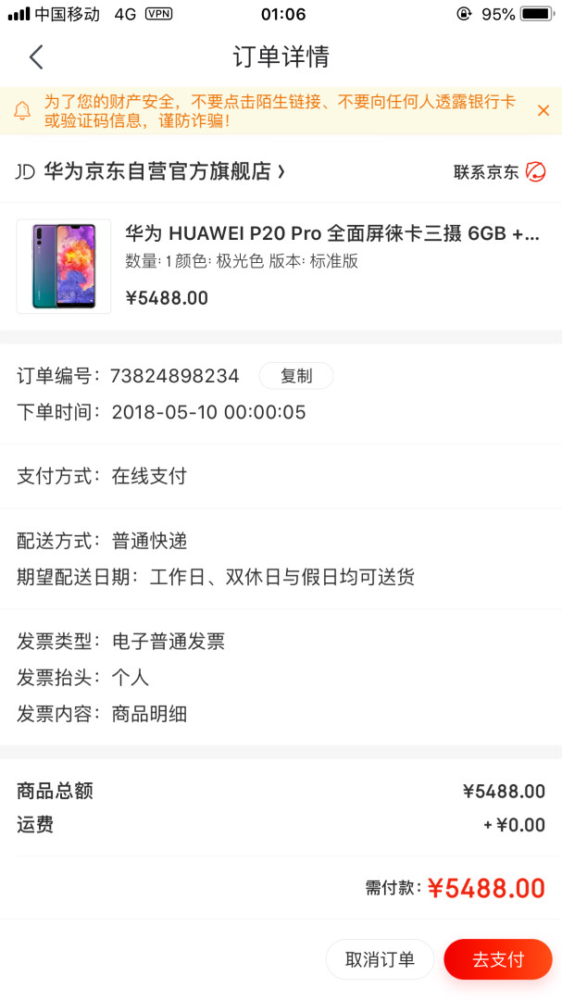
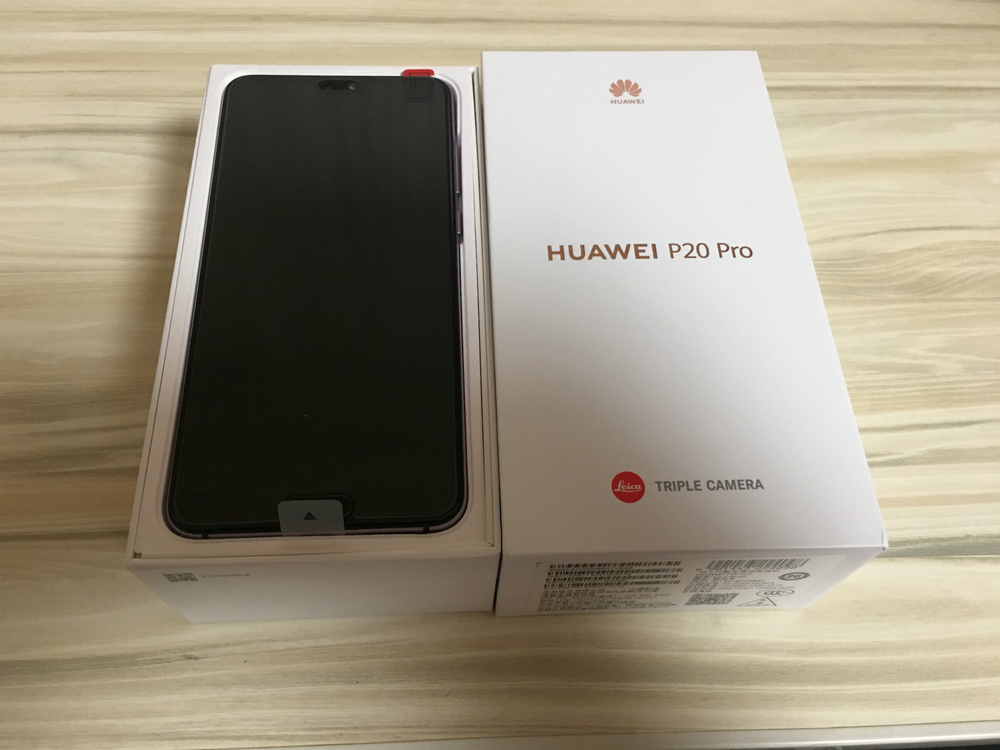

+++
title = "使用 Python 爬虫自动登陆京东抢购华为 P20 Pro 手机"
description = "使用 Python 爬虫自动登陆京东抢购华为 P20 Pro 手机"
tags = ["华为 P20 Pro","Python"]
date = "2018-05-08 20:36:04"
lastmod = "2018-05-14"
categories = ["乱七八糟"]
slug = "jd-autobuy"
lightgallery =1
+++

## 原因

目前使用的 iPhone 6s plus 慢慢的有点卡了，低电量降频的时候更加严重，升级到 ios 11.3.1 后不强制降频了，不卡了，但是本来掉得快的电量掉得更快了，我是不习惯有空就插着充电的那种，所以经常临时出门发现电量少点可怜了，充又来不及，挺尴尬的。

想着换一块电池满血复活，也不贵，还上门安装，挺好的，但是我妈前两年买的手机也是卡到不能正常使用了，她对手机性能和电量没什么需求，就想着把 6 sp 给她用吧，我自己再买一个。

 苹果这些年尽出水桶机，这次考虑换到安卓阵营了，试了下朋友的华为 mate 10 pro，感觉这几年国产安卓手机并不像前几年说的用久必卡，软件生态虽然没有苹果好，但是我自己又不爱折腾了，常用的软件就那么几个，差不多就行，在翻阅了这个知乎问答：[从 iPhone 更换成 Android 手机之后，你有怎样的不同体验？](https://www.zhihu.com/question/263623119)后，觉得可以换了。


## 购买问题

前面试过华为 mate 10 pro，感觉还行，刚好出了华为新旗舰 P20 pro,看着挺不错，据说手机拍照全球第一??? 

决定了就上华为官方商场一看，貌似还要显示抢购，刚好时间点对着上，我就试了一下，抢购个毛啊，一到点瞬间就没了，一直显示排队中，饥饿营销???

那么上京东上看一下啊，也是显示没货，每晚 8 点也有个抢购时间，我试了下，是有货的，但基本是黑色和蓝色，两种渐变颜色极光色和樱粉金基本瞬间光，我有一天晚上能加上购物车，一点提交订单就显示没了。

那至少还有戏吧，不像华为官方商场那么坑。

## JD_AutoBuy

最反感这种抢购的，没时间守着抢，都不打算买了，但是还是忍不住，于是网上找了 Python 爬虫，项目地址在这里：[JD_AutoBuy - Python爬虫，京东自动登录，在线抢购商品](https://github.com/Adyzng/jd-autobuy)，看了下说明，使用环境 Python 2.7。还需要两个库：


- Requests: 简单好用，功能强大的Http请求库
- beautifulsoup4: HTML文档格式化及便签选择器



刚好我使用的 VPS 系统是 Debian ，自带的 Python 版本就是 2.7（本来想着在本地电脑上运行的，但是我没事不可能一直开着电脑挂着，还是在服务器上运行吧）。

### 安装脚本


登陆 VPS，先查看 Python 版本：

```bash
python -v
```

如果是 Python 2.7，下一步，如果是 Python 3，换成 2.7 ，这个脚本在 Python 3 会出错。

然后安装上面说的两个库：

```bash
pip install Requests
pip install beautifulsoup4
```

完成后先克隆一份脚本

```bash
git clone https://github.com/Adyzng/jd-autobuy.git
```

进入脚本目录：

```bash
cd jd-autobuy/
```

到这里，先别急着运行脚本，先看看脚本配置参数。

### 脚本参数

先看看使用帮助，运行：

```python
python scraper-jd.py -h
```

显示：

```bash
usage: scraper-jd.py [-h] [-u USERNAME] [-p PASSWORD] [-g GOOD] [-c COUNT]
                     [-w WAIT] [-f] [-s]

Simulate to login Jing Dong, and buy sepecified good

optional arguments:
  -h, --help            show this help message and exit        // 使用帮助
  -u USERNAME, --username USERNAME                      
                        Jing Dong login user name              // 京东账号
  -p PASSWORD, --password PASSWORD
                        Jing Dong login user password          // 京东密码
  -g GOOD, --good GOOD  Jing Dong good ID                      // 京东商品编号
  -c COUNT, --count COUNT
                        The count to buy                       // 购买数量
  -w WAIT, --wait WAIT  Flush time interval, unit MS           // 间隔时间 单位：毫秒
  -f, --flush           Continue flash if good out of stock    // 如果商品缺货就一直刷直至成功
  -s, --submit          Submit the order to Jing Dong          // 有货添加到购物车并下订单
```

这个脚本写了两个版本，一个 Python 版本，还有一个 golang 语言版本, go 语言版本有个区域设置的参数，这个 Python 版本也有的，只不过没有在使用帮助上说明出来。 


```
-a, -area string
        ship location string, default to Beijing (default "1_72_2799_0") // 设置商品区域 默认北京地区
```

**首先：`-u` 和 `-p` 这两个参数基本用不到，因为这个脚本支持扫码登陆，不用去填账号和密码。**

然后： `-g` 参数后加的是商品 id，就是商品页面浏览器地址栏那串数字，比如我要抢的`华为 P20 Pro 6GB + 128 G 极光色` 的 id 为 `6946625`,据说购物商城比较鸡贼，这个 id 会变，防止软件刷自动抢购，不过我看了京东没变过。

再然后：`-c` 这个没什么好说的，购买数量，买一件后面加 1，买两件加 2。

再来： `-w` 间隔时间，这个用它默认的时间就好了。

再继续， `-f` `-s` 不用说了，不断刷直到成功下单。

最后说说这个 `-a` 设置商品区域（默认北京地区），这个值在怎么填，可以先选择配送地，比如我的：



用 Chrome 浏览器的话，就可以直接 F12 页面检查，先切到 `Network`,然后在过滤器上输入 `stock`,最后得出的 `area` 后面的那串数字就是了,如图：



这样，我们所需要的参数都有了，完整举个例子：

比如我要抢购 数量为 `1` 台的 华为 P20 Pro 6GB + 128 G 极光色，他的商品id 为 `6946625`，配送区域广西柳州市XXXXXX。区域 id 为 `20_1720_3659_0` ，没货刷新直至有货，有货之后添到购物车并且提交。那么可以这样运行脚本：

```python
python scraper-jd.py -c 1 -g 6946625 -a 20_1720_3659_0 -f -s
```

然后到这里还是不急着运行脚本，最后做点准备。


### 运行前的准备

最后运行脚本之前，首先要保证这个抢购脚本一直在运行，不能我一断开 SSH 连接它就跟着终止了。

那么有这几种方法：具体可以看这里：[Linux 技巧：让进程在后台可靠运行的几种方法](https://www.ibm.com/developerworks/cn/linux/l-cn-nohup/index.html)

我这里用的是 `screen` ，先安装

```bash
apt-get install screen
```

然后 

```
screen -S jd_autobuy  // 名字随便起，我直接用脚本名字 jd_autobuy 了。
```

运行脚本：

```python
python scraper-jd.py -c 1 -g 6946625 -a 20_1720_3659_0 -f -s
```

没什么问题的话就会提示你扫码登陆，生成的二维码在脚本同一目录 qr.png，你可以下载到本地扫码，这里有点奇怪，我用京东手机 app 扫，没反应，只好用微信扫码，然后提示用京东手机 app 打开，再在手机上点确认登陆就可以了，有点奇葩。

遇到的2个问题：


- 有时候第一次登陆会要验证，把终端验证那一串地址在浏览器打开，接受个手机验证码就可以了。
- 我试了买了一个胎压计，然后再买其他商品就添加不上购物车或者下不了订单了。只能没买完一个商品，把脚本同级目录下的 Cookie 文件删除，然后重新扫码登陆一遍就可以了。


还有，开了 screen 后就可以断开 ssh 连接了，下一次登陆终端，想恢复到脚本界面，用：

```bash
screen -r jd_autobuy
```

附 screen 常用命令：

```bash
screen -S yourname -> 新建一个叫yourname的session
screen -ls -> 列出当前所有的session
screen -r yourname -> 回到yourname这个session
screen -d yourname -> 远程detach某个session
screen -d -r yourname -> 结束当前session并回到yourname这个session
```

## 运行界面

最后最后，动图流：



2018.05.09 更新: 一觉醒来可还是没有刷到，TMD 刷不到不买了，给惯的！
2018.05.10 更新：晚上和朋友在吃烧烤，突然手机京东通知来了，已提交到订单：



## 到货

2018.05.14 更新：

到货了：



晚上吃宵夜，随便拍了一张，我真的不会拍照，原谅选了这么一个地方，不过照片的色调和拍摄夜景能力真的非常不错的。

