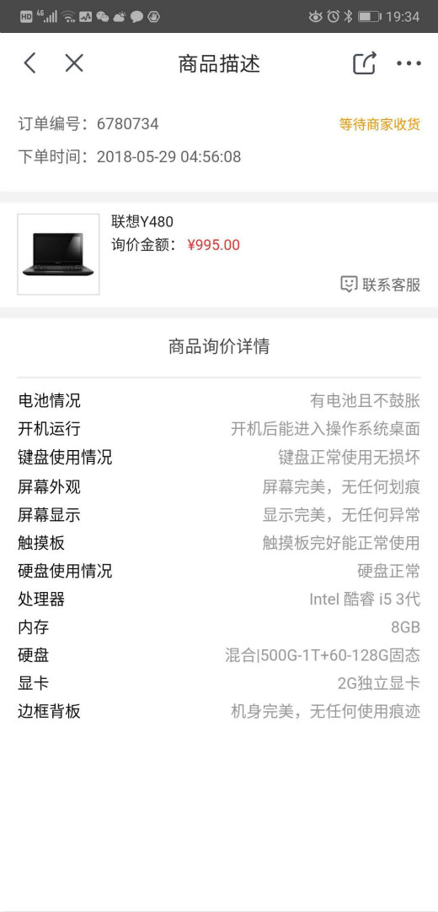
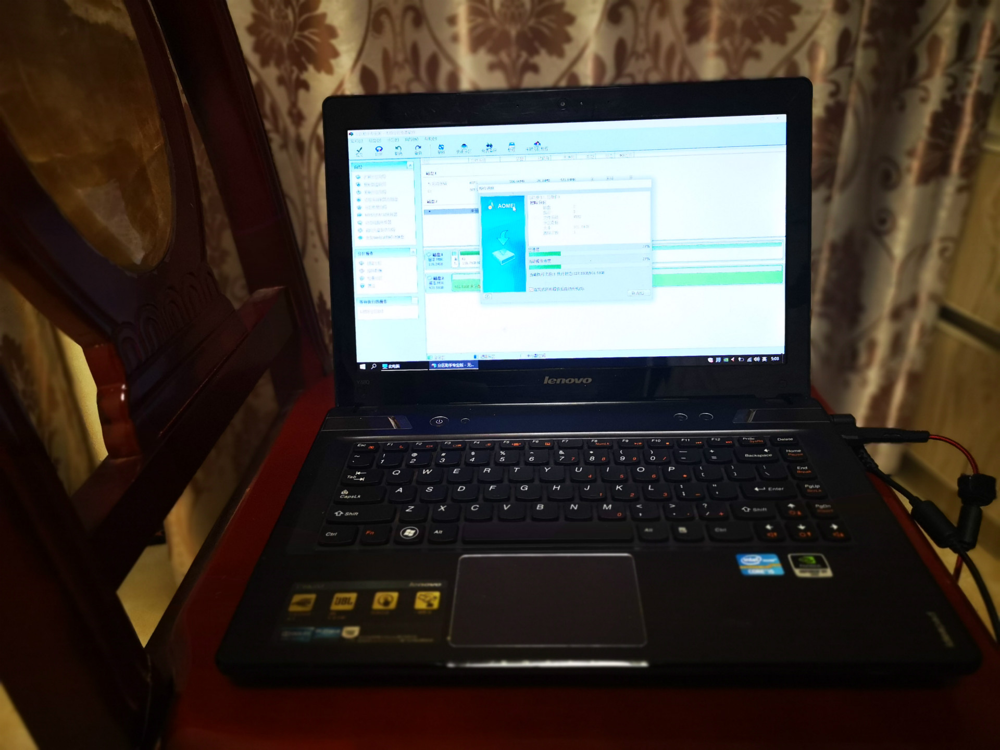

+++
title = "京东回收掉使用了 5 年的 Y480"
description = "京东回收掉使用了 5 年的 Y480"
tags = ["笔记本电脑"]
date = "2018-05-29 18:49:04"
lastmod = "2018-11-05"
categories = ["乱七八糟"]
slug = "bye-y480"
lightgallery =1
toc = false
+++

前段时间买了 [惠普 (HP) 游戏本暗影精灵 3 Plus](https://clearsky.me/new-omen-iii/)之后，我用了 5 年的老笔记本联想 Y480 终于退役了。

这台笔记本是刚工作的时候买来打游戏的，i5 酷睿 3 代，NVIDIA GeForce GT 650M 独立显卡＋Intel GMA HD 4000 集成显卡，内存我自己加到 8 G，硬盘原来是 1 TB机械硬盘，我自己后来加了一块 120G 的 SSD 做系统盘，配置在当时还可以，玩当时大部分非硬件杀手的游戏都还凑合，除了用料看起来有点搓，整体做工还算不错，这几年用它玩游戏，刷美剧，挂机下载什么的，本身我没有关机的习惯，随开随用，保养方面就连简单的拆盖清灰我也从来没做过，能坚挺这 5 年而且从来没出现过什么问题我也是挺惊讶的，本来想扔在家里做个下载机什么的，但是扔了 3 个月好像也没怎么用上过，还是算了，直接卖掉算了。

本来想挂在闲鱼上看看，后来嫌麻烦直接京东拍拍回收填了一下货物信息，直接卖了，估价 995，我估计到最后就 700 多吧，可能还要少，无所谓，放在家里也是烂掉。

卖之前，清除硬盘数据，我没什么特别隐私的东西在硬盘上，就直接把硬盘格式化，然后擦除分区一次就好了，毕竟老机器了，做擦除分区一次居然花了 2 个多小时，一边擦除变拍个照片留个念吧。

半夜填提交的单子，今天下午京东就上们来拿货了，准备好身份证让小哥核对一下就可以了。

就这样，等到手多少钱再更新一下。

2018.11.05 更新：

过了这么久才记得没补。。。实收 750 元。