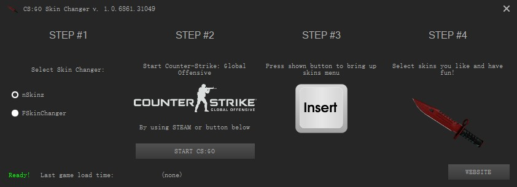
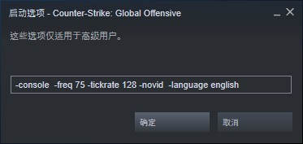
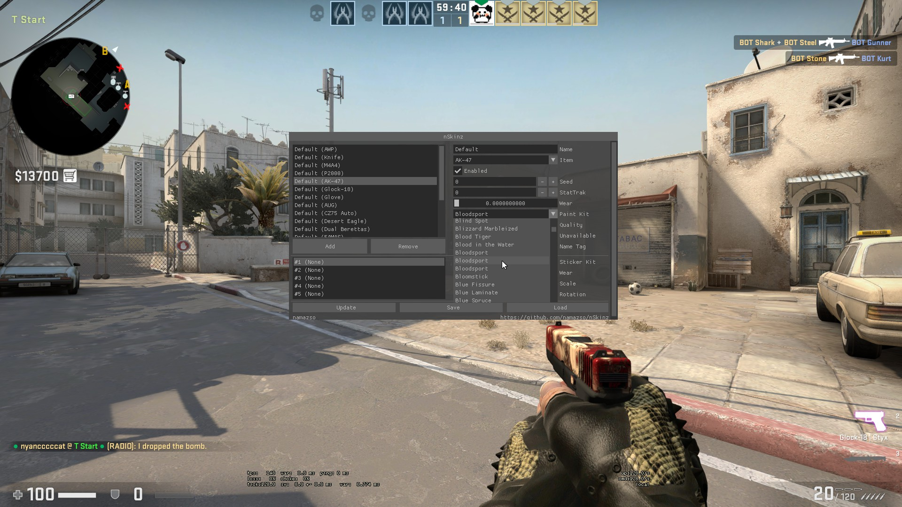
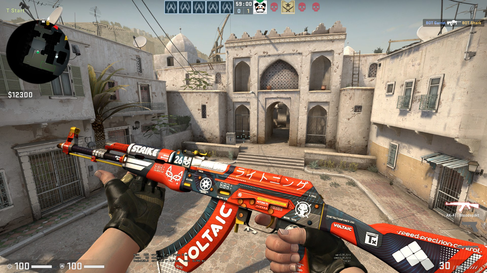

+++
title = "使用 CSGO Skin Changer 更换 CSGO 枪械皮肤"
description = "使用 CSGO Skin Changer 更换 CSGO 枪械皮肤"
tags = ["CSGO"]
date = "2018-09-07 20:49:04"
categories = ["游戏娱乐"]
slug = "csgoskinchanger"
lightgallery =1
toc = false
+++

偶尔打打 CSGO，中老年手残玩家，实在不好意思上各种平台受虐，偶尔开个单机打打 BOT 娱乐一下。

不是深度玩家，没必要氪金买饰品了，但是看着好多枪械皮肤挺好看，于是找到这个小软件替换下皮肤，打 BOT 的时候自娱自乐一下~

##  CSGO Skin Changer

官网 [CS:GO CHANGER](http://cs-changer.ru/#)

页面是俄语的，点击页面最显眼的按钮就可以下载了。运行下载好的 `setup.exe` 文件，一路点击就弹出程序界面了：

界面上使用步骤一目了然，这个软件集成了两个 Skin Changer。

- 第一步：选择使用哪一个，建议使用 nSkinz，另外一个 FSkinChanger 我在使用中老出点问题。
- 第二步：点击 Start 运行游戏，不过建议运行之前修改 CSGO 游戏启动参数，加上关闭 VAC 保护参数 `-insecure`，还有一个是最好把游戏语言设置为英文　`-language english`，要是中文的话，进游戏选择枪械皮肤名称会乱码，显示为一堆问号。


我的启动参数为 `-console  -freq 75 -tickrate 128 -novid  -language english`，如图：


- 第三步：进入游戏建好房间后，按下　`Insert` 调出界面：


左边　`add` 增加替换的枪械，右边选择你喜欢的皮肤就好了，还能加各种贴纸。然后 `save` 就好了。

选了个我最喜欢的 AK 皮肤血腥运动 BloodSport。

不知道用这个会不会封号，反正我只打单机娱乐。