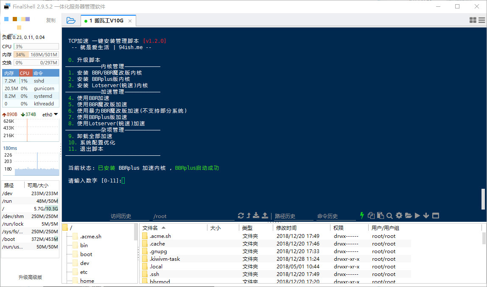
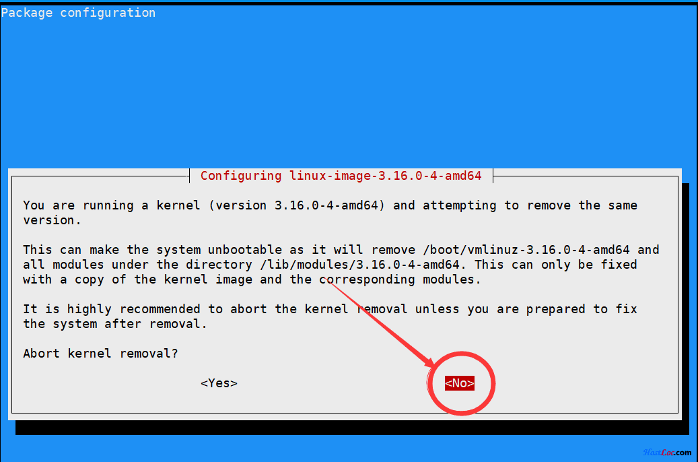

+++
title = "Ubuntu 18.04 安装宝塔面板遇到问题及启用魔改 BBR"
description = "Ubuntu 18.04 安装宝塔面板遇到问题及启用魔改 BBR"
tags = ["宝塔","Ubuntu"]
date = "2018-12-20 20:49:04"
categories = ["学习备忘"]
slug = "ubuntu-1804-bbr"
lightgallery =1
+++

## 手贱

每隔一段时间就有换 VPS 系统的坏毛病，今天看到搬瓦工后台可以直接安装 Ubuntu 18.04 了，环境管理方面这次直接用面板了，用的是宝塔面板。对于个人使用，我觉得怎么方便怎么来吧，系统的话，如果是生产环境，还是建议 CentOS。

后台安装完成后更新完系统后，安装宝塔面板：

```bash
wget -O install.sh http://download.bt.cn/install/install-ubuntu_6.0.sh && sudo bash install.sh
```

## 报错 1

安装失败，报错：


Pillow installation failed


搜了下大致与 Python 有关，于是直接安装 `python-setuptools` 工具：

```bash
apt-get install python-setuptools
```

完成后再次安装，这次安装成功了，但是状态显示面板一直无法启动。

## 报错 2

搜了下是 Python 版本问题，我更新后 Python 版本是 `3.7`，而宝塔是 Python 2 写的，不兼容。

于是移除软连接：

```bash
rm -rf /usr/bin/python
ln -s /usr/bin/python2.7 /usr/bin/python
```

再次启动面板

```bash
service bt restart
```

看到：

```
Stopping Bt-Tasks... done
Stopping Bt-Panel... done
Starting Bt-Panel... done
Starting Bt-Tasks... done
```
没问题了！

## 安装魔改版 BBR


Ubuntu 18.04 内核 为 `4.15`，高于 BBR 内核要求为 `4.9` 以上，所以不用换内核了。直接使用大佬魔改版本 [BBR+BBR魔改+Lotsever(锐速)一键脚本 for Centos/Debian/Ubuntu](https://www.moerats.com/archives/387/) 

Ubuntu 18.04 使用下面：

```bash
wget -N --no-check-certificate "https://raw.githubusercontent.com/chiakge/Linux-NetSpeed/master/tcp.sh"
apt install make gcc -y
sed -i 's#/usr/bin/gcc-4.9#/usr/bin/gcc#g' '/root/tcp.sh'
chmod +x tcp.sh && ./tcp.sh
```

完成后按提示选择就行了，如图：



安装过程出现下图：选择 `NO`。



安装 `不可描述软件` 之后，喜闻乐见的油管动图测速：


油管非高峰期，1440P 下这个速度非常满意了。
