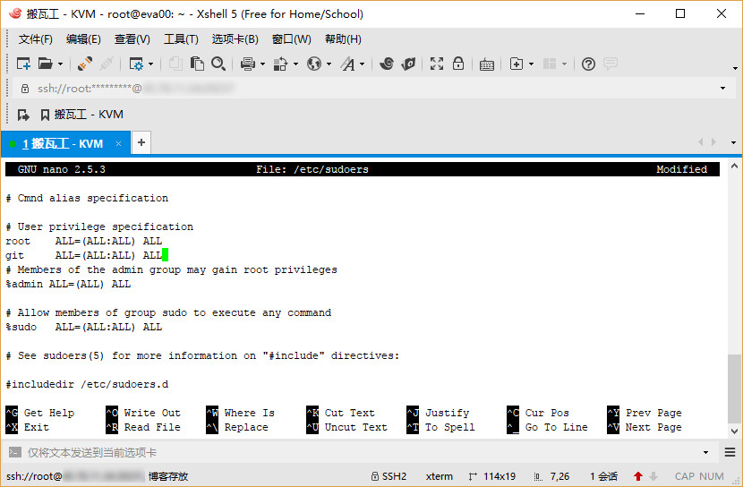
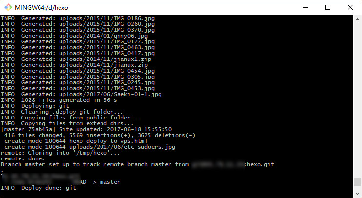

# Hexo 部署到搬瓦工 VPS


## 环境设定


- 搬瓦工年付最便宜 $19.99  10G VPS，KVM 架构。 
- VPS 操作系统 Ubuntu 16.04.2 LTS ，已开启 [Gooole TCP BBR](https://clearsky.me/ubuntu-bbr.html)。
- 本地系统 Windows_NT 10.0.15063 win32 x64，已安装 Hexo 3.3.7，[Node.js](https://nodejs.org/zh-cn/) 版本 6.10.3。
- SSH 连接管理软件 [Xshell 5](https://www.netsarang.com/products/xsh_overview.html)，本地终端 [Git for Windows](https://git-for-windows.github.io/index.html) 2.13。



## 方案选择

传说中有 2 种方案：


1.  在 VPS 安装配置 Hexo，完成后 `hexo server` 让它本地运行，之后通过配置 Nginx 让域名指向  `http://localhost:4000` 。
2.  本地安装配置 Hexo，生成静态文件，然后 `git hook` 或者 `rsync` 这类方式部署到 VPS，Nginx 作为 Web 服务器解析。



**因为我以前一直是本地生成静态文件部署到 github 或者 coding 上的，显然第二种方案适合我，在这里使用的是`git hook` 方式部署，因为 Google 搜索出来大多是这种方式，文章多，容易解决问题。**


## 安装 Git 和 Nginx

`root` 登录 VPS，安装 Git 和 Nginx。

```bash
apt-get update
apt-get install git-core 
apt-get install nginx
```

### 配置 Git

新增一个用户 `git` ，并赋予操作权限。

```bash
adduser git
```

提示输入密码，并且填写一些身份信息。完成后赋予权限：

```bash
chmod 740 /etc/sudoers
```

编辑 `/etc/sudoers`，我用的 `nano` ，不会 `vi` 。

```bash
nano /etc/sudoers
```

在如下图位置添加 `git  ALL=(ALL:ALL) ALL`：



之后保存，记得把权限改回来

```bash
chmod 440 /etc/sudoers
```


**输入密码不可见，也无星号提示，输入一次，回车，再输一次再回车就好了。身份信息直接一路回车默认就好了。觉得 vi 操作麻烦可以用 nano 来编辑，注意添加位置。**



### 上传本地 ssh 公钥

```bash
su git		# 切换至 git 用户
cd ~
mkdir .ssh && cd .ssh
touch authorized_keys
nano authorized_keys 
```

出现编辑框，这里需要把`本地` 公钥里面内容复制进，本地公钥在 `~/.ssh/id_rsa.pub` ，我是直接用编辑器打开复制进去的。复制完成保存。

然后测试一下连接，**本地终端**运行：

```bash
ssh git@VPS IP 地址
```

这里出错了，连不上，原因是搬瓦工默认连接端口不是 `22`，那么本地 `~/.ssh/` 目录下新建 `config` 文件 ( 注意没有后缀 )，内容如下：

```bash
Host # VPS IP地址
HostName # VPS IP地址
User git
Port # SSH 端口
IdentityFile ~/.ssh/id_rsa
```

完成后再试一下，没问题了。

### 部署 Git 库

```bash
cd ~
mkdir hexo.git && cd hexo.git
git init --bare
```

### 授权配置钩子

```bash
cd /var/www
sudo mkdir hexo		#需要输入 git 用户密码
sudo chown git:git -R /var/www/hexo
```

```bash
cd ~/hexo.git/hooks
nano post-receive
```

编辑框输入以下内容：

```bash
#!/bin/bash
GIT_REPO=/home/git/hexo.git
TMP_GIT_CLONE=/tmp/hexo
PUBLIC_WWW=/var/www/hexo
rm -rf ${TMP_GIT_CLONE}
git clone $GIT_REPO $TMP_GIT_CLONE
rm -rf ${PUBLIC_WWW}/*
cp -rf ${TMP_GIT_CLONE}/* ${PUBLIC_WWW}
```

并赋予权限

```bash
chmod +x post-receive
```

至此，VPS Git 配置完成。记下来是 Nginx。

### 配置 Nginx

为了方面先可以切换到 `root` 用户，首先配置 Nginx 站点文件：

```bash
nano /etc/nginx/conf.d/hexo.conf
```

输入以下内容并保存，酌情修改：

```
server {
  listen  80 ;
  listen [::]:80;
  root /var/www/hexo;
  server_name clearsky.me www.clearsky.me;
  access_log  /var/log/nginx/hexo_access.log;
  error_log   /var/log/nginx/hexo_error.log;
  error_page 404 =  /404.html;
  location ~* ^.+\.(ico|gif|jpg|jpeg|png)$ {
    root /var/www/hexo;
    access_log   off;
    expires      1d;
  }
  location ~* ^.+\.(css|js|txt|xml|swf|wav)$ {
    root /var/www/hexo;
    access_log   off;
    expires      10m;
  }
  location / {
    root /var/www/hexo;
    if (-f $request_filename) {
    rewrite ^/(.*)$  /$1 break;
    }
  }
  location /nginx_status {
    stub_status on;
    access_log off;
 }
}
```

完成后重启 Nginx。

```bash
/etc/init.d/nginx restart
```

## 配置 Hexo 部署

和部署到 github 和 coding 一样，修改 Hexo 配置文件 `_config.yml`  的 `deploy` 部分：

```yaml
deploy:
  type: git
  repo: git@VPS的IP:hexo.git,master
```

## 完成测试

和往常一样，`hexo g -d` ，看了一下没问题了。



先吃饭，回来再添加下 SSL 证书。


---

> 作者: [pagezen](http://clearsky.me/)  
> URL: https://clearsky.me/hexo-deploy-to-vps/  

