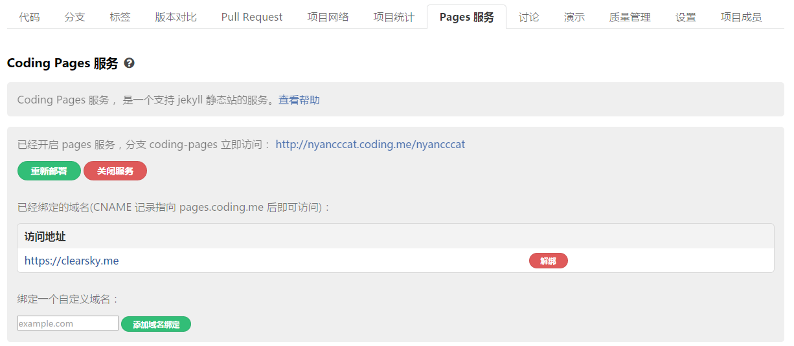
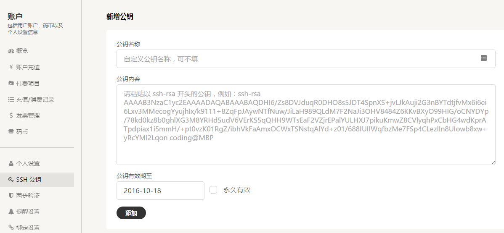

# Hexo 多部署--同时使用 Coding 和 Github 托管博客


由于八达岭内网络环境的复杂性，使得部署在 Github 的博客时常抽风，访问体验不是那么的好，所以想想还是放在 Coding Pages 上好了。部署的时候同时部署到 Github，有需要直接解析回来，Github 托管不说了，记录下部署到 Coding Pages 。

## 关于 Coding Pages

>Coding Pages 是一个免费的静态网页托管和演示服务。您可以使用 Coding Pages 托管博客、项目官网等静态网页，还可以绑定自定义域名。  Coding Pages 支持用户 Pages 演示和项目 Pages 演示。用户 Pages 可以通过 {user_name}.coding.me 形式的 URL 直接访问，适合用作个人或组织的演示网站；项目 Pages 需通过 {user_name}.coding.me/{project_name} 形式的 URL 访问，适合用作项目的演示网站。

## 创建 Coding Pages

登陆 Coding.net 创建一个与**用户名一样**的项目，切到 **Pages 服务**。



绑定域名，开启 pages 服务，分支 coding-pages 。

## 项目部署 SSH 公钥

命令行终端下：

```bash
ssh-keygen -t rsa -b 4096 -C "your_email@example.com(注册用的email)"
```

推荐一路按回车，完成后，进入 ssh 目录并列出文件：

```bash
cd ~/.ssh/
ls
```

看到生成了`id_rsa.pub`。

```bash
cat id_rsa.pub
```

复制出长长的字符串内容，粘贴到 Coding 的账号设置下的 SSH 公钥栏中。



## Hexo 多部署

编辑 Hexo 配置文件 `_config.yml` 部署部分，格式如下自行调整：
```yml
deploy:
  type: git
  repo:
    coding: git@git.coding.net:username/username.git,coding-pages
    github: git@github.com:username/username.github.io.git,master
```

暂时到这。


---

> 作者: Anonymous  
> URL: https://clearsky.me/hexo-deploy/  

