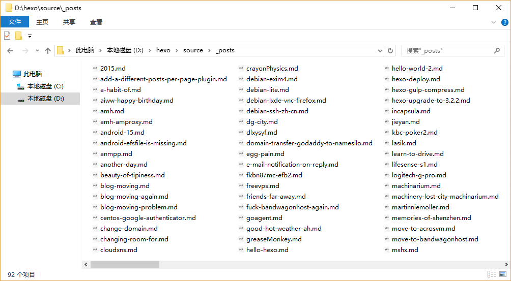
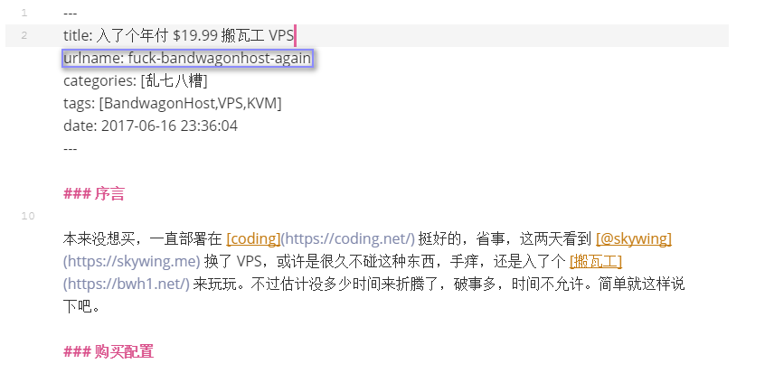
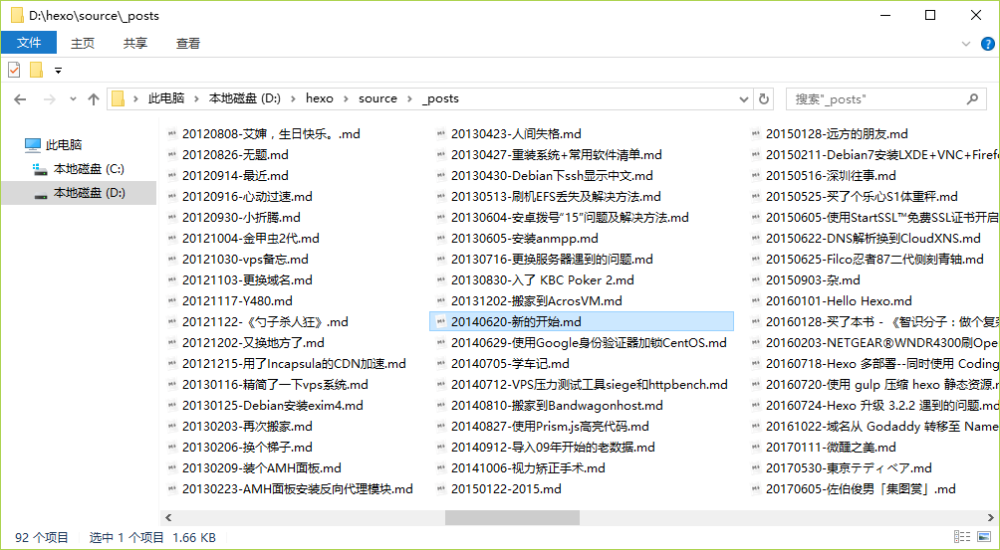

# Hexo 永久链接管理


### 起因

Hexo 官方文档关于永久链接（Permalinks）是这样定义的。

您可以在 `_config.yml` 配置中调整网站的永久链接或者在每篇文章的 `Front-matter` 中指定。

|    变量     |                  描述                  |
| :-------: | :----------------------------------: |
|   :year   |            文章的发表年份（4 位数）             |
|  :month   |            文章的发表月份（2 位数）             |
| :i_month  |           文章的发表月份（去掉开头的零）            |
|   :day    |            文章的发表日期 (2 位数)            |
|  :i_day   |           文章的发表日期（去掉开头的零）            |
|  :title   |                 文件名称                 |
|    :id    |                文章 ID                 |
| :category | 分类。如果文章没有分类，则是 default_category 配置信息 |

我一直是用 `:title`，也就是文件名称作为永久链接变量的， Hexo 配置文件`_config.yml` 中，配置如下：

```yaml
permalink: :title.html
```

假设 `\source\_posts ` 文件夹 中，有一篇 `hello-world.md` 的文章，那么它生成的效果实例为：

[https://clearsky.me/hello-world.html](https://clearsky.me/hello-world.html ' 你好，世界！ ')

问题来了，如果按照文件名称生成永久链接的，我的文件格式都要是这类 `英文字母.md`  的格式，那么我的 `\source\_posts ` 文件夹如下图：



看起来很乱啊，虽然文章不多，但我要找出一篇多年前的文章很难，按时间排序的话，很多文章又是后面修改过的，定位很难，如果改用 `中文标题.md` 的格式，似乎会好很多，一眼就能知道这篇文章说的是什么。但是改成 `中文标题.md` 的话，生成的链接就会类似这种：

[https://clearsky.me/你好世界.html](https://clearsky.me/hello-world.html ' 你好，世界！ ')

浏览器地址栏上很不美观，对 SEO 也不好（虽然我不在乎）。

有没有办法让 Markdown 文件用 `你好世界.md` 这类中文文件名保存，生成的永久链接格式又是 `hello-world.html` 这种样式呢？

### 搜索实践

一番 Google 之后，终于找到答案，来自 [HEXO的站内链接和永久链接](http://www.wuliaole.com/post/permalink_and_internal_link_in_hexo/) 这篇文章里面说道：

> Markdown `Front-matter` 区域可以看到，我这里除了 `title`， `date` 以及 `tags` 外，自己添加了一个新的变量 `urlname` ，这个新的变量用来保存每个文章的英文名字，这样一来可以有利于SEO，二来可以缩短博客文章URL的层数。

那么，`Front-matter` 区域新增一个变量 `urlname` ，值为前面说的英文字母格式。拿昨天的一篇文章举例，如图蓝框处：



再在 Hexo 配置文件 `_config.yml` 中，把 `permalink:` 的值设为 `urlname.html` 。

```yaml
permalink: :urlname.html
```

OK，搞定！

### 额外的修改

在看上面那篇文章的时候发现作者在每个 Markdown 格式的文章前加上时间，这样以后查找起来就非常简单了，很容易定位到。于是学习了，经过一番修改，我把以前所有的文章都加上了 `urlname` ，文件名称改成 `发布时间 - 中文标题.md` 这样的，纯体力活，之后如图：



这样看着舒服多了~

### 结束

弄完这些已经快 23:00 了，昨天晚上还说要把这里部署到 VPS 上去，看来是不行了，很难说，等会要是睡不着继续折腾，反正明天不上班。

---

> 作者: [pagezen](http://clearsky.me/)  
> URL: https://clearsky.me/hexo-permalinks/  

