# 入了 KBC Poker 2

前段时间晚上无聊逛逛外设论坛，看到这玩意挺多人讨论的。

看着外形和60%布局挺讨喜的，跟风买了一个。

x宝上逛了一圈，基本上都是一个价，随便找了家信誉不错的买了。

本来想买青轴的，但是论坛翻了下帖子，貌似关于poker2的轴讨论茶轴评价不错，再想想青轴估计也太吵，还是买个万金油茶轴好了。

三天后到货了，今天中午回家拆包裹。

拿到的包裹，破了个洞，物流真给力。。。

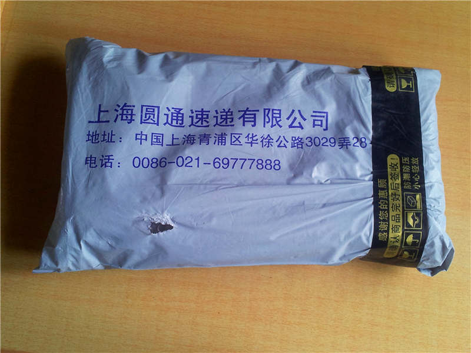

外包装：

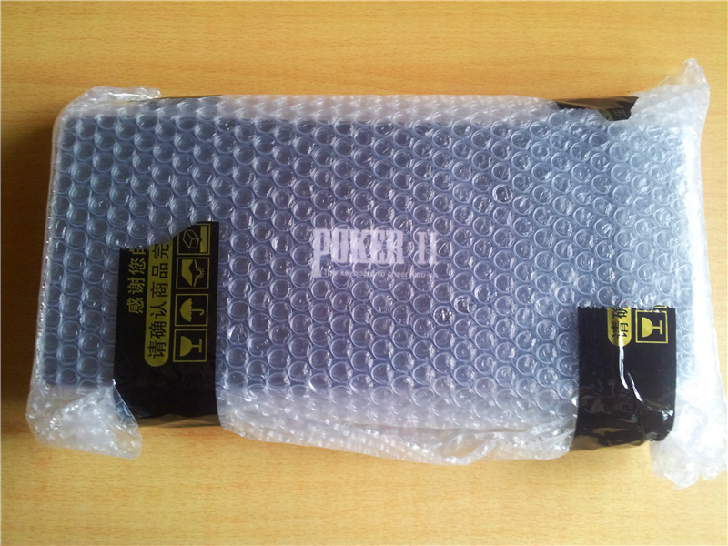

盒子：

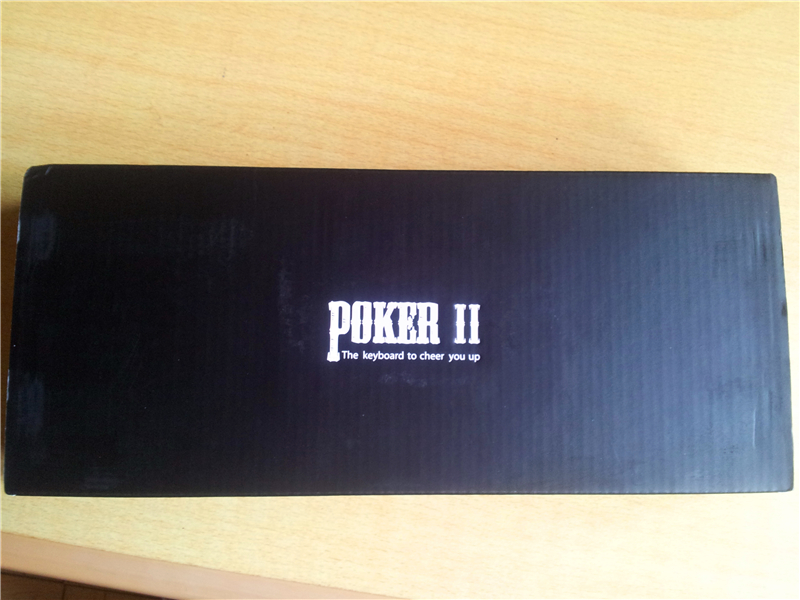

以扑克牌的花色来表示轴的，如图是茶色的梅花。

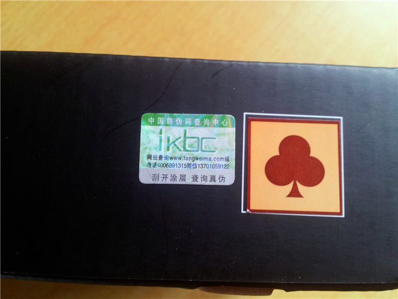

配件：

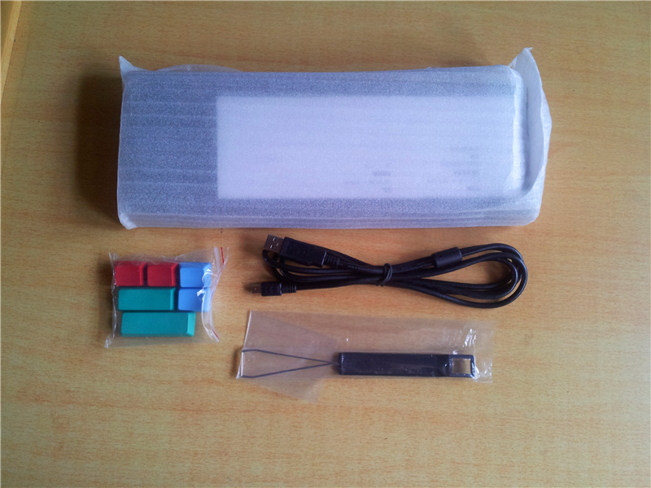

真身，本来我以为是黑色，但是好像是偏灰色。

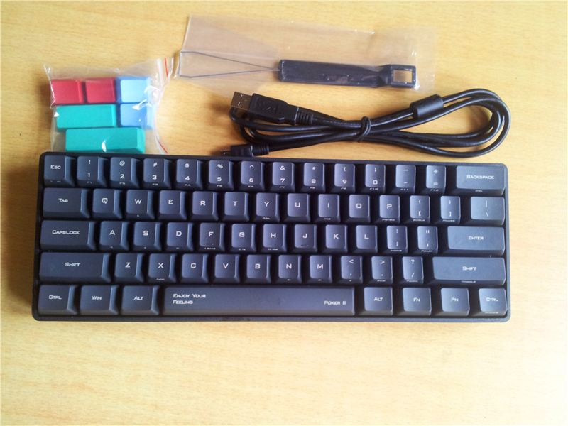

底部的铝牌：

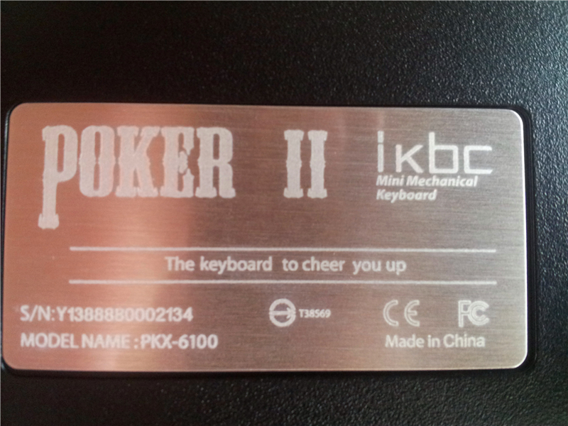

用拔键器拔下一个，茶轴：

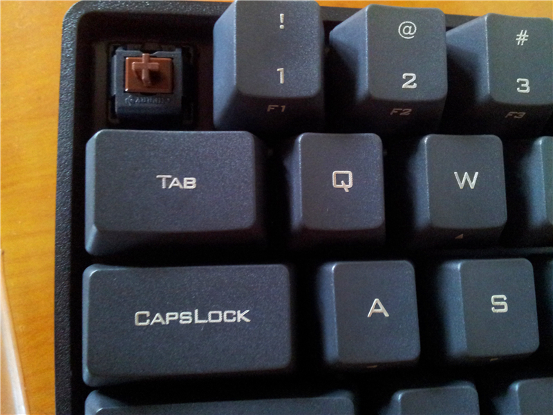

键帽：

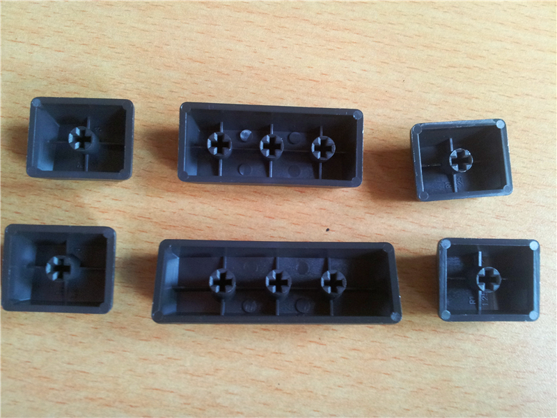

换上无刻彩色键帽，不那么死板了。。。

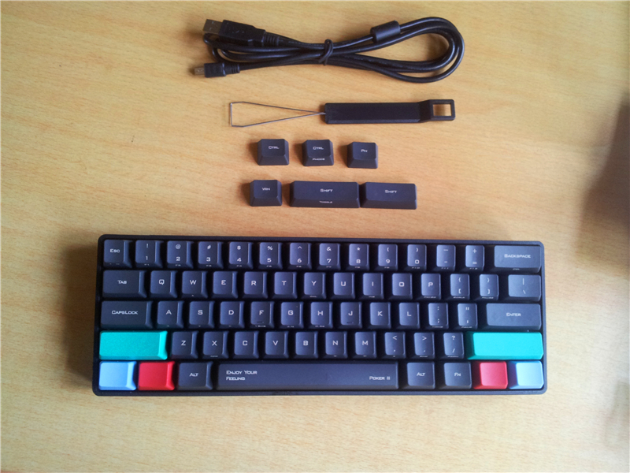

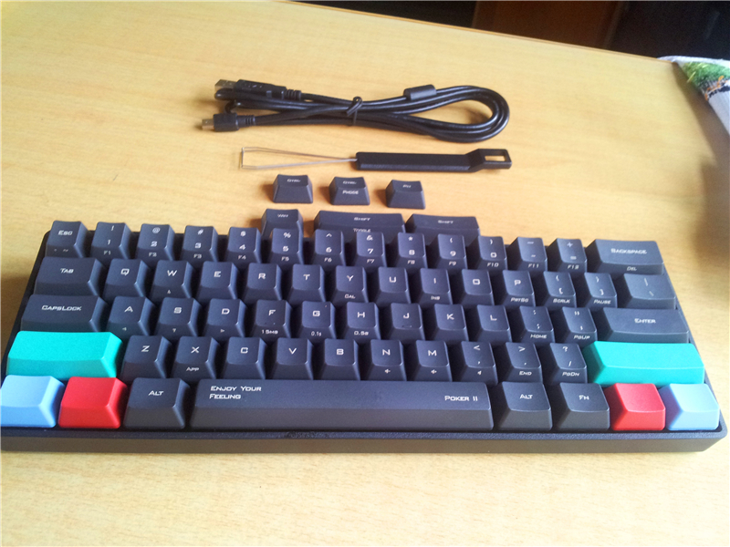

中午到现在使用了一个多小时，感觉茶轴买对了，输入很舒服，就是因为60%键盘，无用的键基本都没了，一开始有点不太习惯，老打错字，还有，没有上下左右键，要fn+w,s,a,d,来代替，有点不习惯，不过估计问题不大。一些键的搭配还要看看说明书，就这样吧。

---

> 作者: Anonymous  
> URL: https://clearsky.me/kbc-poker2/  

