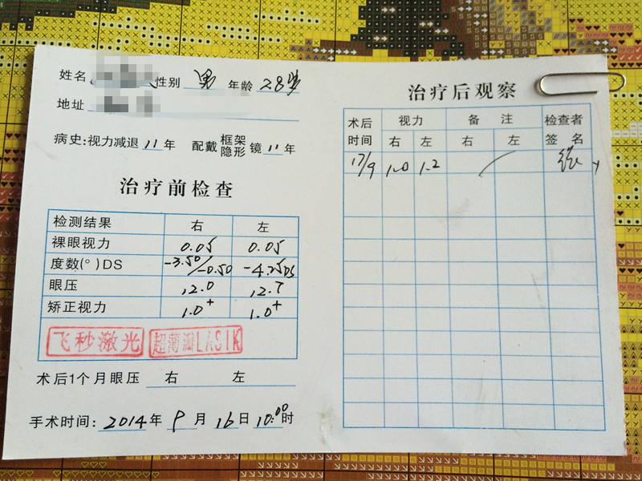
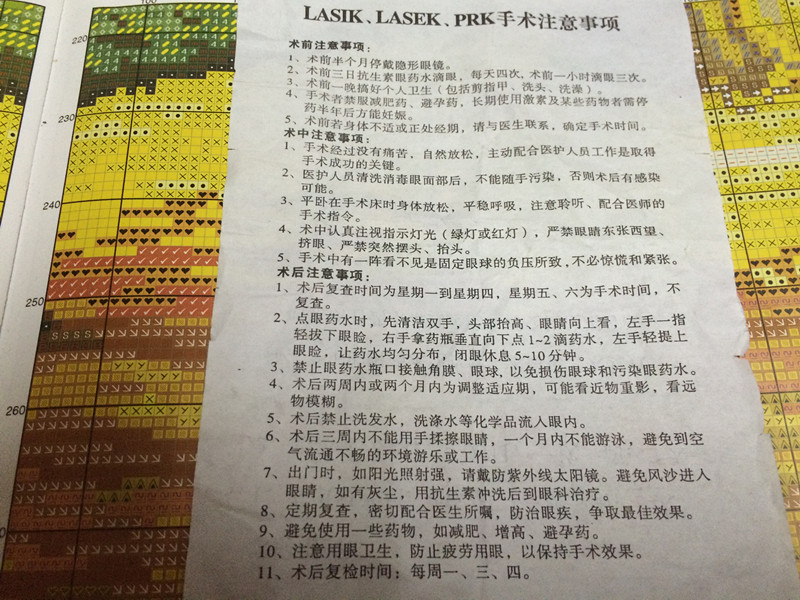
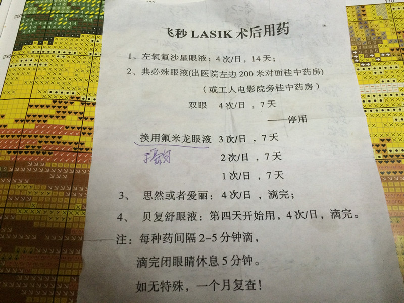
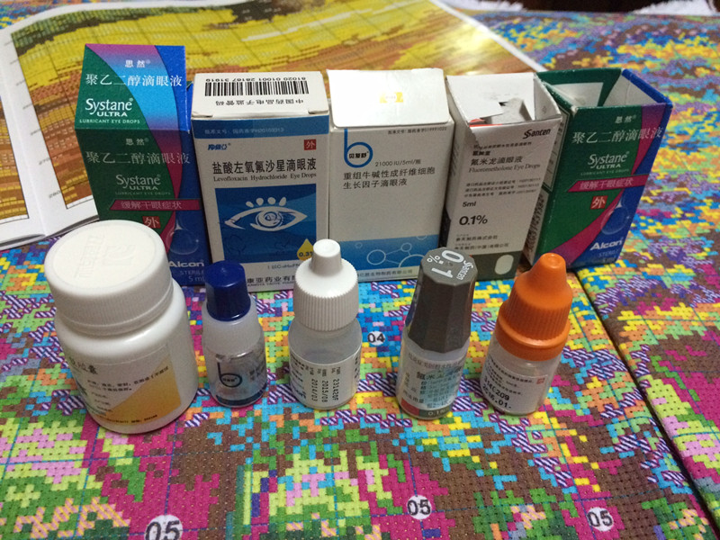
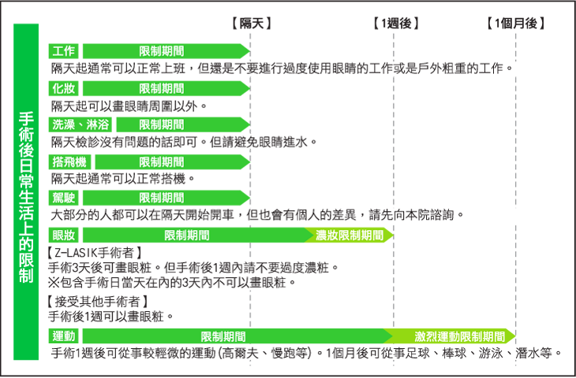
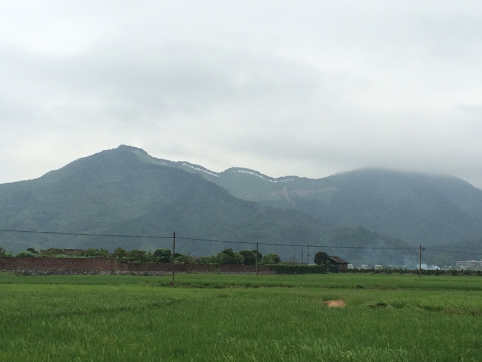
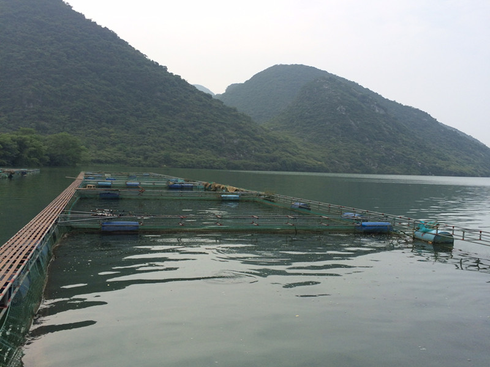
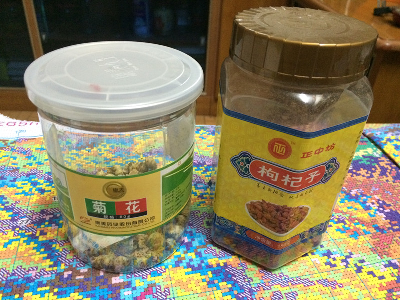
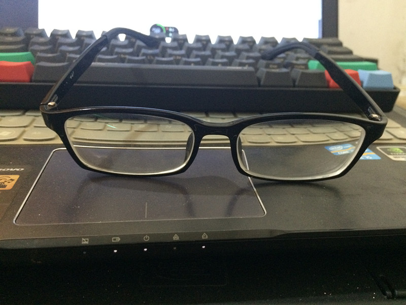

# 视力矫正手术

最近刚做完视力矫正手术，算算已经二十多天没打开电脑了，这篇文章也是断断续续在手机上记录在印象笔记中的，因为手术后不敢用眼过度。今天有空，稍微整理一下发布出来。

#### 近视史

戴眼镜11年了，第一次是在初三，那个时候沉迷于玩游戏，红白机，黑卡机，ps什么的一直玩下来，而且为了躲避父母检查，经常是半夜爬起来玩，光线不好又喜欢趴着盯着屏幕，渐渐的，就有点近视了，那时候个子算高，上课的时候坐在最后一排，看黑板的小字有点模糊，刚好同桌是四眼兄，借他眼镜戴着看看，感觉好清楚，于是当时做了个非常脑残的决定，让他帮我配了和他一模一样度数的眼镜下午帮我带过来。。。

就这样开始，注定离不开眼镜了，当然了，后面去配了适合自己的度数，接下来高中三年经常用眼不当，度数一直往上窜，高考完左眼350度，右眼400度，不过读大学的时候倒是没怎么涨。比较稳定了。

#### 手术决定

都戴这么久了其实也戴习惯了，根本不会感觉鼻梁上架着个东西，就是偶尔感觉不方便而已，其它的也没什么。其实身边也有朋友早就做了这种手术，效果还不错，都说没什么。但是自己老觉得要给眼睛来那么一下听着也挺恐怖的。就一直没做。

今年以来身体感觉不太好，想积极锻炼一下，这时候就感觉戴着个眼镜不太好运动了，碍手碍脚的，而且冷暖变化一层雾气罩上来，什么都看不清。我以前也试着戴过隐形眼镜，第一次花了差不多40分钟才戴上去，而且极度不舒服，就直接扔抽屉了。于是，有了动手术的想法。

于是慢慢的在网上看了下资料，有说好的，有说坏的，每当下定决心的时候又看到一条负面评论的，心中就又默默打退堂鼓了，想想还是再等等几年，等新技术出现的时候再做吧，正在一直纠结的时候，看到一句：

**『十年之后肯定比现在好多了，但是在保证安全的前提下，你等待10年值得吗？』**

是啊，一语惊醒梦中人啊，我纠结个毛啊！侧重关注安全性吧。

于是我看了一些相关资料如下：



[准分子激光角膜屈光手术问与答](http://songshuhui.net/archives/tag/%E9%87%91%E8%89%B2%E8%91%A1%E8%90%84 "科学松鼠会 &raquo; 金色葡萄") --来自科学松鼠会

[激光手术矫正近视：一场世纪医疗骗局？](http://songshuhui.net/archives/50753 "激光手术矫正近视：一场世纪医疗骗局？") --来自科学松鼠会

[近视眼手术有哪些风险和后遗症？](http://www.zhihu.com/question/21425599 "近视眼手术有哪些风险和后遗症？")--来自知乎

[对已经决定接受激光治疗近视手术的人，有哪些建议？](http://www.zhihu.com/question/21277398 "对已经决定接受激光治疗近视手术的人，有哪些建议？")--来自知乎

[全飞秒激光Smile手术与飞秒激光LASIK手术的区别](http://changzhengdr.blog.sohu.com/278498151.html "全飞秒激光Smile手术与飞秒激光LASIK手术的区别")（视频不建议观看）



然后作了动手术的决定，有需求的也可以阅读一下自己做决定，上面第四个的视频建议别看，虽然是三维动画的，但是对手术有点影响，后面会说。

#### 手术前检查

刚好有10天多的假期，玩了几天之后，就去医院做检查了，去之前做了电话预约的，得知整个手术需要3天，第一天做检查，第二天手术，第三天复查，没事就可以回家了。到了LZ工人医院的飞秒中心，在前台护士那里填了一张表格，等了一会就被人带去做了常规检查，步骤和在眼镜店配眼镜差不多，就有一个不太一样，就是拿着一个类似激光笔的东西照射眼睛，告诉我这东西不会碰到我眼睛，要坚持盯着它看那么十几秒，明天的手术也是类似的这样的红点。

再接下来往眼睛里滴了一些药水，按照网上查的资料，我知道这是散瞳剂，散瞳后还要做一次检查的，鉴别真假性近视。滴完后几小时内瞳孔增大，看近处会头晕看不清，果然，护士给我的解释差不多。还有一个，散瞳后上厕所的时候看了一眼镜子，感觉整个眼睛很干净，没有一丝血丝，像婴儿的眼睛一样，但是，少了灵性，只是白而已。常规检查结束之后，裸视力双眼都是0.05，度数左眼-4.25DS，右眼-3.50/0.50（这个看不懂），反正我戴眼镜就是左眼350度，右眼400度，眼压左眼12.7，右眼12.7，如图：

之后就和医生讨论手术方案，因为我的角膜厚度是左眼501um，右眼507um，正常人的角膜是在500um-560um之间，恰好我是正常范围的低值，因此医生建议我做全飞秒超薄瓣LASIK，能省点角膜，按照网上的资料，角膜保持410um以上是比较安全的，我近视度数不算高，做完大概还有460um左右。最终，我做的手术方案是飞秒+波前相差+虹膜跟踪+旋转定位，反正也不知道什么意思，只知道是这个医院最贵的了，暑假+国庆期间优惠，打完折手术费9300，加上其它的药费，办就诊卡之类七七八八的费用，1w多一点。

接下来没什么说的了，刷卡，领药水，回来后，两种药水轮流滴够次数，洗个澡舒舒服服睡一觉，准备明天的手术。

#### 手术过程

第二天起了大早，早早来到治疗中心，和我妈一起去的，手术后不方便，有人领着回家好一点。

前台护士带领着做了一次术前复查，确定个人数据，和我说今天是主任做手术，手术之前先去主任办公室聊会天，大致谈话内容就是手术过程的一些注意事项，主要是放松，要配合之类的。出来之后发了一张注意事项的纸片，说坐下看一会，确定了然后在协议书上签字就准备手术了。小纸片：（写这篇文章的时候翻出来拍的，已经皱巴巴了，将就看吧）

签了字就等着做手术了，这天早上有8个人做，都坐在那里等，大都都在玩手机。一次进去两个，轮到我的时候，护士说你怎么穿个短裤来了，我还奇怪眼睛手术和我穿什么裤子有什么关系。进去的时候才知道里面要恒温的，冷得很，护士说忍忍吧，等会上手术台的时候给你盖个毛毯，在手术室外面的等待室，换上了手术服，用药水清洗眼睛消毒麻醉等等，然后就老老实实坐着等。

过了一会，和我一起的那位被叫进去了，大概十分钟后，门打开了，换我进去，上了手术台，我就后悔之前在网上看了手术过程的三维动画，因为接下来医生做的每一步，我都知道他在我眼睛上干了什么，心想真脑残，我什么都不知道进来躺十分钟就完事了多好，手贱看什么手术过程，这下这十分钟难熬了。大致过程不细说了，有兴趣可以看上面的视频。大致是用一个东西撑开眼皮固定住，闭不上眼睛，然后一个镜头一样的东西压下来，暂时你就什么都看不见了，能看见后让你盯着一个红点看，之后打激光之后闻到一股类似皮屑烧焦的味道，之后看到有东西在眼球上扒拉几下，就完了。

双眼做完，出去等待室，另一名医生让对着一台仪器做一次检查，他检查完说了一句“怎么瓣膜有点皱”，然后和手术室里面说了下，让我等会再上手术台一次，我当时就囧了，有点皱是什么意思，再上一次什么意思。没办法，进来了就老老实实的了，几分钟后我又躺在手术台上，医生和我说别紧张，你刚才做完睁眼闭眼动作太大了，瓣膜被挤压到了，有点皱，稍微调整一下，又有东西在眼球上划了几下，出去之后检查没事了。然后用两个眼罩固定在眼睛上，交代回去别使劲睁眼闭眼，好好休息一晚明天来复查就行。

#### 手术后

回家吃点东西直接就睡，几个小时后麻药过后，开始流眼泪，偶尔有一点点刺痛。但问题不大，就是感觉泪水，药水之类的混在一起，又不能擦，有点脏，迷迷糊糊睡到半夜醒来，偷偷睁开眼睛往眼罩上的那个孔往桌子上看，模模糊糊一片，往窗外看，楼下停放的车子车牌在灯光下却很清楚，果然和我所了解的一样，手术后看近处不清楚，总有个类似拍照时候对焦的过程，看远处却很舒服。这种情况大概十天到一个月之后消失。第二天复查，摘掉眼罩，护士用眼药水和棉签帮忙清洗了眼睛。复查视力左眼1.0，右眼1.2，我倒是不怎么在乎这些数值，等看得清楚就行。医生嘱咐这个月视力波动也是正常的，按时滴药，注意别用眼过度。术后用药：

就是这一堆药水了，滴得每天嘴巴都是苦苦的：

按照这个图

#### 术后注意事项，感受和问题

手术后20多天了，术后这段时间的注意事项可以参照这个图，网上搜来的：

感受嘛：世界变得清晰美好了。

问题嘛，术后可能出现的后遗症：

干眼症：这个我倒是没有，就是长期用眼感觉比以前容易累，还有就是眼睛对烟尘之类比以前敏感了，个人觉得问题不大。

眩光：这个貌似100%会有的问题，就是晚上看灯散发出来的光圈会比正常人的大，这个不算什么问题，据说过段时间就会好，其实不是好了，而是你的眼睛适应这个现象了，自动调节到让你感觉不难受而已。

夜视力减弱：这个感觉好像有点，但是好像也没什么影响，就是光线昏暗的地方看得没以前清楚，正常灯光下还是没什么问题的，后来想想这也不算什么问题，光线昏暗下本来也看不清楚的，多一点少一点差不了多少。

其它的暂时没发现。

杂七杂八：手术后这段时间早上有空喜欢在河堤和山脚下转几圈，看看青山绿水，眼睛挺舒服的。

跑步到山脚：

水箱抓鱼：

洗澡：一开始是个麻烦问题，不能碰水，洗一次挺麻烦的，特别是洗头，每次都是小心翼翼的慢慢用湿手巾慢慢擦，后来习惯就好，速度也快了不少。

饮食方面：基本没什么忌讳的，少吃点辣最好，适当补充维生素A，防止干眼症和增强夜视力的：
富含维生素A的水果：梨、苹果、香蕉、荔枝、西瓜、甜瓜。
蔬菜：马齿菜、大白菜、荠菜、番茄、茄子、南瓜。
实在不行买一瓶维生素A+D，几块钱一瓶，一次一粒，能吃一个月。

最近这几天喜欢用菊花和枸杞泡茶喝，清肝明目挺好的，已经消灭大半罐：

最后，感谢陪伴我11年的眼镜兄，当然，这是最后使用的那副：

---

> 作者: [pagezen](http://clearsky.me/)  
> URL: https://clearsky.me/lasik/  

