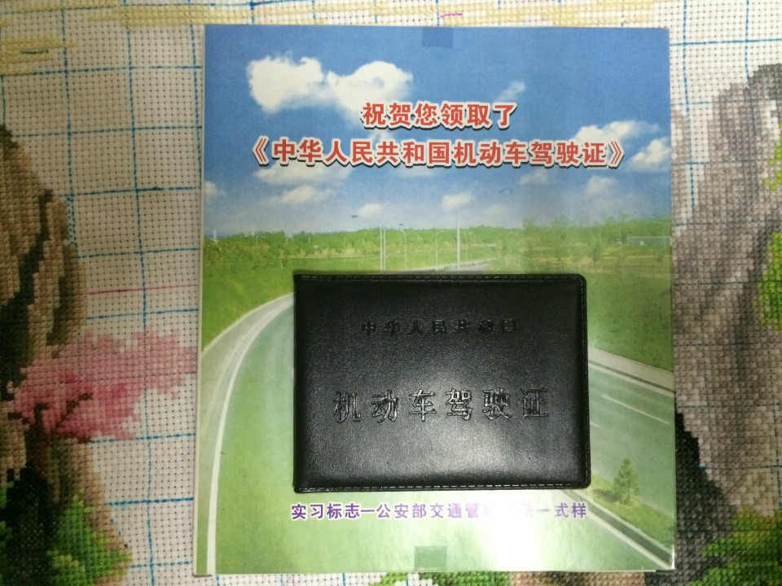

# 学车记

说来挺囧的，本身对操作机械之类的东西就没什么兴趣，但是这东西还是需要的，于是去年4月就报了名，之后拖延症犯了，一直没去，后来到了年底工作忙了就没时间去了。

今年初工作换了新的岗位，离家近了，相对来说时间多了一点，于是3月份去考了科目一。4月中旬开始打电话给教练说我要开始练了。教练还说都一年了都快把你忘了。去的第一天，我这种从来没碰过车的感觉还挺新鲜，踩离合不给油直进直出这么无聊的事情也玩了一天。

第二天去的时候才发现头天其实好多人没来，人多练就没那么容易了，早八点晚六点一整天下来，能上车的时间也就半小时不到，太难等了，而且工作上也卡得紧，感觉时间没这么多，教练说这个月考试名单要报上去了，问我报不报，我只能说下次吧，但是不报名上去，来练车就相当于占用了这个月要考试的人的练车时间。于是只去了两天就作罢了。

感谢这两天的这只小狗，让我在等上车的时候不那么无聊：

又过了一个多月，都6月份了，想着这样等着也不是办法，硬挤出时间去吧，打电话联系教练，他说这一期都开始几天了你基本什么都没练过，还有10多天考试，看你能来的时间也不多，来得及吗？我想着反正越往后也越没时间的，考了再说。接下来这10多天是挺折腾人的，早上上班，中午急忙赶去驾校开一趟，跑完就赶回来上班，下班后又赶过去一趟，有时候实在没时间就不去了，总之10多天下来，整套场地考试（倒车入库、侧方停车、半坡起步、直角转弯、曲线行驶）总共也就练10趟左右吧。而且没有一次是能通过的，实在是太赶了，匆匆忙忙上车，什么参考点啊，后视镜啊都顾不上听了，跑完一圈就上班去了。

6月18号科目二，刚好那两天休息，考试前一天晚上去了一趟驾校，一人熟悉一圈，我刚好是排在后面的，人基本走光了，我和一个同期的多转了几圈，他和我说了一些参考点之类的，我试了下，勉勉强强能过了，第二天考试的时候了还来了场大雨，等了半天雨停了还得等场地干了才开始考试，反正我是下午一点多才开始考的，饭都没吃（不知道什么时候叫到我，不好走开，一起学车的给了个小面包吃顶了一下），三人一组进去，我是最后一个，前两个转一圈下来都挂了，搞得我都紧张了，不过上车之后就一点都不紧张了，大不了补考呗，开了再说，大概5分钟后，副驾驶座上面的仪器发出一声“考试通过”，看了一眼，还是满分通过，运气不错。

几天后科目三，也有点小插曲，第一次快开到终点了，前面有个面包车挡着考试用的那个临时红灯，没注意看，直接闯过去了，直接挂了，还好现场补考一次，过了。考完科目三一个月后才预约科目四，现在正在等待中。。。

* * *

2014.7.22更新：

去驾校考场考了科目四，去之前两天都没什么事，无聊就用手机看看题目，算是背得滚瓜烂熟了，电脑上面考完点提交，弹出一个“未满五分钟，不允许提交试卷”，囧。。。最后错了一题98分。

* * *

2014.8.8更新

接到教练电话，叫我去拿证，到了交了30块钱领了一本劣质壳套包的驾照和两个实习期标志，图：

---

> 作者: Anonymous  
> URL: https://clearsky.me/learn-to-drive/  

