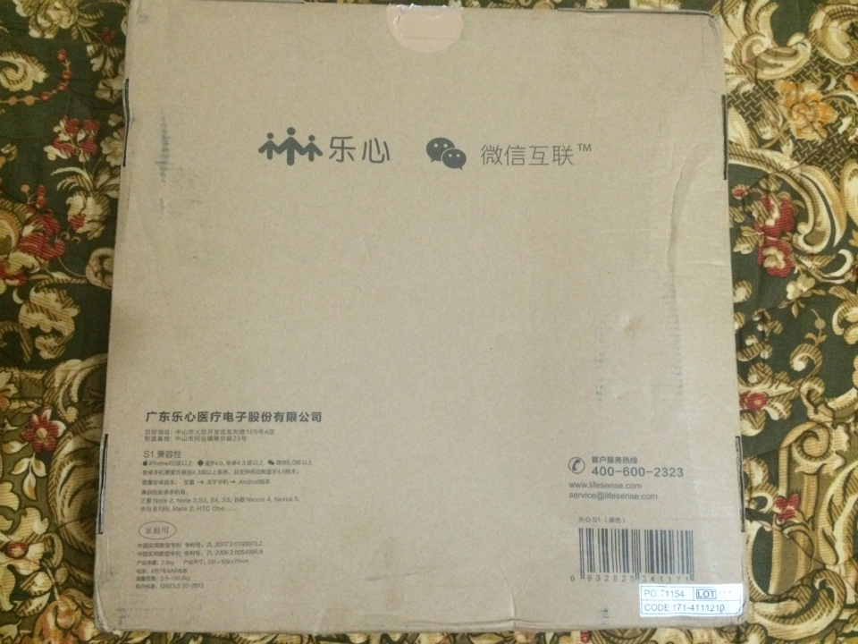
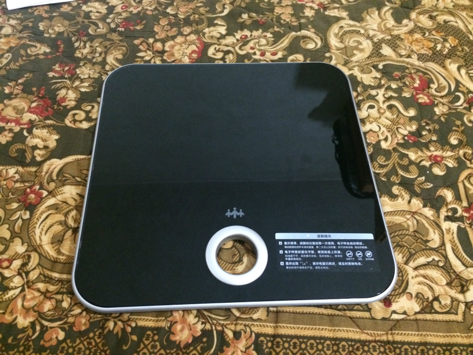
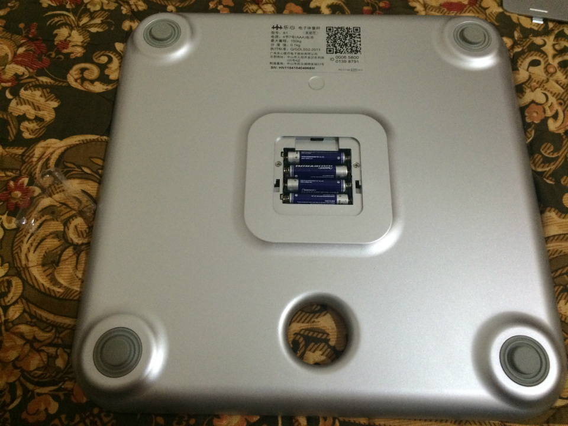
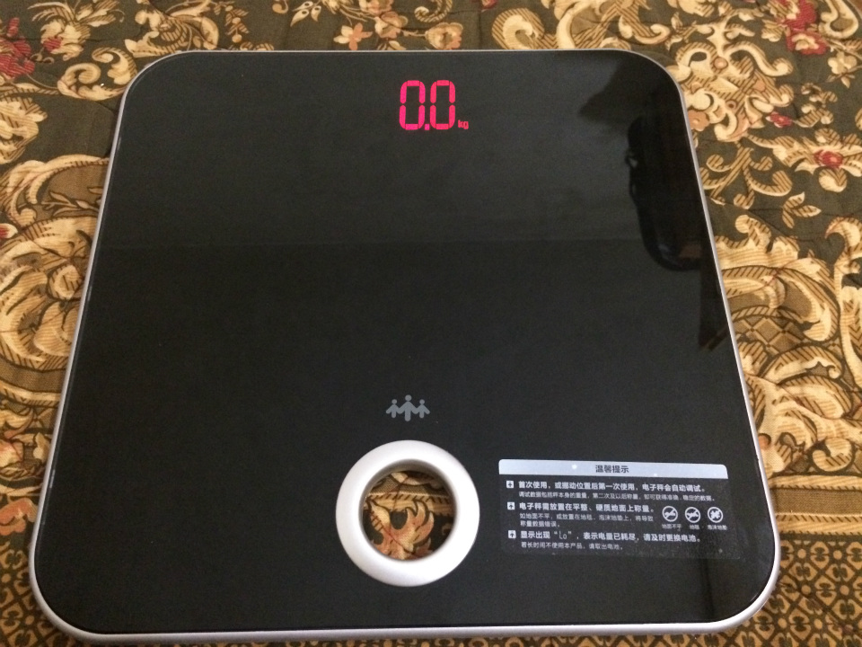
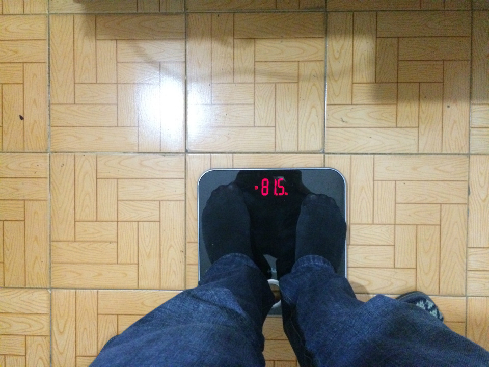
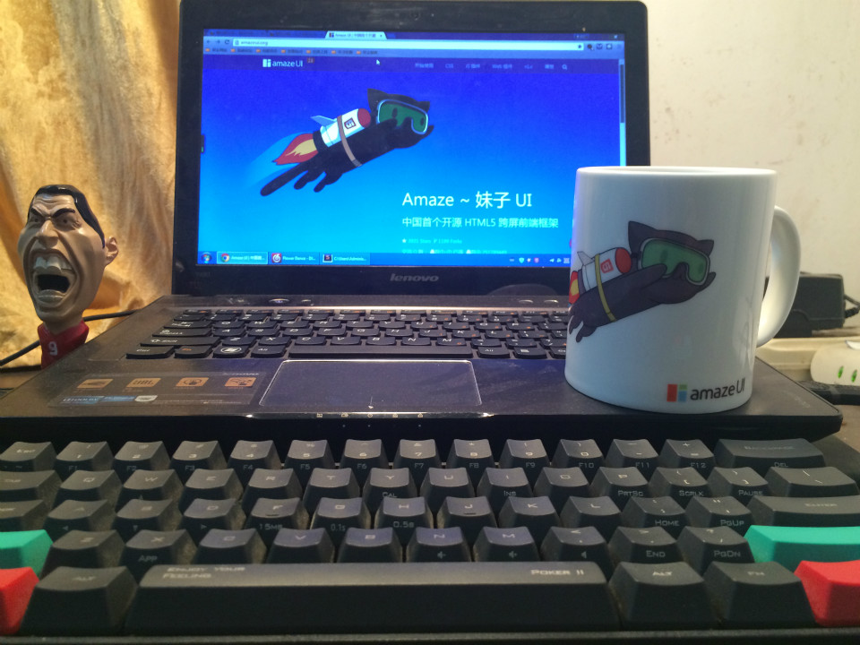

# 买了个乐心 S1 体重秤

最近好像体重下降了，自己又不太确定，想着家里面有个体重秤还是挺有必要的。于是在随便搜了一下，发现现在体重秤也打智能牌，什么乱七八糟的都有，什么测体脂的，骨量的，看得头晕。想想就偶尔称称体重，没必要搞这种，随便买一个低端的就行，本来想买小米那个，不过那货99元还要加15元的配送费，而且看下面又是缺货，实在是烦搞这种饥饿营销。算了。网上看这个乐心S1还挺多人买的，也是99元，也懒得看什么参数功能之类的了，就一体重秤，只要精度正常就行，直接马云家付款拍下了。今天下班回家，包裹到了：

拆开了包裹看正面，我买的是黑色，看着镜面材质还行，挺亮的，一看就是指纹收集器:

翻过来看菊花，包裹里还配送4节电池，为什么这个价位都不搞usb充电的？不管了，直接塞进去：

再翻回来就显示屏点亮了:

试试效果，在地板放平了站上去：

呵呵，连续试了几次都是这个数值，我身高178，按照两种古老的算法（没依据），（178-100）*0.9=70.2kg，或者（178-105）=73kg，我应该算偏胖。

顺便说下还有这个秤还有蓝牙同步测量数据到微信公众号的功能，支持多人数据统计记录，测量体重而已，我就懒得麻烦了，没去弄。

大概就这样吧，没什么写的，凑凑数，顺便放个上次参加AmazeUI活动送的马克杯。

---

> 作者: Anonymous  
> URL: https://clearsky.me/lifesense-s1/  

