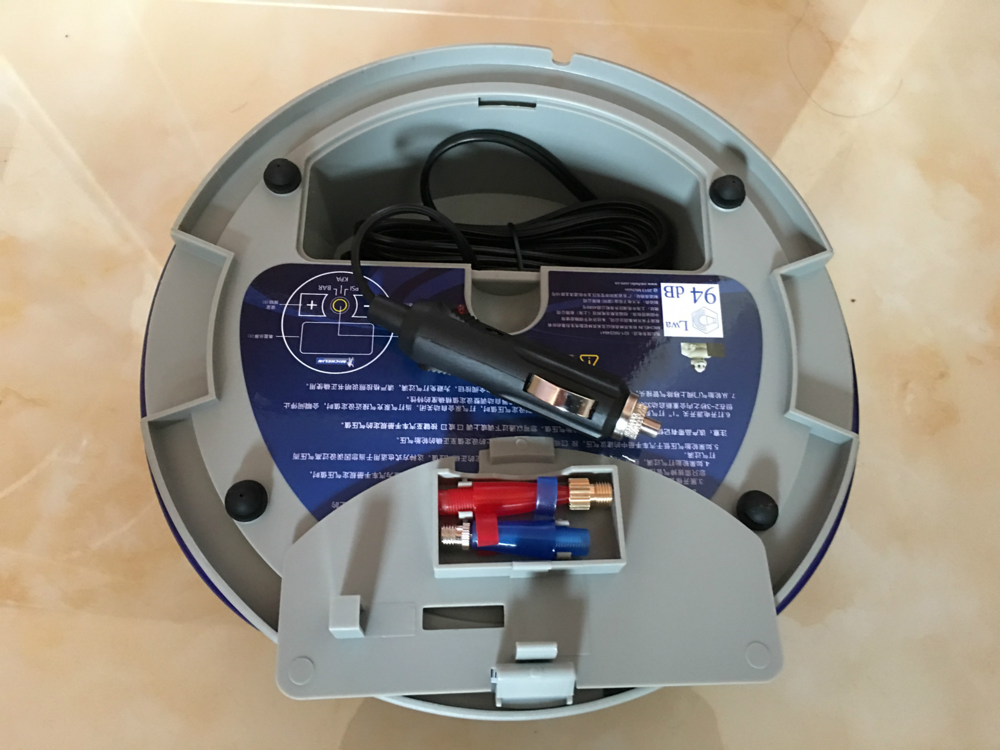

# 购买米其林车载充气泵和伟力通无线胎压监测

## 起因

前段时间晚上开车出去宵夜，回来的路上发现胎压监测报警了，路过洗车店让老板测了下胎压，发现左后轮胎压只有 1.8 bar了，当时天黑看不清有什么东西，也没在意，就直接让老板帮充了气让我能开回来就行了，顺带说一下，除了这个轮胎异常，其他 3 个轮胎胎压太高了，全部是 3.0 bar,全部是出厂时候的胎压，上次首保的时候我就让 4S 店把胎压放低了，估计给忘了，难怪我说怎么老感觉悬挂太硬了，亏我还顶着这么高的胎压跑了这么多次高速，让老板帮我把 4 个轮胎全部调到 2.5 bar，开回来的时候感觉和以前完全是两辆车，舒服太多了，虽然油耗会有所增加，不过无所谓了。

过了 3 天，下班回家路上胎压监测又报警了，估计还是那个轮胎，唉，肯定是扎胎了，这里鄙视一下马自达，都顶配了还不给我个显示哪个轮胎胎压不正常的胎压监测。找了本地一家补胎店，和老板聊了一下发现还是老乡，他测胎压的时候发现除了左后轮，右后轮也不正常，拆下来看，左后轮一颗稍大钉子，右后轮一颗小的，小钉子扎得不深，漏气慢，所以上次在洗车店测的时候没感觉。漏了 3 天才低到报警，还不算严重，老乡手挺快，15分钟就补好了，没用火补，蘑菇钉呢我觉得这一点点也没必要，用的他推荐的自粘型补片，据说对付这种轮胎小伤比较好。

## 考虑 1

经过这次，觉得自己配个测胎压的工具还是有必要的，本来想买个60多块数字显示的，跑高速之前测一下就行，后来想想，要是哪天又被扎了我光知道不正常有个毛用，还不是得找充气的地方，后备箱常备一个充气泵还是有点必要的，虽然一年估计都用不到一次，但真需要的时候一次就够本了。脚踩充气泵肯定不考虑了，因为使用的时候那个场景看起来真的好傻，还是车载接点烟器那种方便省心省力，于是京东上翻了一下，找到这货：

## MICHELIN 米其林 充气泵 4389 ML

米胖子家的，应该还可以，可以预设胎压自动充停还是很方便的。等了2天，到货了，外包装，使用 12V 电源：

全部配件，说明书、保修卡、保险丝，保险丝站在盒子上面的，注意看清楚别跟着盒子一起扔了

正面：

背面照，背面的小盒子里面还有其他的充气头，用来充球类或者自行车、皮筏艇之类的，对我来说没什么卵用：

## 考虑 2

现在能自己充气了，还有个问题，前面说的马自达的坑，感觉还是需要能实时显示每一个轮胎的胎压值比较好，这一类产品一般分内置和外置两种，两者区别如图：

外置的安装方便，数据不如内置准，不需要做动平衡（这里提下，那个感应器有 9 克重，按实际理论应该要做动平衡，不过就多一点点，不做也可以，看个人吧），还有外置的感应器容易丢，虽然这年头没人会偷这个，不过熊孩子手贱是很有可能的。

内置的显示数值应该比较准，但需要拆轮胎，还要做动平衡。

我对显示数值精准度要求不是很高，差不多就行，主要是嫌拆轮胎麻烦，所以这里买的是外置的，刚好在什么值得买上看到伟力通京东专供这款在搞活动，所以就买了下面这款，也没太纠结。

## 伟力通太阳能胎压监测无线外置 T6SL

到货有几天了，这这段时间一直下雨，没心思弄，先扔几个图：

懒得写了，哪天装上了再说，先这样吧。

更新一下：

看着外面不下雨了，跑到老房子那边安装了一下，先用带数显的充气泵测下胎压，全部是 2.5 bar，不用充气了。那么直接安装胎压监测器吧。

建议先打开胎压监测器，每装一个就看看有没有显示，要不后面没显示还得重新拆下来一遍。

先扭下轮胎螺帽，先顺时针扭入那个防盗垫螺环，别扭太死了，等下还要反方向扭回来，然后顺时针扭入感应器，注意每个感应器对应的轮胎，别安错了。

然后把防盗螺环片用手逆时针扭回来，手扭紧后，再用那个专门的小扳手再扭紧一点，这个小扳手别弄丢了，以后拆下来需要用到，没这个扳手很难拆下来。

4 个轮胎一起完成后，和充气泵合个影：

最后胎压监测显示器在车上找个位置放就可以了，背面带 3M 胶的，想粘哪里粘哪里。我不喜欢粘在车上，就直接扔在挡把前面的储物槽了，一般也不用总是盯着看，偶尔瞄一眼就可以了。

显示器正上面是太阳能板，说明书上说晴天 2 天充满，阴天 1 周充满，要是临时没电了，还有个 usb 充电口，不过没有配数据线，看了一下，就是大多数安卓手机数据线插口，晚上回家拿一根扔在车上备用。

至于感应器的电池，用的是常见型号的纽扣电池，按照它说明书说的功率，保守估计能用 2 年吧，足够了，估计到时候这货坏了电池电量都没用完。

最后，这货显示得还挺准，和我那个充气泵显示得数值一样，都是 2.5 bar，四轮胎压显示一样看着真舒服~

---

> 作者: Anonymous  
> URL: https://clearsky.me/michelin-4389ml-and-victon-t6ls/  

