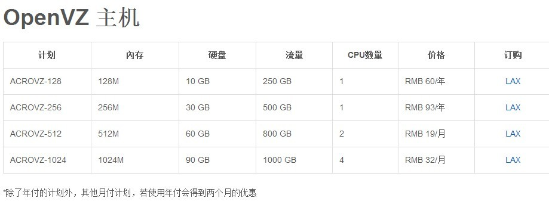
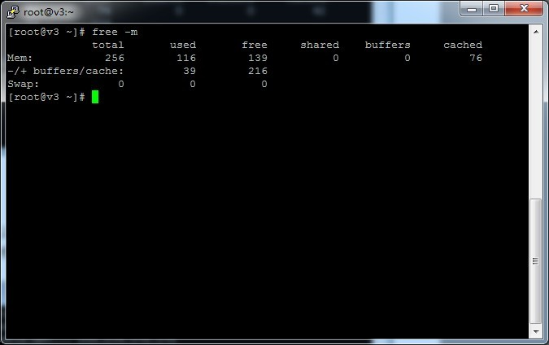
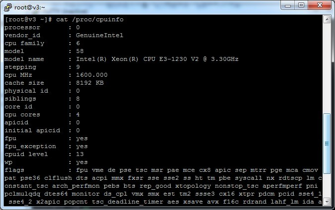
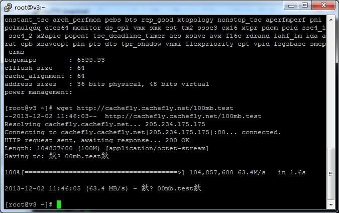
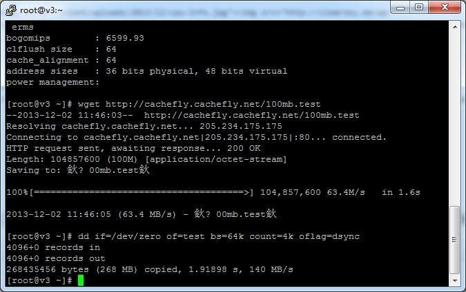
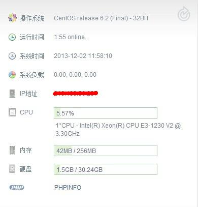

# 搬家到 AcrosVM


虚拟主机还有3个月到期了，登陆到控制面板里面看了下，去年买的小容量虚拟主机，大小200MB，目前空间用了54%。 本来想升级个套餐的，因为vpsaa的虚拟主机确实还可以，这一年来基本没什么问题，还挺平价的，以前我还说过不想折腾用虚拟主机挺好的。 但是最近有朋友问我要“翻墙梯”，最近自己也突然想折腾一下了，还是转到vps上玩玩吧。

## 需求

至于买哪个，我一般都针对自己需求：

1.  我要求不高，放个基本无流量的wordpress + 搭建梯子 + 一些命令学习，配置够用就行。
2.  付款简单点好，我懒得信用卡，paypal，财付通运通账号之类的。
3.  E文烂，最好有中文客服，但是这个有利有弊，国人扎堆的vps你懂的。
4.  线路稳定点，速度稍微慢点无所谓，但是天天抽风就不好了。

## AcrosVM

说说买的这个vps吧，AcrosVM，引用官网的介绍：

> AcrosVM是由美国Hostigation的開展的直属品牌，提供OpenVZ架构的VPS主机服务。 Hostigation自2006年开始提供服务，和Highspeedweb, AcrosVM 為同一集团品牌。
> 呵呵，看是Hostigation旗下，这家挺不错的，好感度+1。 AcrosVM支持支付宝，有中文客服，美国西岸 QuadraNET（PR）的数据中心. 基于openvz,管理面板是SolusVM，面板上可以自行打开`tun/tap` `ppp`,作用你懂的。 OpenVZ各个套餐： 



### 购买

年付送2个月，我买的是ACROVZ-256，也就是14个月/93RMB。算是很低廉的价格了。 这里要是注意的是：这里的套餐**无突发内存**，128内存的装环境比如lnmp1.0可能会提示内存不够，购买前多考虑。 这里有个囧事，其实昨晚21：00我就下单了，好久没碰支付宝，一堆控件乱七八糟，加上网络不好，连续下了4个订单。。。 到后面还输错支付宝支付密码3次，等了3小时才解锁。凌晨才支付完成。对了，这里支付宝付款最好选即时到帐。 想着今早起来应该开通了，一早起来还是等待中，直接发了个tk，一分钟后开通了。

### 测试

老一套： 先看内存，无突发。


CPU：凑合



速率：凑合。



硬盘IO：比我想象的好。



管路面板重装了centos6 32位，懒得麻烦，直接装了AMH4.2，打包一下原来虚拟主机的数据，转过来了。



怎么说呢，感觉原来的虚拟主机还没到期，又换，挺浪费的，虽然钱不多，但是需要克制一下了。

* * *

晚上更新下，amhftp上传大文件老出问题，搜索了下，一些办法试了也解决不了，懒得折腾了，直接后台重装，直接上了军哥的lnmp1.0。 控制面板开启 `tun/tap` ` ppp` 也有点曲折，开启后， 终端：

```bash
[root@vpn ~]# cat /dev/net/tun
cat: /dev/net/tun: File descriptor in bad state
[root@vpn ~]# cat /dev/ppp
cat: /dev/ppp: Permission denied
```

`tun/tap`没问题，`ppp`不行，这样就无法搭梯子了。 发了tk，客户说关闭再开启，再重启下试试，试了下，貌似没用。 后来有事出去了，回来之后重启下又好了，不管了，能用就行，搭个梯子试了下，能连上，发给朋友，完，睡觉！


---

> 作者: [pagezen](http://clearsky.me/)  
> URL: https://clearsky.me/move-to-acrosvm/  

