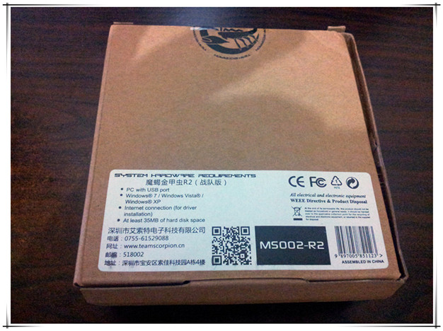
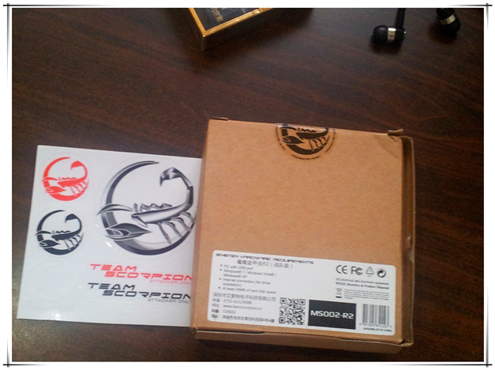
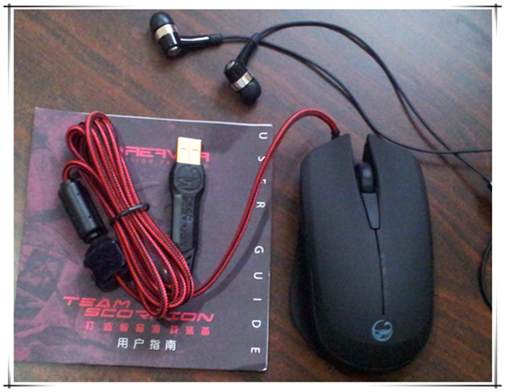
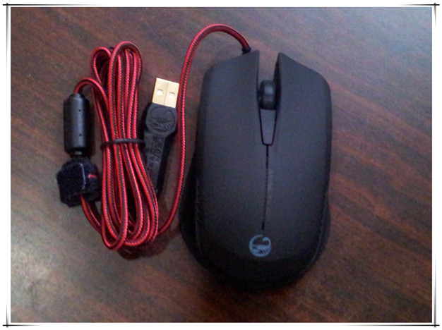

# 金甲虫2代

前段时间和朋友玩游戏的时候发现手上的鼠标飘得很，经常误点击，而且拿鼠标本来就小，握着很不习惯，顺口抱怨了下，朋友听了也打算换个鼠标，于是直接在某dota解说X宝店买个2个金甲虫2代，事实上我也不玩dota，买这个纯粹是它比较大，造型也奇葩。

今天到货了，拆开试了一下，还算凑合，大小还满意，就是重量123g对我来说还是太轻了。

四档dpi设置，500~2000，我个人习惯是1000，回报率：125HZ-500HZ-1000HZ。

插上usb接口试了一下，左右按键声音好脆，好像经不起狂点击的样子。中间滚轮搓起来比以前那个好，以前的每转一圈就会卡住一下。

好像不能关掉那个侧边的透光，大晚上不开灯的话，绿幽幽看着不怎么舒服。

包装盒里面居然还有解说的签名照，囧，男的就懒得贴了。

---

> 作者: Anonymous  
> URL: https://clearsky.me/new-mouse/  

