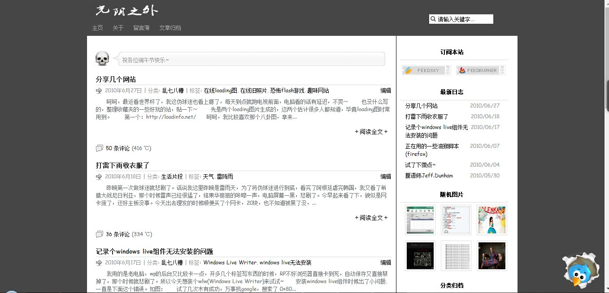
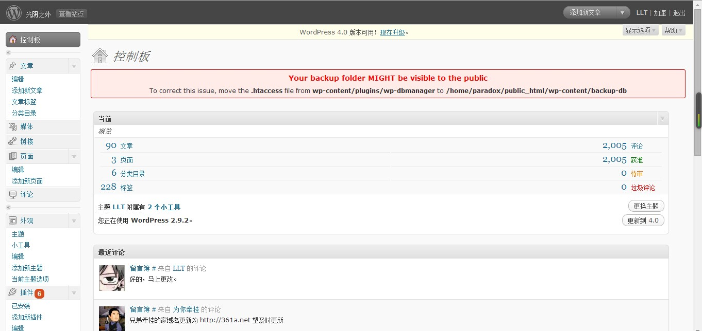

# 导入 09 年开始的老数据


今年5月[数据丢失](https://clearsky.me/start/ "新的开始")，5年的数据没了。

本来都不抱什么希望了，今天误打误撞登录到一个已经很久很久不用的网盘的时候，居然发现里面居然还留着一份2009至2010年的数据备份，附件什么的都在。

赶紧下载下来，搭建个PHP环境上传导入，刷新页面的看到的一瞬间，说不出的感觉。



呵呵，我记得以前用的这个主题是自己用那时候很火的主题[Elegant Box](http://www.neoease.com/elegant-box/ "WordPress 主题 Elegant Box")瞎改的，没什么审美水平，就是折腾着玩，不懂html，不懂css，遇到不会的就google，经常折腾到半夜。现在想想那时候真是精力旺盛~

既然有这备份数据，还是导入到这里来吧。虽然中间还是有一部分数据再也找不回来了。

操作数据库麻烦，懒得折腾，直接以前的wordpress后台，`工具`--`导出`--`下载导出文件`。

顺便贴个以前的后台截图，好怀念。。



导出后直接在这个新的这里导入就可以了，再把以前的附件上传上来就可以了，注意合并下以前的分类目录，页面。

接下来我一篇一篇的回味，哈哈，越来越想笑，以前真的太二了，顺带删除多篇转载或者只有几句话的文章。

删除一些文章后优化下数据库，顺便SQL删除所有未使用的标签。SQL执行：

```bash
DELETE a,b,c
FROM wp_terms AS a
LEFT JOIN wp_term_taxonomy AS c ON a.term_id = c.term_id
LEFT JOIN wp_term_relationships AS b ON b.term_taxonomy_id = c.term_taxonomy_id
WHERE c.taxonomy = 'post_tag' AND c.count = 0
```
完了，接下来再做个备份就可以了。

遗憾的是，评论里面的绝大多数博友链接我都打不开了，时间跳得那么快，转眼5年了，每个人都有自己的生活吧。


---

> 作者: Anonymous  
> URL: https://clearsky.me/old-data/  

