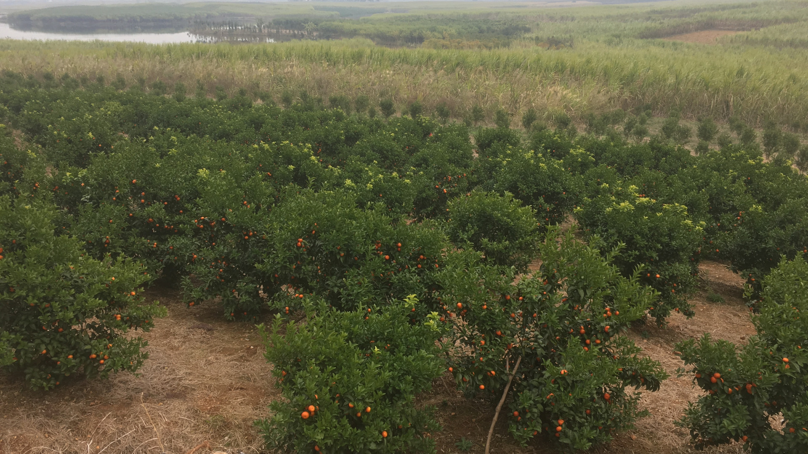
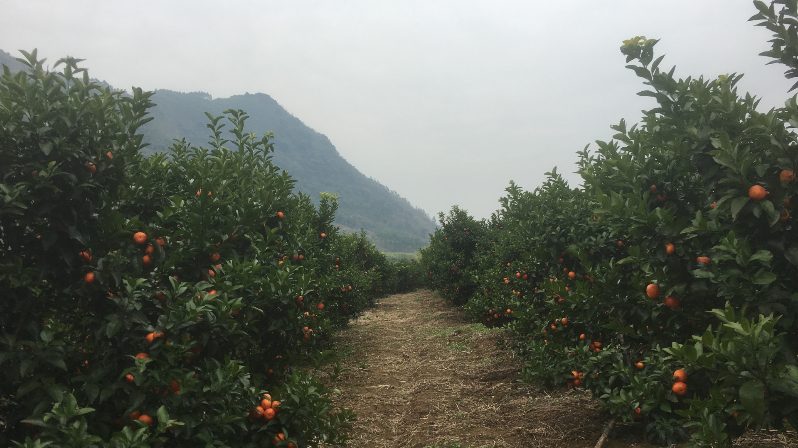
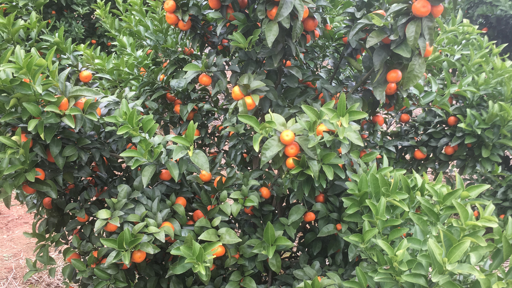
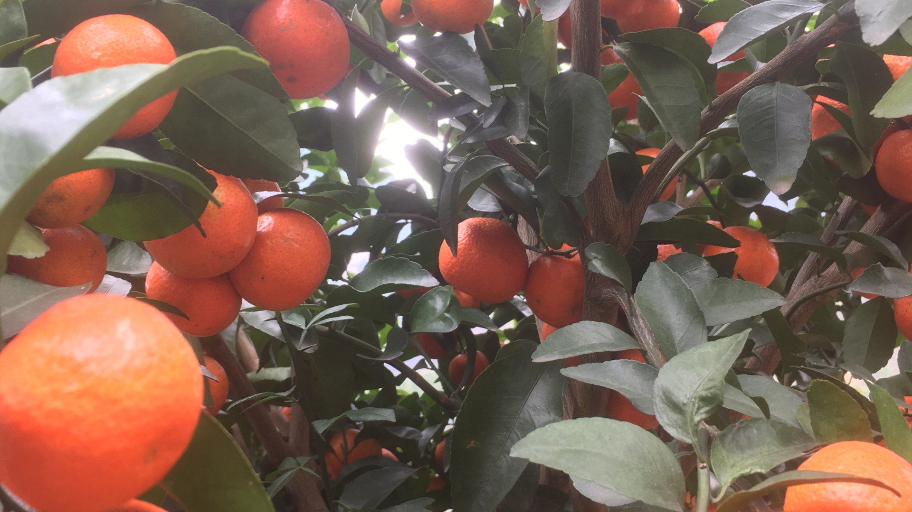
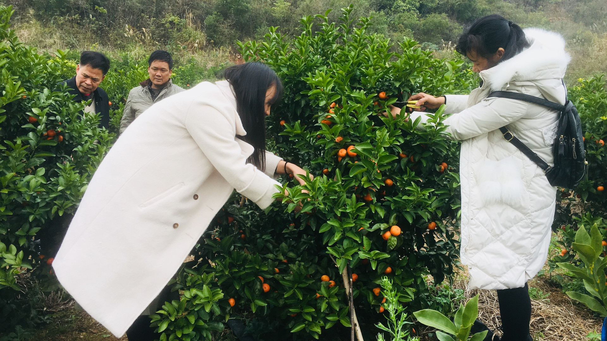
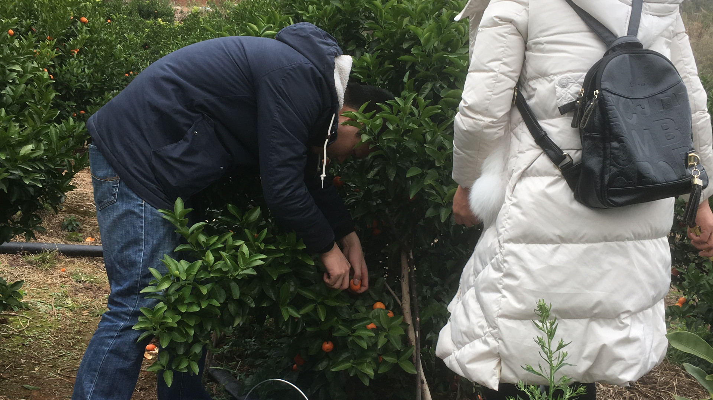
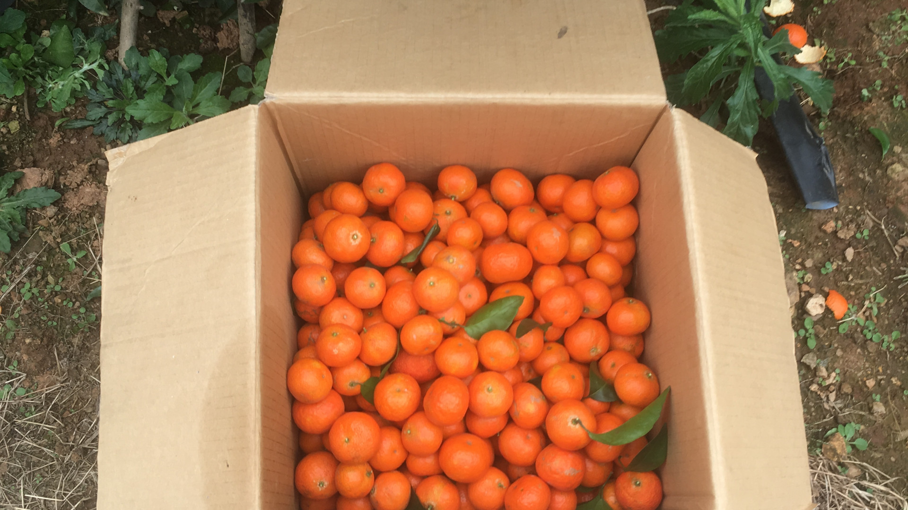
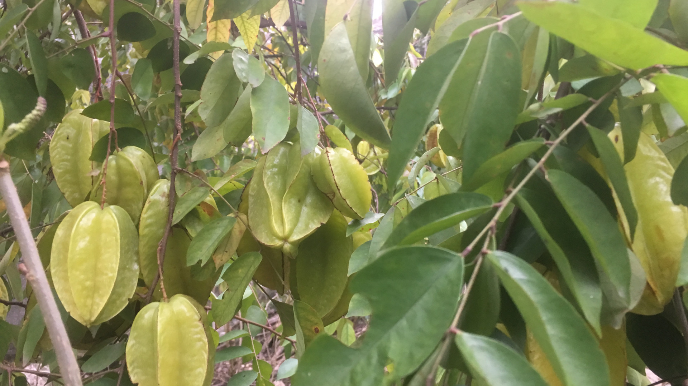
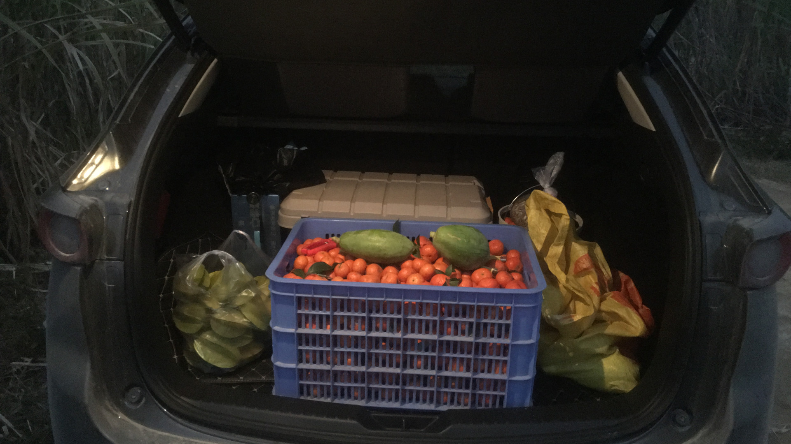

# 摘橘子

终于熬过了一年中最忙的日子，刚才今天休息，本来想宅一天看看美剧。

刚好爸妈都过来我住的这边看看，突然想想自己好像极少和父母一起出去玩过，本来一起打算到附近县城寺庙上上香之类的，但是外面又下了点小雨，想想还是算了，我爸提议到柳城姑父家摘橘子，打个电话过去，刚好是这两天摘橘子卖，而且那边不但不下雨，天气也还不错。决定出发。

午饭后，爸妈还有女朋友一行四人驾车沿三柳高速一路狂奔，1 小时后到达高速洛满东出口，在出口等了一会，姑父就来接了，直接跟车穿过长长的一片甘蔗地，到了果园。

站在山坡上看，这只是一个角落。

走近，并列好整齐：

近看，今年结了好多果子。

再近一点：

开摘，专用小剪刀剪剪剪：

装箱：

只是一小部分，又跑回去拿了两个大塑料袋才装完。回到姑父家吃完饭，发现后院的种的杨桃和木瓜不错,又爬上去摘了一大袋。

最后装车回家~

晚饭后，回家，好累，随便贴到这吧，今天大家都很开心，休息的时候多陪陪父母。

---

> 作者: Anonymous  
> URL: https://clearsky.me/pick-tangerines/  

