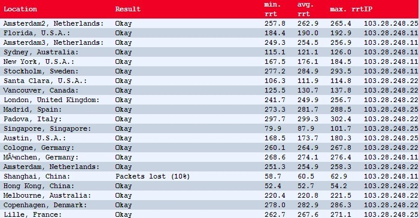
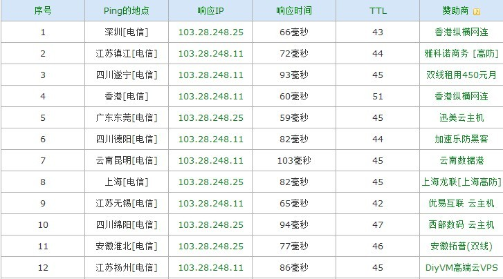

# 用了Incapsula的CDN加速


闲来无事逛逛hostloc，发现有位坛友发了个地址，访问速度还真挺快的。

看下面的回复是用了Incapsula的免费CDN加速，搜了下，这玩意最近还挺火的。

反正也没事，我也用用看一下，教程什么的网上一搜一大把，其实也不需要什么教程，注册帐号后按它的提示一步一步来就可以了。免费帐号貌似50G流量，反正这里是肯定是用完了，DNS直接A它的日本节点103.28.248.*，*号随意，防止被wall可以多设几个。


完成后打开网站后发现右下弹出有个类广告的东西，不知道是不是免费账户弹广告，看了页面元素，直接主题CSS里添加：


```css
.page-tooltip{display:none;}
```
就可以去掉，后来网上搜了下这玩意其实可以在Incapsula的后台设置不显示的。

至于加速效果：**just-ping**



**站长工具超级ping：**




---

> 作者: [u0defined](http://clearsky.me/)  
> URL: https://clearsky.me/20121215-%E7%94%A8%E4%BA%86incapsula%E7%9A%84cdn%E5%8A%A0%E9%80%9F/  

