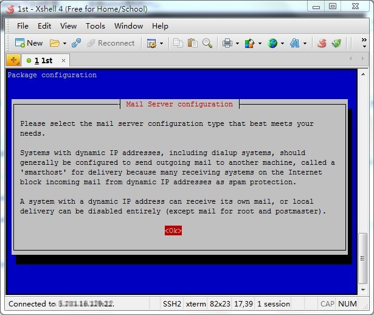
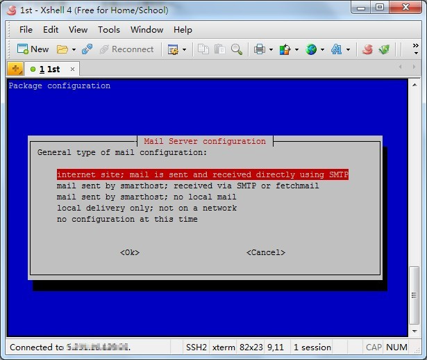
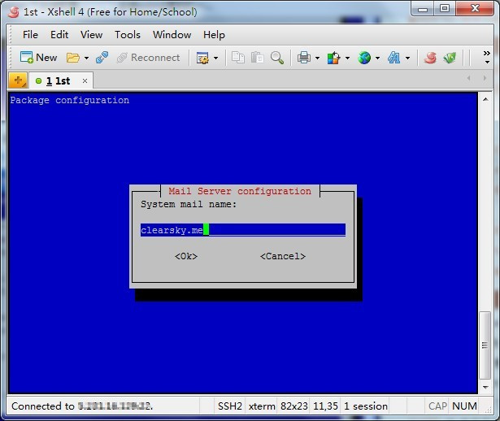
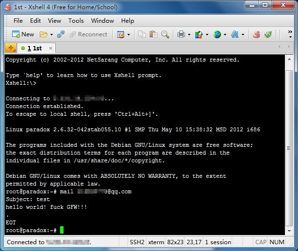
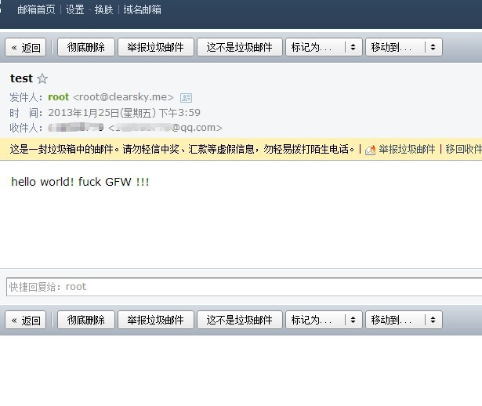

# Debian安装exim4


今天有空，网上翻翻有关vps的资料，打算使用更加轻量级的exim4替换sendmial。

网上找了下资料，整理记一下。

系统是debian，卸载sendmail后，安装exim4：

```bash
apt-get install exim4
```
安装完成后配置一下：

```bash
dpkg-reconfigure exim4-config
```

进入设置界面：局部马赛克~



这里，独立ip选第一个：



这里。系统邮件名称，设置成自己的。



至于其余的，一路按回车键默认。

安装完重启exim4：

```bash
/etc/init.d/exim4 restart
```

在这里出现了点问题，提示是：

    > ALERT: exim paniclog /var/log/exim4/paniclog has non-zero size, mail system possibly broken … failed!

以这段为关键字google搜索了一下，满屏幕的英文里面终于找到个中文的答案。

方法略暴力：

```bash
rm /var/log/exim4/paniclog #删除log。
```

再次重启exim4：

```bash
/etc/init.d/exim4 restart
```

安装成功，测试下发送mail,右下角本来就开着QQ，直接发送到QQ邮件好了:

直接用mail命令，发送一封主题为"test" ，内容为"hello world! fuck xxx!!!"的邮件。
一个小点.然后回车键。



右下角企鹅没有弹出邮件，很正常，这种肯定在垃圾邮件列表中：



完了~


---

> 作者: [u0defined](http://clearsky.me/)  
> URL: https://clearsky.me/20130125-debian%E5%AE%89%E8%A3%85exim4/  

