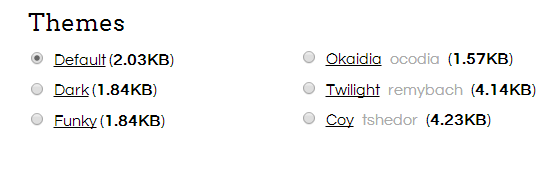
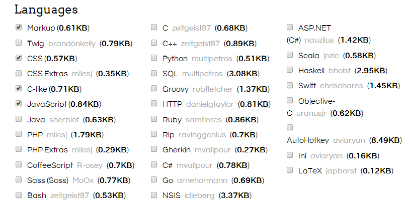
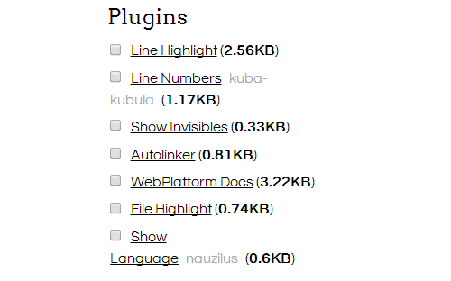

# 使用 Prism.js 高亮代码


其实也不怎么贴代码，偶尔贴一下就直接pre标签括起来，在随便翻个样式扔到css里面，今天休息没事做，也是闲得没事做小折腾一下，以前也用过几款代码高亮插件，总感觉体积太大了，加载慢，这次选用的是轻量级的Prism.js。

## 什么是Prism.js？

Prism是一款轻量级，可扩展的代码高亮javascript类库，默认支持HTML/CSS/Javascript三种语言，当然你在官方上很方便的扩展自定义添加其它语言支持，除了语言支持，行号显示，行内高亮，自动链接，显示语言等等功能也可以自由定制。

Prism官网点这里：[Prism.com](http://prismjs.com/)

安装之前你也可以在这个[官方在线示例](http://prismjs.com/test.html)先感受一下。

## Prism.js的使用

打开Prism[下载页面](http://prismjs.com/download.html)。

官网上有六款风格可以选择，我是直接用默认的，感觉比较舒服。



下面是选着语言支持，当然你选着越多后面生成的js和css也越大，看自己需求选择。



再下面是插件支持，也是看需求，我就选了显示行号和显示语言。



然后下载直接生成好的`prism.js`和`prism.css`文件就可以。

把这两个文件上传到到网站目录，在网站`head`插入`prism.js`和`prism.css`：

```html
<link href="prism.css" rel="stylesheet" />;
<script src="prism.js"></script>;
/*改一下上传文件的路径*/
```

Wordpress撰写文章的时候编辑器里面使用下面的格式就可以高亮代码了：

```html
<pre><code class="language-X">...这里是代码...</code></pre>
```
上面的`X`表示语言类型，比如`language-css`。

如果你选择了行号插件，要显示的话，`pre`标签里面加个class`line-numbers`，像这样：

```bash
<pre class="line-numbers">
    <code class="language-X">...这里是代码...</code>
</pre>
```
至于其它的功能比如行高亮之类，可以参考[官方文档。](http://prismjs.com/examples.html)

当然了，每次贴都要打这么一堆挺麻烦的，可以为编辑器加个快捷按钮:

主题`function.php`放上这一堆：

```php
function mxthemes_add_quicktags() { ?>
<script type="text/javascript">
QTags.addButton( 'Prism', 'Prism', '\n<pre><code class="language-php">', '</code></pre>\n' ); //快捷输入[Prism]标签
</script>
<?php }
add_action('admin_print_footer_scripts', 'mxthemes_add_quicktags' );
```

这样后台编辑器就多了个按钮(文本模式下)，我是没有用这个，感觉多敲两下键盘也没什么。

~~不写了，文本模式插入html尖括号没转义成符号好恶心，先这样，空了再找找有没有解决方法，一个多月晚上都有点失眠了，先睡了。~~

我就知道睡不着的。。。起来搜索半天，没什么好的办法，只能在可视化模式下先贴上代码再切换一下文本模式，让尖括号转义之后再用高亮代码包起来。

## 乱七八糟

1. `Prism.js` 用`pre > code`这样使用语义化元素来标记代码区块是非常不错的，就是我自己喜欢用code来强调一些关键词，比如：`fuckwall`，定义这样的样式就和prism.css有点冲突了，所以主题style.css里面的code样式改一下，用`:not`选择器：
```css
:not(pre) > code {
    ...样式...
}
```
2. 多加载了10几KB的文件，速度肯定慢点。但是无所谓，本来这里就慢
3. 感觉用这类高亮库一旦停止使用了，文章内容里面还要改一堆挺麻烦的，虽然可以直接从数据库里面改。
4. 真的困了，睡觉。


---

> 作者: [u0defined](http://clearsky.me/)  
> URL: https://clearsky.me/20140827-%E4%BD%BF%E7%94%A8prism.js%E9%AB%98%E4%BA%AE%E4%BB%A3%E7%A0%81/  

