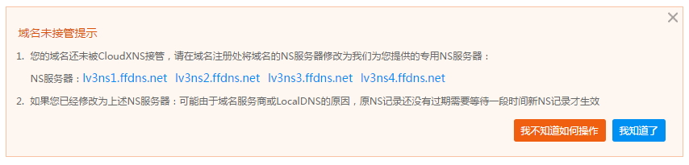
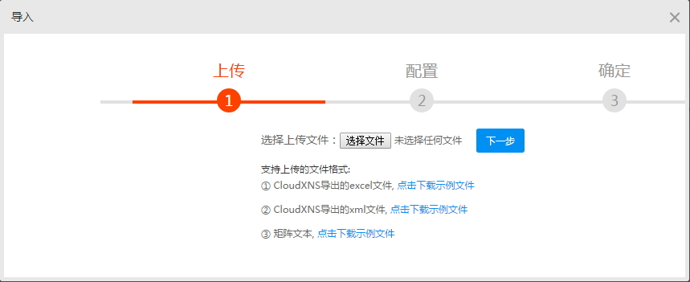
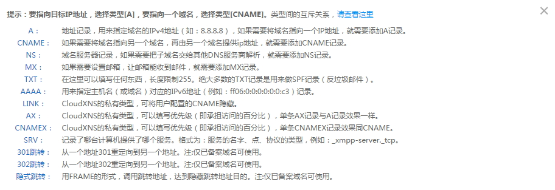
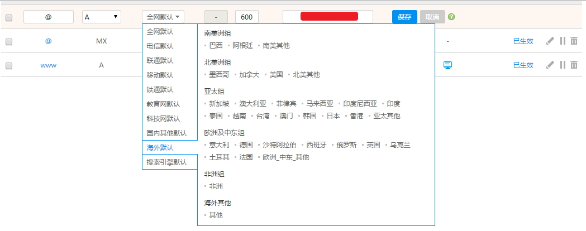
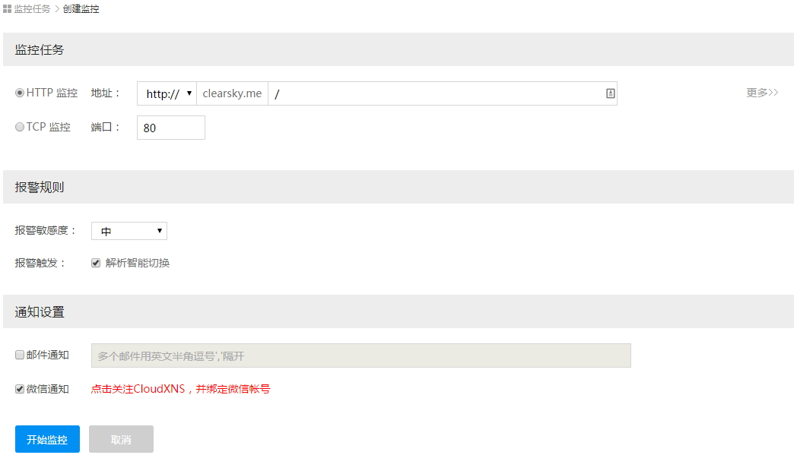

# DNS 解析换到 CloudXNS

一直以来用的都是DNSPod（好像现在被鹅厂收购了），期间有过几次服务不稳定，速度慢的情况，但是本来就是小博客，无所谓，能用就行，也没打算换。

今天网上有朋友推荐了这个[CloudXNS](https://www.cloudxns.net/Index/index.html)，说是多条线路切换，精确到省+运营商，我也刚好闲的没事，简单体验一下。

## CloudX简介

> CloudXNS是中国最大的电信中立互联网基础设施服务商——世纪互联集团（NASDAQ：VNET）旗下北京快网自主研发全新架构的智能DNS解析系统，提供多元化智能DNS解析服务。
>
> CloudXNS在响应、分发、存储及负载均衡等设计中使用北京快网私有DNS协议，所有的解析生效都是实时生效,自助解析非常简单方便，一目了然。
>
> CloudXNS音：[klaudz ns]，是Cloud eXtended Name Service的缩写，意为扩展的智能DNS系统，X取自extend。

具体官方介绍可以看这里：[CloudXNS 面向云计算的智能DNS系统](https://www.cloudxns.net/Index/AboutXns.html)

## 更改NS

常规注册登陆后添加域名，提示未接管。

赶紧去godaddy那里NS换成上面4个地址，不一会就生效了。

## 添加解析记录

发现CloudXNS这里是可以导入导出记录的：

以往我都是手动添加的，反正一般就是做个A记录之类的，记录也不多，手动输入可能还快一点，看到这个想试试，到DNSPod后台看了一下，发现找不到导出的地方，算了~这里支持多种记录类型。

DNSPod那里自定义线路需要企业套餐，而这里是可以自定义线路的（如下图），根据需要自行选择：

## X优化

记录界面有个X优化，不懂是什么，看了下官方说明：


X优化是一种智能托管解析服务

当开启X优化后当前线路上的所有A记录解析将按智能策略解析（在X优化开启状态下添加的本线路上的A记录，也会按智能策略解析）

当您有多个IP解析时，只要您开启了X优化，就算全部都是全网默认我们也能给您的用户找到最适合的ip

例如在电信默认线路下填入了众多电信IP ，联通IP，移动IP

当开启X优化后，X优化将根据用户配置的灵敏度及匹配数，选择较优的电信IP

联通及其它IP将智能帮您剔除，从而达到最优化的访问线路

注：X优化只能在有A记录的线路上开启


好像有点用，果断开启。

## 设置监控任务

常规通知有邮件邮件通知，我没用，用了微信绑定。

大致就是这样，刚用，只觉得后台体验挺好，具体用一段时间再说吧。

还有，提交了一个私人线路申请，不知道能不能审核下来。再就是据说还提供免费CDN的，不过我找不到在哪里，估计也是要申请开通吧，再说吧。

---

> 作者: [u0defined](http://clearsky.me/)  
> URL: https://clearsky.me/20150622-dns%E8%A7%A3%E6%9E%90%E6%8D%A2%E5%88%B0cloudxns/  

