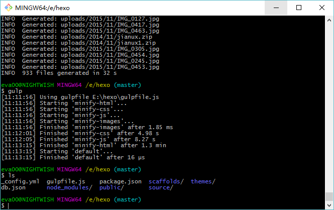
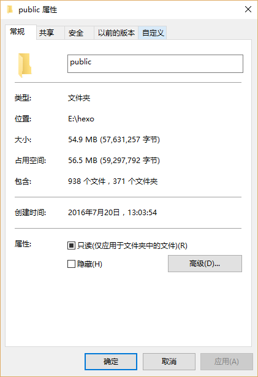

# 使用 gulp 压缩 hexo 静态资源


## 前言

前两天把博客托管到 Coding，相比以前放在 Github 访问速度有了不错的提升。

今天休息没事，想着再优化下，查看页面源码发现代码未压缩，于是到 Hexo 插件库看了下，找到个 [hexo-all-minifier ](https://github.com/unhealthy/hexo-all-minifier)，但是我安装下来一直报错，搜索过程中找到基于 gulp 的几个压缩插件，马上试试。

## 关于 gulp

>gulp 的官方定义非常简洁：基于文件流的构建系统。


>**#说人话系列#**：gulp 是前端开发过程中对代码进行构建的工具，是自动化项目的构建利器；她不仅能对网站资源进行优化，而且在开发过程中很多重复的任务能够使用正确的工具自动完成。


## 安装 gulp 及相关插件

主要安装以下几个：

- 基本：[gulp](https://www.npmjs.com/package/gulp)
- CSS 压缩：[gulp-clean-css](https://github.com/scniro/gulp-clean-css) （原名 gulp-minify-css）
- JS 压缩：[gulp-uglify](https://www.npmjs.com/package/gulp-uglify)
- HTML 压缩：[gulp-htmlmin](https://www.npmjs.com/package/gulp-htmlmin) ,  [gulp-htmlclean](https://www.npmjs.com/package/gulp-htmlclean)
- 图片压缩：[gulp-imagemin](https://www.npmjs.com/package/gulp-imagemin)

```bash
npm install gulp -g
npm install gulp-clean-css gulp-uglify gulp-htmlmin gulp-imagemin gulp-htmlclean gulp --save
```

安装完成后打开 `hexo` 目录下的 `package.json` 文件，查看是否安装了上述插件，比如我的：

```
{
  "name": "hexo-site",
  "version": "0.0.0",
  "private": true,
  "hexo": {
    "version": "3.2.0"
  },
  "dependencies": {
    "gulp": "^3.9.1",
    "gulp-clean-css": "^2.0.11",
    "gulp-htmlclean": "^2.7.6",
    "gulp-htmlmin": "^2.0.0",
    "gulp-imagemin": "^3.0.1",
    "gulp-uglify": "^1.5.4",
    "hexo": "^3.2.0",
    "hexo-deployer-git": "^0.1.0",
    "hexo-generator-archive": "^0.1.4",
    "hexo-generator-category": "^0.1.3",
    "hexo-generator-index": "^0.2.0",
    "hexo-generator-tag": "^0.2.0",
    "hexo-renderer-ejs": "^0.2.0",
    "hexo-renderer-marked": "^0.2.10",
    "hexo-renderer-stylus": "^0.3.1",
    "hexo-server": "^0.2.0"
  }
}
```

## 编写 gulpfile.js

`hexo` 同级目录下新建文件 `gulpfile.js`，编辑内容如下，适当修改路径。

比如图片等附件我一直沿用以前使用 WordPress 留下来的 `uploads` 目录。

其余的插件设置已经在注释中，所有使用说明来自 [一点](http://www.ydcss.com/archives/category/%E6%9E%84%E5%BB%BA%E5%B7%A5%E5%85%B7) 博客的构建工具分类下文章。

```javascript
var gulp = require('gulp');
    minifycss = require('gulp-clean-css');
    uglify = require('gulp-uglify');
    htmlmin = require('gulp-htmlmin');
    htmlclean = require('gulp-htmlclean');
    imagemin = require('gulp-imagemin');

// 压缩 public 目录内 css
gulp.task('minify-css', function() {
    return gulp.src('./public/**/*.css')
        .pipe(minifycss({
           advanced: true,//类型：Boolean 默认：true [是否开启高级优化（合并选择器等）]
           compatibility: 'ie7',//保留ie7及以下兼容写法 类型：String 默认：''or'*' [启用兼容模式； 'ie7'：IE7兼容模式，'ie8'：IE8兼容模式，'*'：IE9+兼容模式]
           keepBreaks: true,//类型：Boolean 默认：false [是否保留换行]
           keepSpecialComments: '*'
           //保留所有特殊前缀 当你用autoprefixer生成的浏览器前缀，如果不加这个参数，有可能将会删除你的部分前缀
        }))
        .pipe(gulp.dest('./public'));
});

// 压缩 public 目录内 html
gulp.task('minify-html', function() {
  return gulp.src('./public/**/*.html')
    .pipe(htmlclean())
    .pipe(htmlmin({
        removeComments: true,//清除 HTML 注释
        collapseWhitespace: true,//压缩 HTML
        collapseBooleanAttributes: true,//省略布尔属性的值 <input checked="true"/> ==> <input />
        removeEmptyAttributes: true,//删除所有空格作属性值 <input id="" /> ==> <input />
        removeScriptTypeAttributes: true,//删除 <script> 的 type="text/javascript"
        removeStyleLinkTypeAttributes: true,//删除 <style> 和 <link> 的 type="text/css"
        minifyJS: true,//压缩页面 JS
        minifyCSS: true//压缩页面 CSS
    }))
    .pipe(gulp.dest('./public'))
});

// 压缩 public/js 目录内 js
gulp.task('minify-js', function() {
    return gulp.src('./public/**/*.js')
        .pipe(uglify())
        .pipe(gulp.dest('./public'));
});

// 压缩 public/uploads 目录内图片
gulp.task('minify-images', function() {
    gulp.src('./public/uploads/**/*.*')
        .pipe(imagemin({
           optimizationLevel: 5, //类型：Number  默认：3  取值范围：0-7（优化等级）
           progressive: true, //类型：Boolean 默认：false 无损压缩jpg图片
           interlaced: false, //类型：Boolean 默认：false 隔行扫描gif进行渲染
           multipass: false, //类型：Boolean 默认：false 多次优化svg直到完全优化
        }))
        .pipe(gulp.dest('./public/uploads'));
});

// 执行 gulp 命令时执行的任务
gulp.task('default', [
    'minify-html','minify-css','minify-js','minify-images'
]);
```

## 命令执行

```bash
hexo clean
hexo g && gulp
```




## 效果比对

截取了整个 public 目录 压缩前后大小变化图：




貌似压缩得让我不够满意，还是我哪里没弄好。

不管了，先部署上去看看。

```bash
hexo d
```
以后生成、压缩、部署也可以连起来。

```bash
hexo g && gulp && hexo d
```

完成后查看页面源码，整个页面代码都压缩了，实际打开感觉也是比以前快了点。

## 待更新

先到这里，以后再翻翻资料。


---

> 作者: [u0defined](http://clearsky.me/)  
> URL: https://clearsky.me/20160720-%E4%BD%BF%E7%94%A8-gulp-%E5%8E%8B%E7%BC%A9-hexo-%E9%9D%99%E6%80%81%E8%B5%84%E6%BA%90/  

