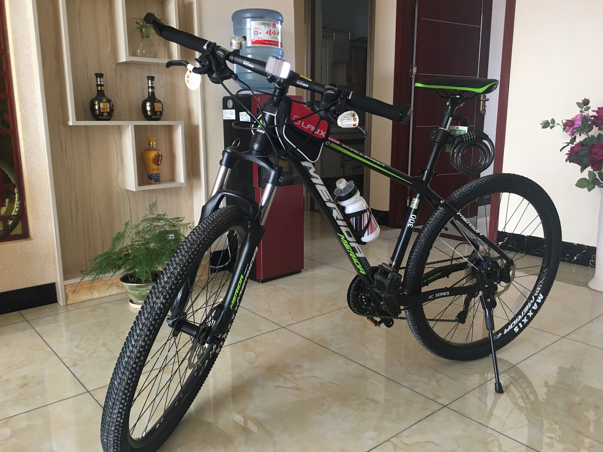
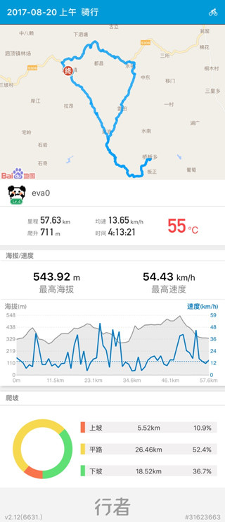
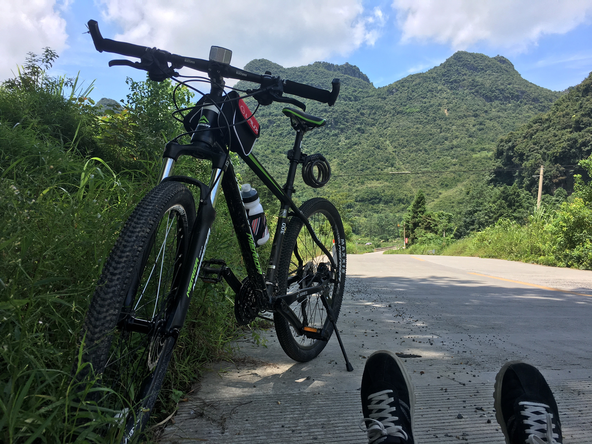
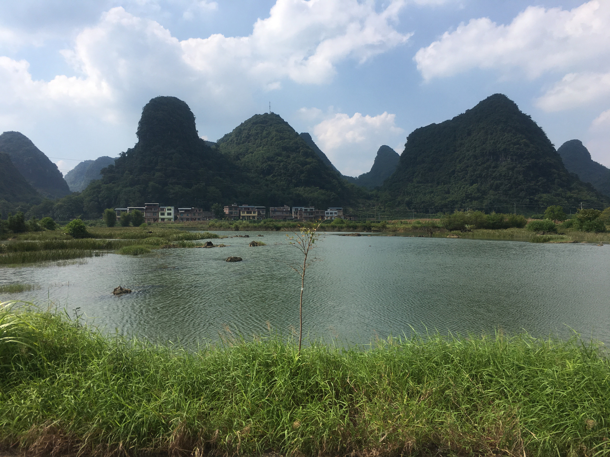
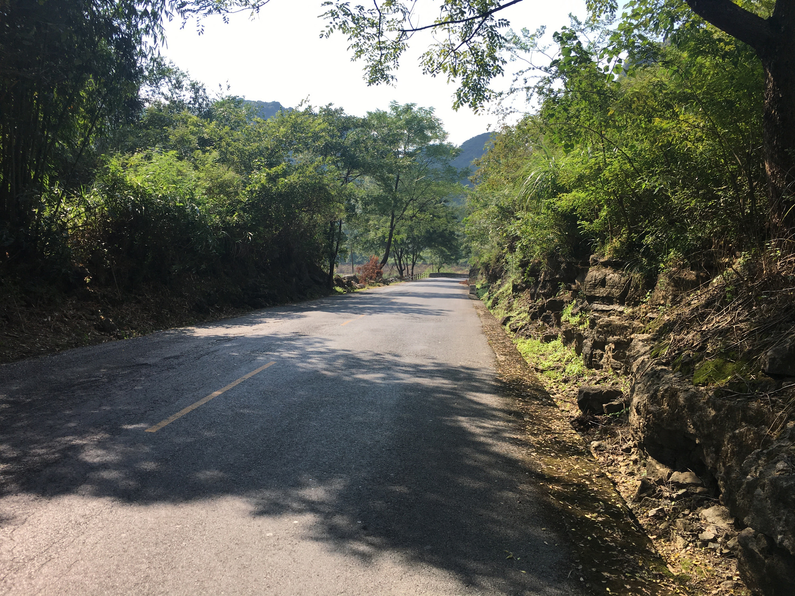
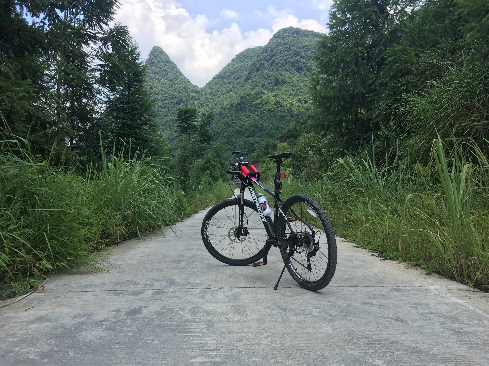

# 骑行入门山地车 - 美利达挑战者 300

## 需求

跑步一年多了，貌似膝盖有点受不了，可能是我姿势不对或者是跑步量太大了。总之决定暂停一段时间。

这段时间如果值班的话就去散散步，走河堤的时候看到有人骑山地车路过，看着感觉还不错，刚好换一个锻炼方式，从来没骑过山地车，不太懂，预算 3000 元左右，咨询玩这方面的同事，这个预算他给了 3 个选择：喜德盛传奇 500、捷安特 XTC 800、美利达挑战者 300。

## 选择

好像这类商品大多有经销商保护的，网购的话，貌似很多都是磨掉车架号的，所以我基本只考虑本地经销商拿车，所以先排除一个捷安特，因为我这里没有店面（后来知道有的，我没打听清楚）。

剩下两个对比的话喜德盛传奇 500 性价比肯定高一点，车架也轻，我所在县城有家喜德盛店面在本地还挺有名的，店主两兄弟经常到处参加比赛，买的人多，估计后面售后也方便，本来打算去买了的，后来在网上看了下又觉得美利达的刹车好一点，我买来的话主要是在山里值班的时候骑的，山路陡，感觉刹车重要点，网上还有“不挑不幸福”说法，再到美利达官网看看涂装，感觉合眼缘，不纠结了，直接问了店面电话打电话订了一辆，3100 元送水壶、骑行包、头盔之类的东西。

## 配置

官网配置：

| 主要参数 |    值     |
| :--- | :------: |
| 車種名 |  挑戰者 300 |
| 速別 |    30S   |
| 車架型式 |   液壓輕量化鋁合金   |
| 尺寸 | 26*15/17/19"|
| 顏色 |   麗黑   |
| 前叉 |  XCM-RL-D-100MM  |
| 剎車器  |    MAGURA MT-2 油壓碟煞    |
| 鏈條 |  X10   |
| 齒盤 |  ZEPHYR-651-TT 42/32/24   |
| 前變速器 |  FDM610L6   |
| 後變速器 |  RDM610SGSL   |
| 飛輪 |  CSMS1. 11-36T  |
| 手把 |  HB-3018SP 6' 7/8D BAR:31. 8D AL   |
| 花鼓 |  鋁合金   |
| 座管 |  SP-DC1 31.6D*350L AL   |
| 變速控制桿 |  SHIMANO SLM610LB   |
| 外胎 |  	C-1918 26*1.95   |
| 參考重量 |  13.2KG(17")   |

*車種規格、顏色、配備以實車為準，本公司保留修改的權力*

## 到货

过了几天老板打电话说到货了，问我是不是马上过来安装，当时没时间，先让他给我装好我过两天去拿，周末休息直接过去，已经装好了，送的东西能装上去的都装上去了，没骑过山地车，怎么变速都搞不清楚，在老板门面前的小空地试了几圈才搞清楚。然后就屁颠颠的骑回家了。

小区下面没地方放，我抗进电梯拿回家里面放了，不怎么拍照，随便来一张：

希望不会扔在家里吃灰~

## 更新

半个月后，没有吃灰！！！

大太阳的脑子秀逗了出去骑了半天，脚快断了，还需要继续锻炼。。

还是随便上几个图：

---

> 作者: [u0defined](http://clearsky.me/)  
> URL: https://clearsky.me/20170730-%E9%AA%91%E8%A1%8C%E5%85%A5%E9%97%A8%E5%B1%B1%E5%9C%B0%E8%BD%A6-%E7%BE%8E%E5%88%A9%E8%BE%BE%E6%8C%91%E6%88%98%E8%80%85-300/  

