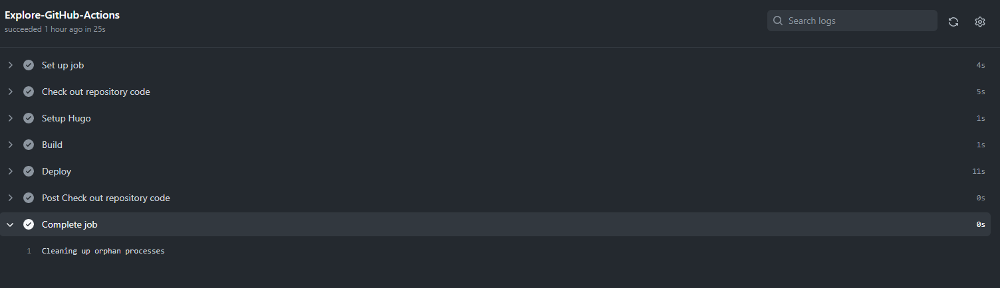

# GitHub Action 自动部署 Hugo 到 GitHub Pages


## 原因

自从换到 Hugo 以来，都是本地运行 Hugo 命令生成生成静态网页 `.public`目录，然后推送到 GitHub Pages 项目仓库，感觉每次发布还要切换目录来上一堆 Git 操作：

```bash
git add .
git status
git commit -m "xxx"
git push
```

略为繁琐，虽然这几行命令可以写个脚本简化一下，但是只推送`.public`目录没有办法对本地源文件进行备份和版本管理，于是决定把源文件推送到仓库，触发 Github Action 构建生成静态文件。

## 配置 GitHub Action

没有在原来项目上新建分支，而是新建了一个仓库用来管理源文件，Github Action 触发后生成静态文件推到原来的 GitHub Pages 项目。在这之前，需要在新建项目仓库设置下验证 key , 具体仓库页面 `Settings - secrets - Actions - New Repository secrets` 设置一下私钥就好了。


名称注意和下面要设置的 `workflows` 配置一样，我的为 `ACTIONS_DEPLOY_KEY`



然后本地 Hugo 博客目录新建`.github/workflows`下，配置以 .yml 后缀结尾，我的为`.github/workflows/deploy.yml`，编辑这个配置文件：

```yml
name: Auto Deploy hugo

on: 
    push:
    workflow_dispatch:
    schedule:
        # 定时执行
        - cron: "0 2 * * *"
jobs:
  Explore-GitHub-Actions:
    runs-on: ubuntu-latest
    steps:
      - name: Check out repository code
        uses: actions/checkout@v2
        with:
          submodules: true  
          fetch-depth: 0    

      - name: Setup Hugo
        uses: peaceiris/actions-hugo@v2
        with:
          hugo-version: latest
          extended: true

      - name: Build 
        run: hugo --minify

      - name: Deploy
        uses: peaceiris/actions-gh-pages@v3
        with:
          deploy_key: ${{ secrets.ACTIONS_DEPLOY_KEY }} # secret 中设置好私钥，名称和上面设置的一样
          external_repository: xxx/xxx.github.io  # Page 仓库地址
          publish_branch: master  # Page 仓库的分支
          publish_dir: ./public # 静态网页路径
          commit_message: ${{ github.event.head_commit.message }}
```

`on` 这里有三种触发方式：


- `push`：git push 推送时执行。
- `workflow_dispatch`：项目仓库的 Action 手动执行。
- `schedule`：定时执行。



## 执行结果

像平时一样提交源文件仓库的代码推送到 GitHub，就会触发 GitHub Actions 执行生成静态文件推送到 GitHub Pages 项目上了。

详情流程可以到源文件仓库的 `actions -- workflows` 下查看。



## 简单部署脚本

为了方便，几个命令打包个简单部署脚本：

```bash
#!/bin/bash
echo -e "Deploying..."
git add .
git status
read -p "Enter git commit message: " msg
if [ -z $msg ];then
  msg="update $(date +'%F %a %T')"
fi
git commit -m "$msg"
git push
```

保存为 deploy.sh ，终端切换到博客目录 

```bash
sh deploy.sh
```

输入 git- commit 信息即可。


---

> 作者: [u0defined](http://clearsky.me/)  
> URL: https://clearsky.me/20220929-github-action-%E8%87%AA%E5%8A%A8%E9%83%A8%E7%BD%B2-hugo-%E5%88%B0-github-pages/  

