# 域名从 Godaddy 转移至 Namesilo

## 起因

这段时间一直收到 Godaddy 的“骚扰”邮件，这个域名快到期了，本来想直接续费的，突然想到 Godaddy 的 WHOIS Privacy (域名隐私保护) 是收费的，好像10多刀一年吧，而 Namesilo 号称 WHOIS Privacy 永久免费，好像续费还比 Godaddy 便宜一点，能省一点算一点，打算趁着今天用空转移一下。

## Godaddy 转出

### 解锁域名状态

登陆 Godaddy 账户，Additional Settings, 把域名锁定关闭掉。

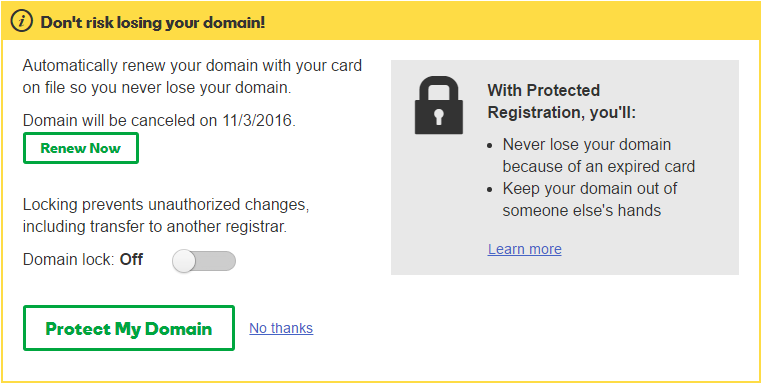

### 获取转移授权码

点击下方的 Get authorization code , 转移授权码会直接发送到域名管理员邮箱。

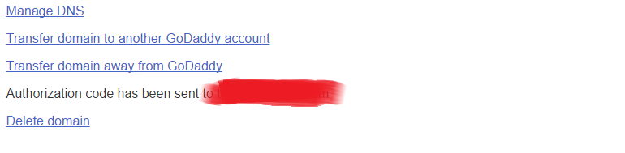

会收到 Godaddy 的邮件，里面有域名和转移码授权码信息。

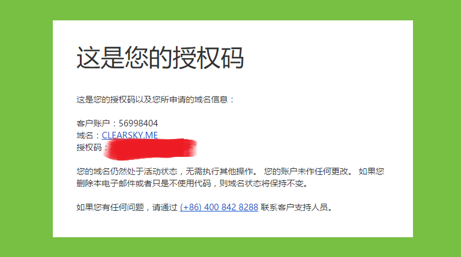

## Namesilo 转入

### 提交转移

登陆 Namesilo 账户，导航模块 Transfer ，有单个域名转入和批量转入两种方式，我就一个，直接 Single Domain Transfer。

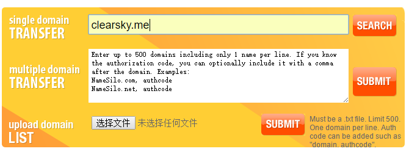

填入转移授权码，确认转移。

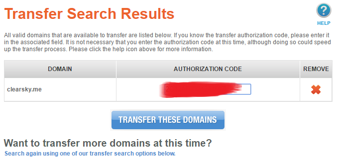

### 支付信息及优惠码

提交后确认支付信息。

自动续费选否， Privacy Setting 选择 WHOIS Privacy ，免费的，优惠码网上随便找了一个，转入优惠 1 刀，总价 14.99 刀。

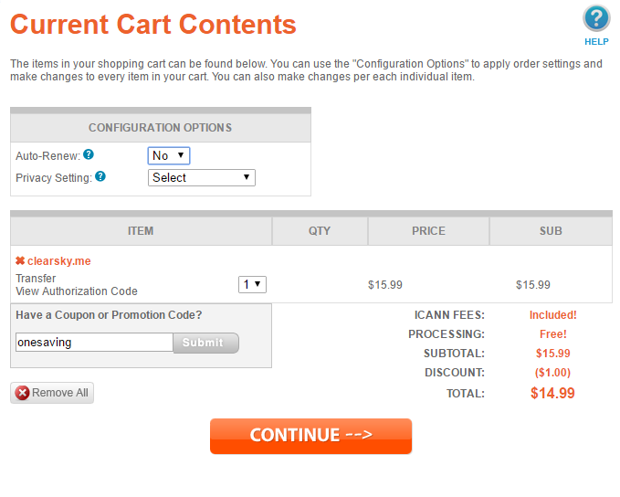

提交支付后，选择支付方式，支持多种支付方式，最后那个熟悉的马牌支付宝。

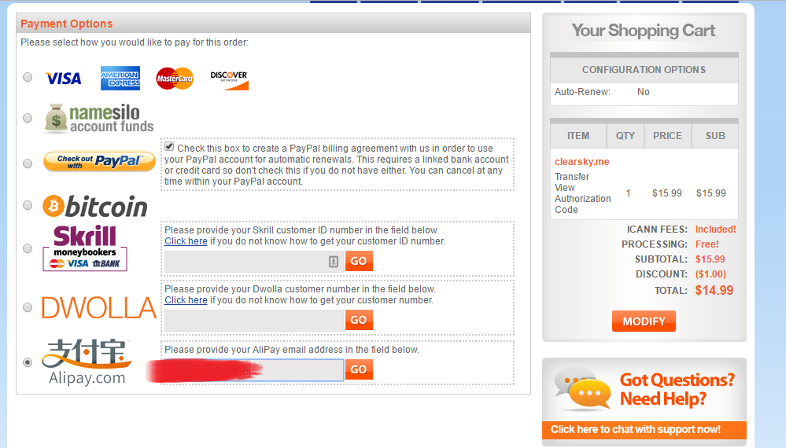

100大洋多一点，还行。

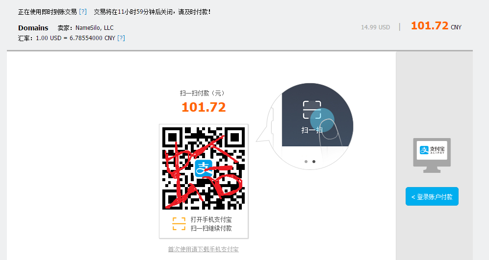

### 确认转移

Namesilo 查看转入信息，已经有确认邮件发出。

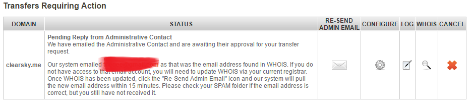

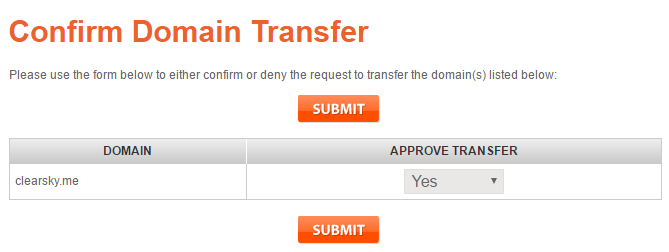

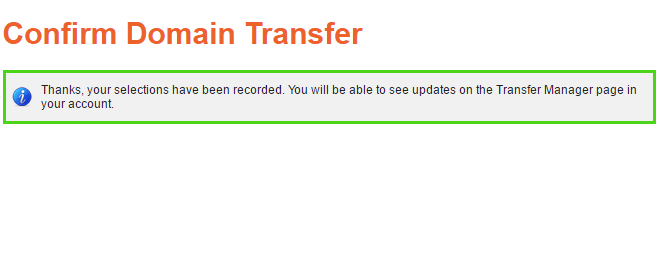

导致完成接下来就等 Godaddy 那边处理了。

### Godaddy 快速转移

这回收到一封来自 Godaddy 的邮件， 如下：

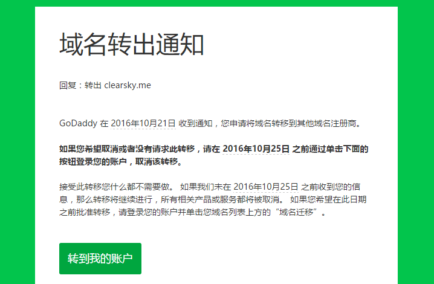

可以看到你不自己处理的话，它会自己拖个几天才转移，很显然没人愿意等，于是登陆 Godaddy 账户，Transfer 列表，选中域名 Accept or decline 选项，然后Accept Transfer 。

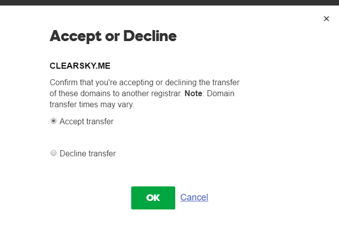

接下来就是等待了，大概10分钟， Namesilo 账户已经显示域名转入了。

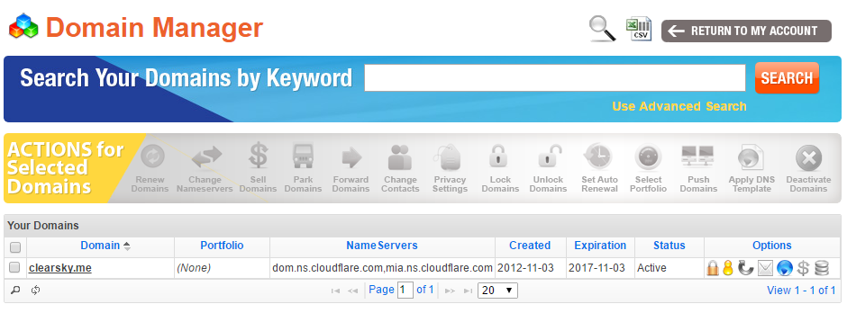

## 尾声

把域名放在境外服务商还是挺方便的，效率挺高，也就半小时左右弄完了，我记得多年前从国内一个什么华夏X网之类的（忘了叫什么了）转移一个域名，乱七八糟的破事花了10多天，不知道现在是变好了还是变得更烂了。为了省事，这次直接在 Namesilo 续费了 3 年，省得折腾了。

---

> 作者: [u0defined](http://clearsky.me/)  
> URL: https://clearsky.me/domain-transfer-godaddy-to-namesilos/  

