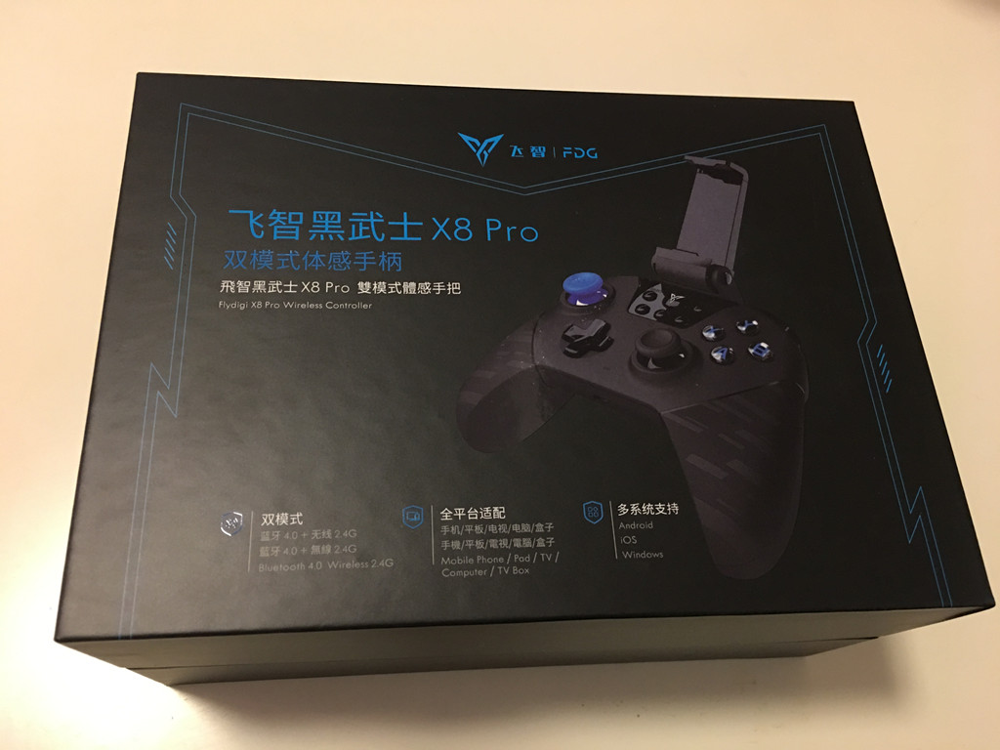
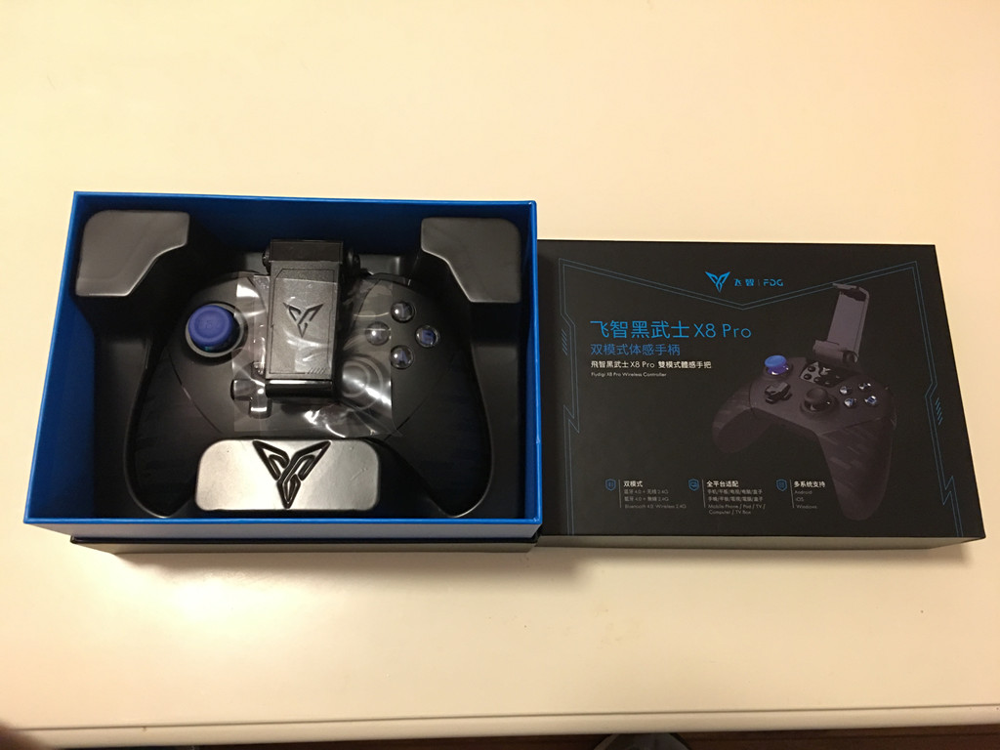
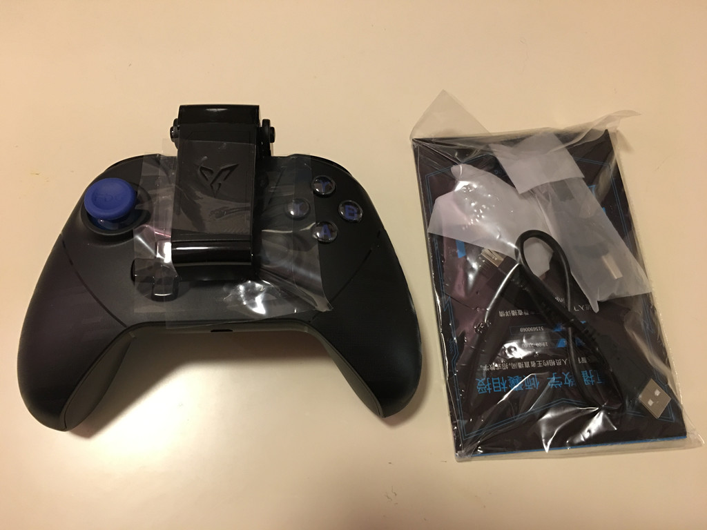
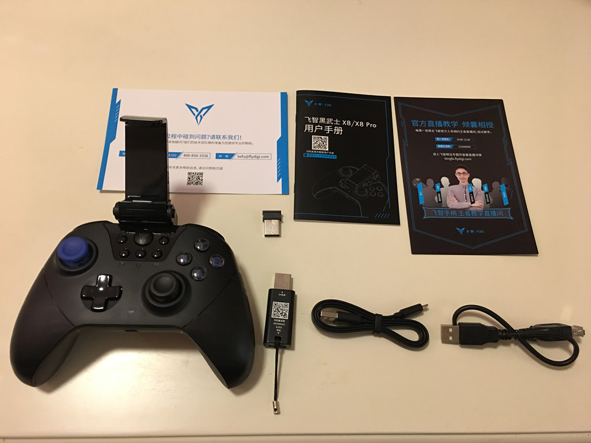
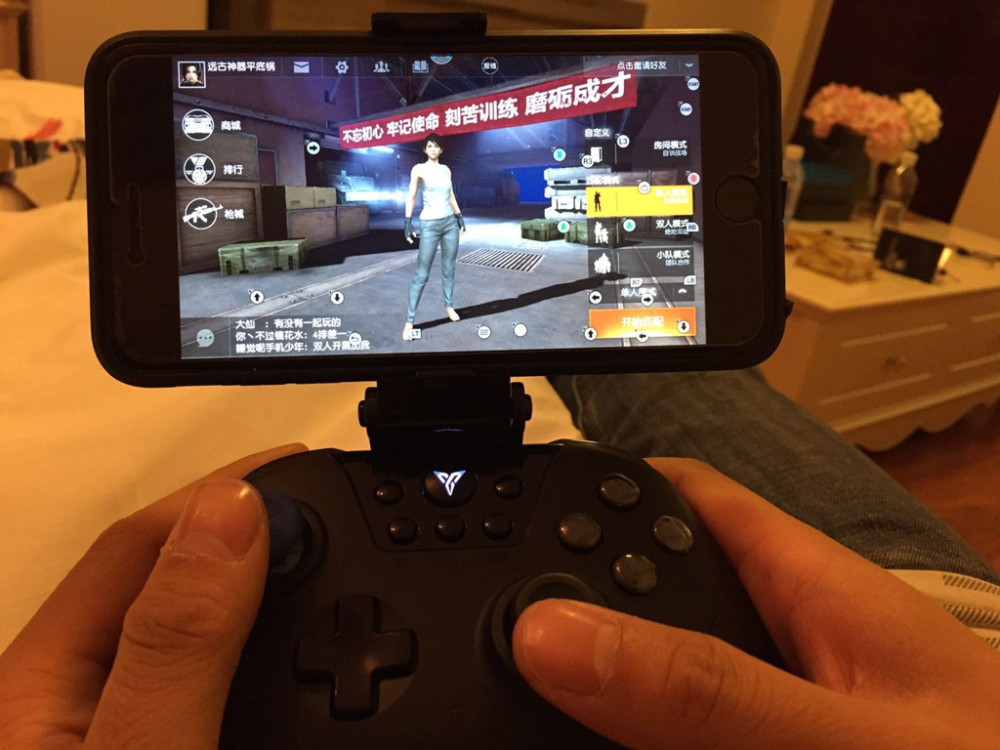

# 手机“吃鸡”神器 - 飞智黑武士 X8 Pro

## 序

“大吉大利，晚上吃鸡！”

《绝地求生：大逃杀》这款现象级游戏的火爆应该不用多说了，今年 3 月发布以来，这款大逃杀游戏迅速冲到 STEAM 第一。各大主播平台也是一片“吃鸡”，各类“吃鸡”游戏流行语也刷爆朋友圈和微博。

然而我一次都没有玩过，主要是 PC 平台要求配置太高，我的笔记本玩不了，近些年对电脑需求没那么高，不想为了个游戏升级电脑，还有一个方面，现在上班时间太忙了，没那么多时间玩游戏，前段时间事我就看看各种“吃鸡”直播，看着过过干瘾。

还好，近月来各类“吃鸡”手游的出现可以弥补上面说的问题，虽然手游吃鸡对比 PC 平台肯定是个极度简化的低配版，但是对我这样我对游戏画面和可玩性要求没有那么高，只需要偶尔利用空余时间和朋友娱乐一下的人来说，是个不错的选择，于是最近都在手机上玩网易推出的类吃鸡游戏《荒野行动》。

## 手机“吃鸡”弊端

众所周知：**大多时候你在手机上玩 FPS 游戏的体验不是在吃鸡，而是在吃屎。**

触屏操作控制太恶心了，双手会遮挡屏幕体积，影响视野，双手操作，左手控制人物，右手控制视野准星，那么射击键呢？腾出手来按射击键意味着你得人物固定或者视野固定，玩过的人都知道多恶心。别和我说陀螺仪和 3D Touch来弥补，体验极差，真的。

## 飞智黑武士 X8 Pro

鉴于每一把都落地成盒或者满身顶配装备被人乱枪爆头，我看过各个主播直播之后发现有些人用手柄玩的，马上搜索了一下，找到这款游戏手柄：飞智黑武士 X8 Pro，先看个视频：



感觉还不错，可能遥控控制视野还需要习惯一下，应该问题不大，还有一种是外接键盘和鼠标那种枪座，那种虽然操作更简单直观，但是不方便携带，我还是用这种手柄好了，扔在包里，无聊的时候拿出来玩两盘。

### 开箱

下单后两天到了，这次 EMS 吃错药了有点快。。。

首先是包装盒，没什么好说的：

拆开之后：

手柄和配件：

全部东西：包括手柄、说明书、保修书、飞智小游、接收器、充电线

简单说下：手柄握柄两侧加了纹理设计，防滑，这一点挺好的。

### 安装激活

没什么好说的，我用的是 iPhone 6 plus，傻瓜流程安装，安卓好像要激活映射。

### 愉快吃鸡

手柄操作还是有点不习惯，熟悉中，不过比用手机玩强多了，导入了一个主播配置，貌似可以神挡杀神，佛挡杀佛，然而：

**吃鸡这种事，不存在的！**

---

> 作者: [u0defined](http://clearsky.me/)  
> URL: https://clearsky.me/flydigi-x8-pro/  

