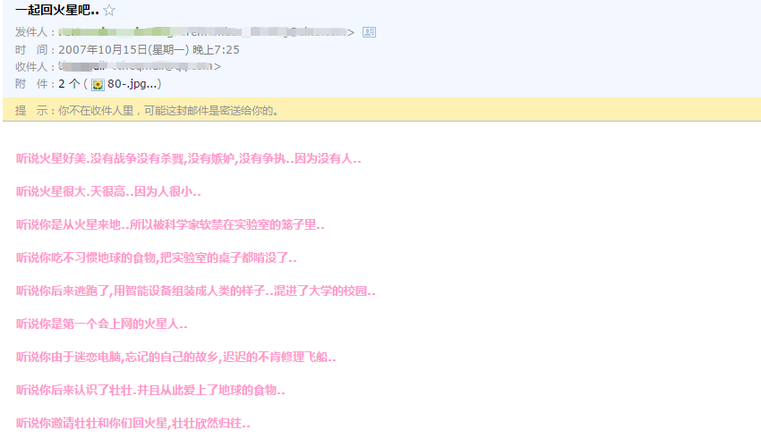

# 远方的朋友

清理邮箱的时候发现这封2007年一位网友写给我的邮件，略有感慨。

记得认识在一个游戏里面，具体什么游戏忘了，你说你不怎么玩游戏的，只是好奇点进来看看。

记得我和你都喜欢发一个吃惊小猪的表情，我们都说这个表情像自己。

记得你看我的桌面截图之后，问为什么我的杀毒软件是小红伞，而你的是小绿伞，我说你的是瑞星，我的是Avira AntiVir，帮你换成小红伞后每隔一段时间都要远程协助帮你更新。

你说你是东北银，正准备申请签证去法国学画画，你教我的第一句东北话是“嘎哈呢”，第一句法语是“je t'aime ”（我读不好，经常读作“鼠呆萌”）。

我经常开玩笑说以后你在法国佬地盘会不会吃蜗牛这种黑暗料理啊，你说你只买得起羊角面包。

你问我年纪轻轻怎么老在网吧通宵啊？我说我没地方去啊。你对我说回火星吧。

我问你维纳斯没有手怎么玩石头剪子布啊，你说这姑娘衣服都没了可以直接喊脱衣野球拳了。

你问我咱俩是网友都聊得这么起劲，现实中你咋不和人多交流交流呢，那时的我想了半天，无言以对。

我问你学成之后要干什么？你说到处瞎逛，四处涂鸦，我说小心被罚款，你说没事，不但不交，还得收费，哈哈。

可能你都不知道，你的开朗，你的自信，或多或少影响并改变当年的我，现在的我，生活步入正轨，未来谁也说不准，但是不再迷茫，谢谢！

远方的朋友，不知道你现在过得怎么样，虽然现在2年多没联系了，你说你要骑车去旅行了，QQ估计再也不会亮起来了，twitter上最后一条推也是2012的了，或许，你在创作一幅惊世骇俗的作品。或许，你在异乡结婚生子，教儿育女。或许，你在骑行的路上啃着羊角面包。无论如何，道一声珍重！

或许有一天，突然收到你的消息：“一起回火星吧。”

---

> 作者: [u0defined](http://clearsky.me/)  
> URL: https://clearsky.me/friends-far-away/  

