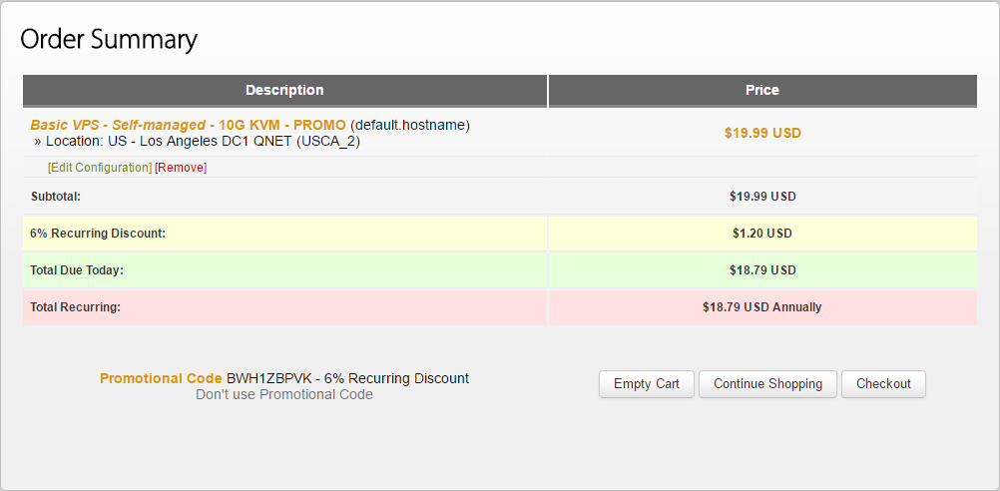

# 入了个年付 $19.99 搬瓦工 VPS


## 序言

本来没想买，一直部署在 [coding](https://coding.net/) 挺好的，省事，这两天看到 [@skywing](https://skywing.me) 换了 VPS，或许是很久不碰这种东西，手痒，还是入了个 [搬瓦工](https://bwh1.net/) 来玩玩。不过估计没多少时间来折腾了，破事多，时间不允许。简单就这样说下吧。

## 购买配置

买的是最便宜的那款 10G VPS，架构方案当然选 KVM （可以锐速、BBR之类），六个机房可选（**洛杉矶直连、洛杉矶MC、纽约、佛利蒙、凤凰城、荷兰、佛罗里达**）月付 2.99 刀，年付 19.99 刀，使用 6% 优惠码 ` BWH1ZBPVK ` 之后 18.79 刀，按今日汇率折合人民币 128.53 元 ，简单贴下：

|       简单参数        |       值       |
| :---------------: | :-----------: |
| SSD RAID-10 Space |   10 GB SSD   |
|      ECC RAM      |    512 MB     |
|     Bandwidth     |    500 GB     |
|        CPU        | 1x Intel Xeon |
|      Network      |   1 Gigabit   |
|     Order KVM     |       √       |
|   Monthly Price   |     $2.99     |



## 简单测试

默认系统 CentOS 6.8 开启了 BBR，用秋大的 [一键测试脚本bench.sh](https://teddysun.com/444.html)  测试一下，貌似有点挫。。。

```bash
[root@eva00 ~]# wget -qO- bench.sh | bash
----------------------------------------------------------------------
CPU model            : QEMU Virtual CPU version (cpu64-rhel6)
Number of cores      : 1
CPU frequency        : 1999.997 MHz
Total size of Disk   : 11.3 GB (0.8 GB Used)
Total amount of Mem  : 507 MB (129 MB Used)
Total amount of Swap : 0 MB (0 MB Used)
System uptime        : 0 days, 0 hour 21 min
Load average         : 0.00, 0.00, 0.00
OS                   : CentOS 6.8
Arch                 : i686 (32 Bit)
Kernel               : 4.10.4-1.el6.elrepo.i686
----------------------------------------------------------------------
I/O speed(1st run)   : 274 MB/s
I/O speed(2nd run)   : 328 MB/s
I/O speed(3rd run)   : 305 MB/s
Average I/O speed    : 302.3 MB/s
----------------------------------------------------------------------
Node Name                       IPv4 address            Download Speed
CacheFly                        205.234.175.175         94.1MB/s      
Linode, Tokyo, JP               106.187.96.148          13.8MB/s      
Linode, Singapore, SG           139.162.23.4            2.29MB/s      
Linode, London, UK              176.58.107.39           1.70MB/s      
Linode, Frankfurt, DE           139.162.130.8           6.11MB/s      
Linode, Fremont, CA             50.116.14.9             1.01MB/s      
Softlayer, Dallas, TX           173.192.68.18           34.8MB/s      
Softlayer, Seattle, WA          67.228.112.250          45.2MB/s      
Softlayer, Frankfurt, DE        159.122.69.4            4.60MB/s      
Softlayer, Singapore, SG        119.81.28.170           402KB/s       
Softlayer, HongKong, CN         119.81.130.170          405KB/s     
----------------------------------------------------------------------
```

路由跟踪，绕了一圈没看明白。。。不管了。


## 结束

暂时就这样吧，好困了，睡了，后天能休息一天，明晚上有空应该就把这里部署到这 VPS 上去，还有 Hexo 也挺久没升级了，明天晚上一起升级了，估计到时候又是一堆坑啊啊啊啊啊啊。。。

---

> 作者: [u0defined](http://clearsky.me/)  
> URL: https://clearsky.me/fuck-bandwagonhost-again/  

