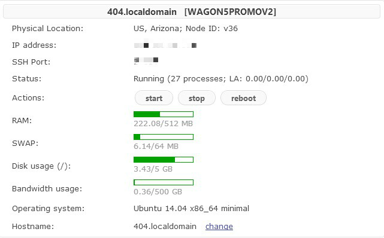

# 搬家到 Bandwagonhost

**这货限制CPU太严格了，安装环境编译过程中超限制被锁定的话，速度简直龟速，入手需谨慎！**

又换地方了，原来的VPS近段时间，特别是晚上，实在是抽得不行了。

后台管理面板reboot后居然无法启动了，发了TK，客服半天不鸟我，算了，反正还有2个月就到期了，懒得续费了，换一个好了。

这次换的还是年付的VPS，Bandwagonhost（俗称的搬瓦工）的5G PROMO v2这款，配置如下：

| 项目     |     参数      |
| ------ | :---------: |
| CPU    |   1 cores   |
| vSWAP  |    64MB     |
| 内存     |    512MB    |
| 月流量    | 500GB/1Gbps |
| 硬盘     | 5 GB (SSD)  |
| KiwiVM |     1IP     |

价格9.99美刀一年，配置较低，反正是够我用了。就扔个Wordpress，搭个梯子出墙，不折腾。

机房在凤凰城，速度嘛，一般，不快也不算慢，还行，只求稳定就行。管理面板是kiwiVM，第一次用，简单明了：

系统尝鲜用了Ubuntu 14.04 x86_64，apt-get方便，不用管其它的，个人服务器就不折腾了。环境也懒得折腾了，直接上了军哥的lnmp一键包，本来想试试AMH的，貌似AMH官方最近有点问题，算了，先这样吧，等AMH5.0出了再说。

就这样吧，最近情绪低落，天天回家倒头就睡，今天算是找到点事做了。

---

> 作者: [u0defined](http://clearsky.me/)  
> URL: https://clearsky.me/move-to-bandwagonhost/  

