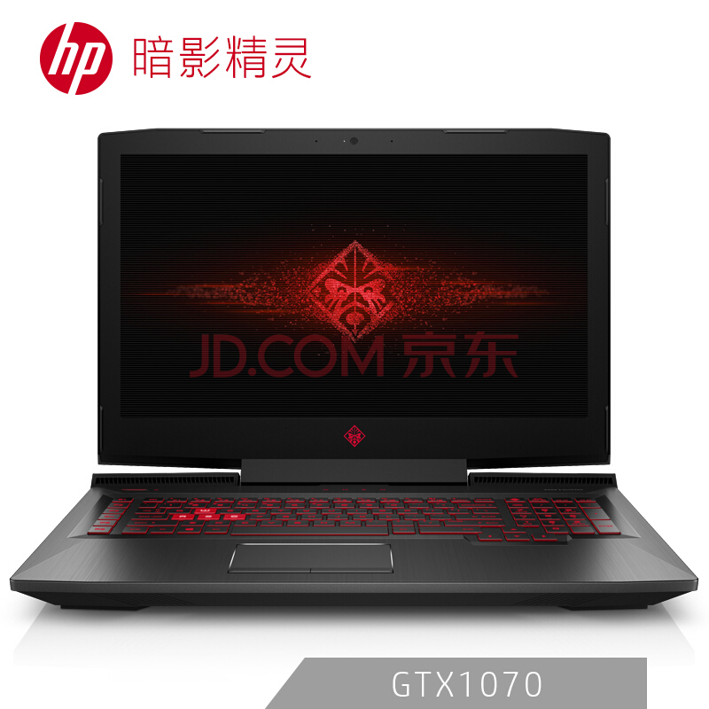
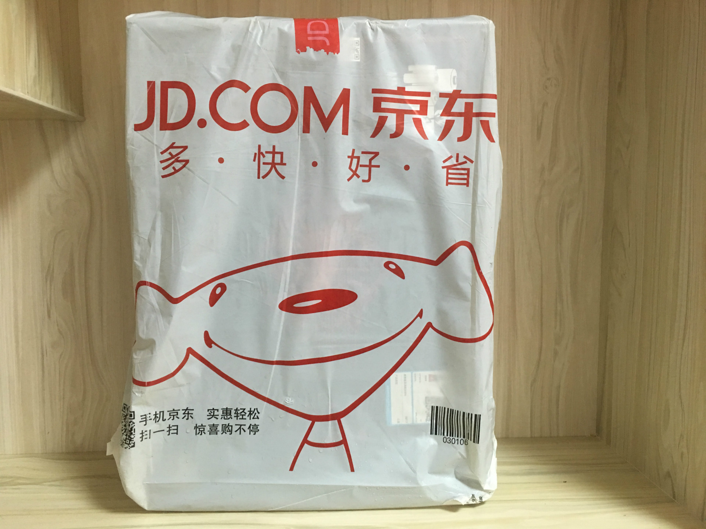
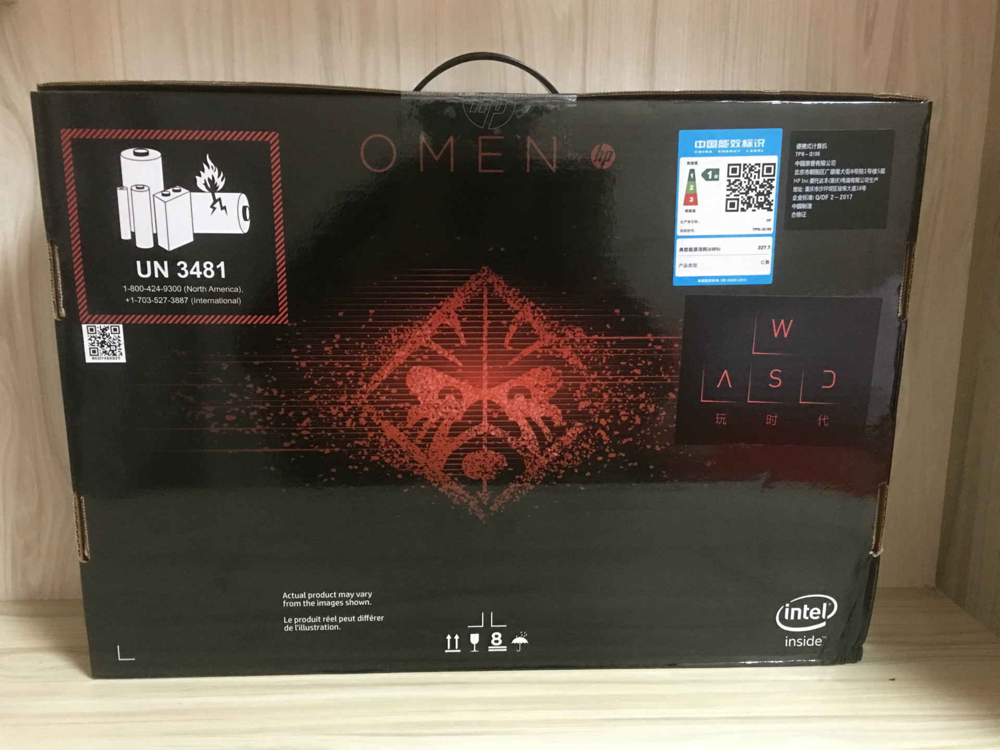
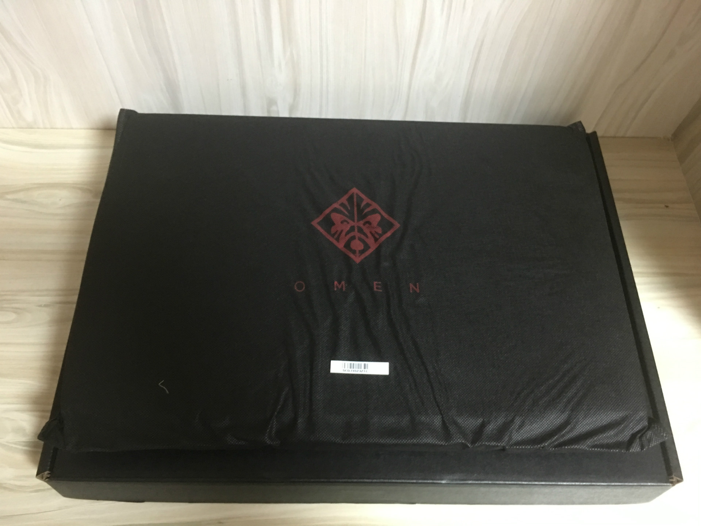
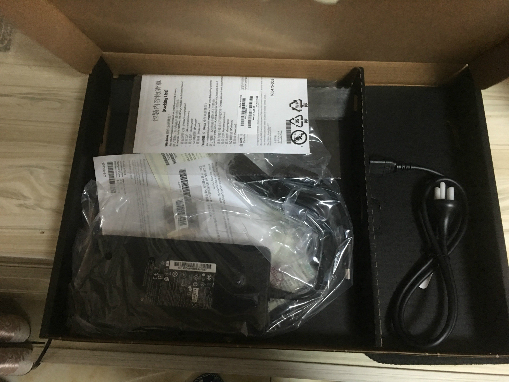
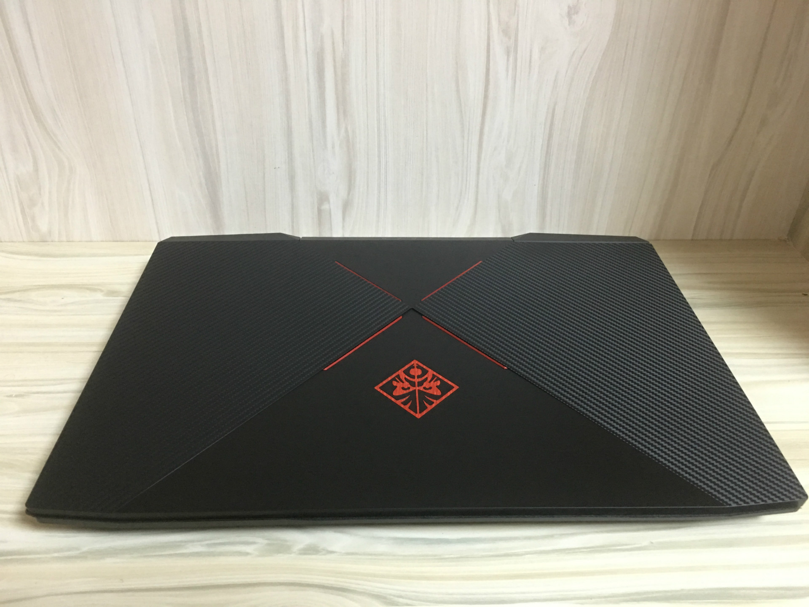
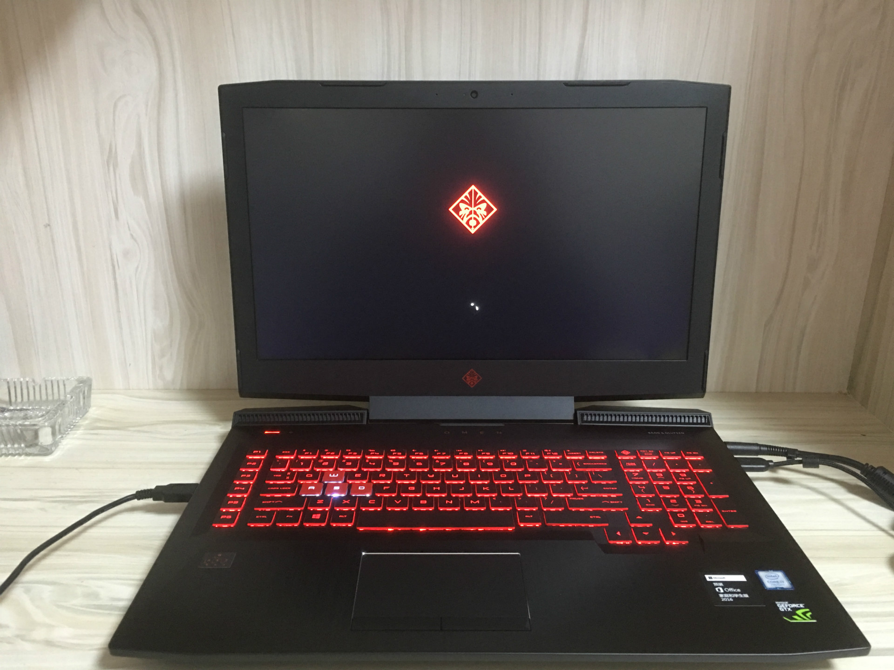

# 惠普 (HP) 游戏本暗影精灵 3 Plus

## 需求

原来沉迷手机吃鸡，买了[飞智黑武士 X8 Pro 手柄](https://clearsky.me/flydigi-x8-pro/ )玩，虽然体验比起用触摸屏玩舒服很多，但是毕竟手机版简化得太厉害了，没 PC 上玩得过瘾，刚好这段晚上有时间了，还是在电脑上玩吧，但是我原来的电脑是 4 年前买的联想 Y480。加装过内存和 SSD，日常浏览网页和看点电视剧我是真心觉得还可以再战一年，但吃鸡肯定是不行了，想想这些年虽然电脑使用频率降低了，但是有时候硬需求还是在的（估计还是想玩游戏...），还是买一台游戏本吧，性能高一点，体验好一点。台式机我不考虑，因为每个月我都一段时间不在家里住的，台式机扛不动 ~

## 品牌挑选

这个最纠结了，特别对我这种有选择困难症的人，我看了几个，简单说下个人观点 (勿喷）：

### 戴尔外星人 (Alienware)

优点：外观霸气，颜值和杀马特灯光碾压众多竞品，散热不错，售后小完美，缺点：配置方面有点卖情怀了，对比同价格牌子性价比低。

### 华硕败家之眼 (ROG)

优点：几乎没缺点。缺点：贵。

### 神船 (Hasee)

优点：蓝天系加持，性价比超高。缺点:傻大黑粗，做工凑合。

### 微星 (MSI)MSI

优点：外观配置售后都还不错。缺点：塞这么多铜管上去散热还是搓。

### 未来人类 (TerransForce)

优点：蓝天系加持，性价比超高。缺点：坏了你要自己修。

### 联想 (Lenovo)

号称美帝良心，如果海淘的话会好一点，主要扫了一眼它配置不适合我，也没多看。

### 机械革命 (Mechrevo)

优点：性价比不错，但毕竟不是一线厂商，细想一下还是算了。

### 惠普 (HP)

优点：一线牌子，外观，配置，售后都还行，缺点：“铁板熊掌普”称号不是白来的。

纠结了半天，选得烦了最后终于选了惠普游戏本 (omen) 暗影精灵系列，我第一次看到这个红黑配色和巫毒 LOGO 就我把它的散热忘了，其中我买的这款暗影精灵 3 号称 2017 下半年最佳理财数码产品，原因可以看[这里](https://www.zhihu.com/question/63693782)，买晚了买晚了~

## 购买

京东上看了一下，本来想买 15 寸的，携带方便一点，后来想想游戏本轻也轻不到哪里去，我也不是需要频繁搬动的，上 17 寸吧，到时候买个大点的电脑包就可以了。

最终买的是这货：

 
和我需求符合，17 寸大屏虽然是不 144 Hz的，毕竟又不是专门买来玩 FPS 游戏的，GTX 1070 虽然是移动框架，但估计也比GTX 1060 强点吧。

配置单：

| 主要参数 |    值     |
| :--- | :------: |
| 电脑型号 |  OMEN by HP Laptop 17-an0xx笔记本 |
| 处理器	 |    Intel(R) Core(TM) i7-7700HQ CPU @ 2.80GHz   |
| 内存容量 |   16.0GB   |
| 显卡| NVIDIA GeForce GTX 1070 |
| 显存容量 |  独立8GB  |
| 显存类型 |  GDDR5  |
| 硬盘容量 |   固态硬盘 / KXG50ZNV256G TOSHIBA (256GB) + 机械硬盘 HGST HTS721010A9E630 (1.0TB) 7200 转/分钟   |
| 主板 |  8393 (40.21)  |
| 网卡 |   1、Realtek Gaming GBE Family Controller 2、Realtek RTL8822BE 802.11ac PCIe Adapter   |
| 声卡 |  1、USB Audio Class 1.0 and 2.0 Device Driver 2、Realtek High Definition Audio 3、NVIDIA Virtual Audio Device (Wave Extensible) (WDM)  |
| 显示器|  17.3 英寸 AUO:9d14  分辨率:1920x1080  G-sync 120Hz FHD |
| 预装操作系统 |  Windows 10 家庭版  64位   |

领了优惠券后 ¥10999 到手。

## 到货简单拆箱:

过了 2 天，收到京东包裹：

拆开包装：

包装盒子和配件，砖头一样的电源：

机身： 巫毒 LOGO 我很喜欢，有中国京剧脸谱的味道。

开机~

懒了，不想写了。。具体跑分什么的肯定不搞了，意义不大，只能说用着挺爽，吃鸡全特效偶尔掉帧，高画质流畅丝滑。

散热绝对是铁板熊掌，玩了一小时后就飙到 80 度，看来还要加个带风扇的底座。

然而，**吃鸡是不可能吃鸡的，这辈子都不可能吃鸡的。**

---

> 作者: [u0defined](http://clearsky.me/)  
> URL: https://clearsky.me/new-omen-iii/  

