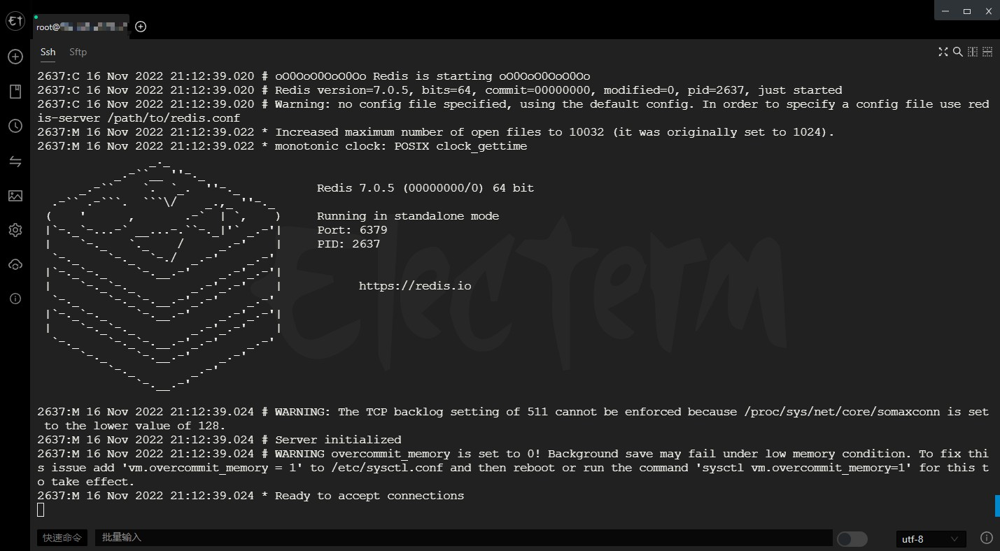
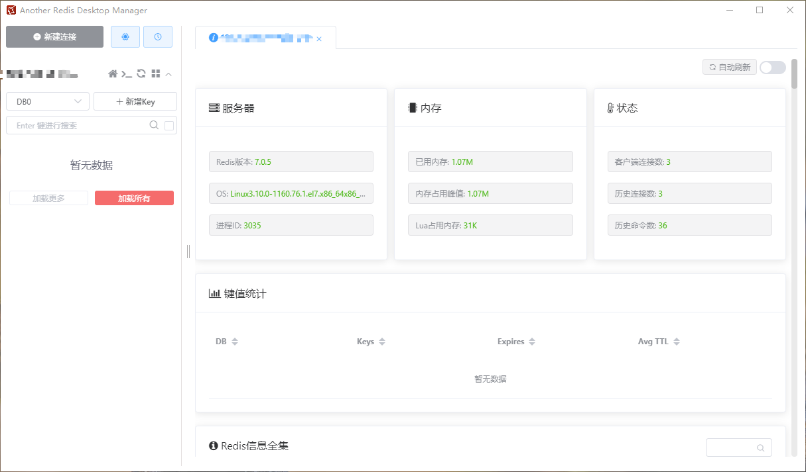

# 简单记录 Redis 安装


### Redis 简介



REmote DIctionary Server(Redis) 是一个由 Salvatore Sanfilippo 写的 key-value 存储系统，是跨平台的非关系型数据库。

Redis 是一个开源的使用 ANSI C 语言编写、遵守 BSD 协议、支持网络、可基于内存、分布式、可选持久性的键值对(Key-Value)存储数据库，并提供多种语言的 API。

Redis 通常被称为数据结构服务器，因为值（value）可以是字符串(String)、哈希(Hash)、列表(list)、集合(sets)和有序集合(sorted sets)等类型。




性能极高 – Redis 能读的速度是 110000 次/s,写的速度是 81000 次/s 。

丰富的数据类型 – Redis 支持二进制案例的 Strings, Lists, Hashes, Sets 及 Ordered Sets 数据类型操作。

原子 – Redis 的所有操作都是原子性的，意思就是要么成功执行要么失败完全不执行。单个操作是原子性的。多个操作也支持事务，即原子性，通过 MULTI 和 EXEC 指令包起来。

丰富的特性 – Redis 还支持 publish/subscribe, 通知, key 过期等等特性。



### Redis 相关资源

Redis 官网： https://redis.io/

源码地址： https://redis.io/

**Redis 官方不建议在 windows 下使用 Redis**，所以官网没有 windows 版本可以下载。虽然有微软维护的版本使用，但这里我是在 CentOS 7 下安装的。

### Redis 安装

Redis 基于 C ,先安装所需要的 gcc 依赖，`root `登录 CentOS，安装依赖:

```bash
yum install -y gcc tcl
```

发文时候官网最新 7.0.5 版本，--> [Download 7.0.5](https://github.com/redis/redis/archive/7.0.5.tar.gz) ，下载后上传放至 CentOS `/usr/local/src` 目录，解压：

```bash
tar -zxvf redis-7.0.5.tar.gz
```

进入`redis-7.0.5`目录：

```bash
cd redis-7.0.5
```

编译：

```bash
make && make install
```

完成安装，默认的安装路径是在`/usr/local/bin`目录下，运行：

```bash
redis-server
```



### Redis 配置

当前目录：`redis-7.0.5` 下，配置文件为 `redis.conf`。

```bash
vi redis.conf
```

修改这些：



#允许访问的地址，默认是 127.0.0.1，会导致只能在本地访问。修改为 0.0.0.0 则可以在任意 IP 访问，为了方便设置为 0.0.0.0，正式环境请勿这样使用。

bind 0.0.0.0

#去掉保护模式

protected-mode no

#守护进程，修改为 yes 后即可后台运行

daemonize yes

#设置访问 Redis 密码 pass

requirepass pass



修改后 `:wq` 保存。

### Redis 自启动

```bash
vi /etc/systemd/system/redis.service
```

写入内容如下，注意路径。

```bash
[Unit]
Description=redis-server
After=network.target

[Service]
Type=forking
ExecStart=/usr/local/bin/redis-server /usr/local/src/redis-7.0.5/redis.conf
PrivateTmp=true

[Install]
WantedBy=multi-user.target
```

重载系统服务：

```bash
systemctl daemon-reload
```

CentOS 修改防火墙设置，通过 `6379` 端口：

```bash
firewall-cmd --zone=public --permanent --add-port=6379/tcp
```

设置开机启动：

```bash
systemctl enable redis
```

可以用下面命令来操作 redis ：

```bash
systemctl start redis           # 启动
```

```bash
systemctl stop redis            # 停止
```

```bash
systemctl restart redis         # 重启
```

```bash
systemctl status redis          # 查看状态
```

### Redis 可视化客户端

一般用的是 Redis Desktop Manager，但是好像要自己编译。

这里换了一个 Another-Redis-Desktop-Manager，也挺好用的。

下载地址: [Another-Redis-Desktop-Manager](https://github.com/qishibo/AnotherRedisDesktopManager/releases/)

截个图 ：




---

> 作者: [u0defined](http://clearsky.me/)  
> URL: https://clearsky.me/redis-install/  

