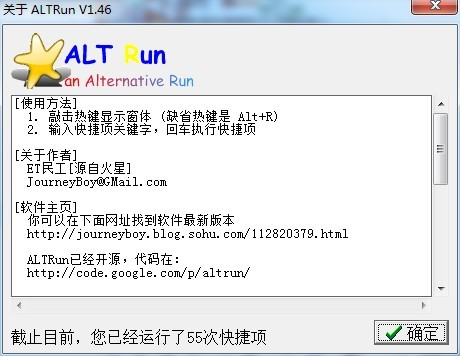
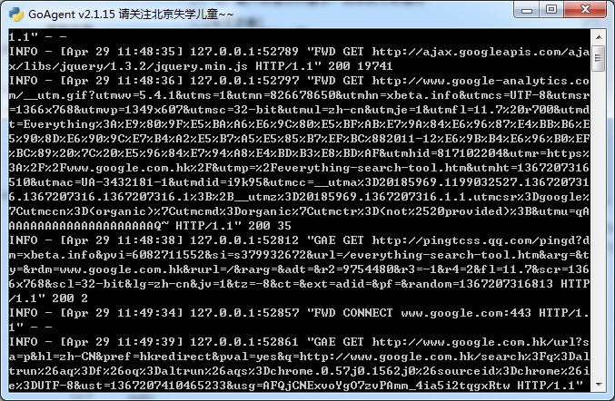
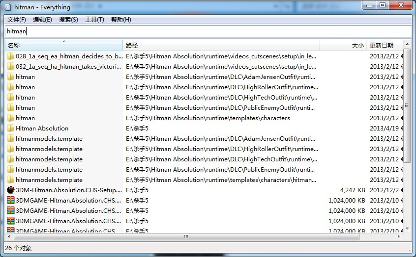
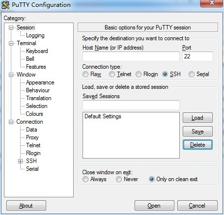
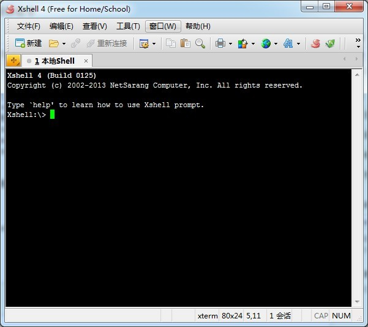
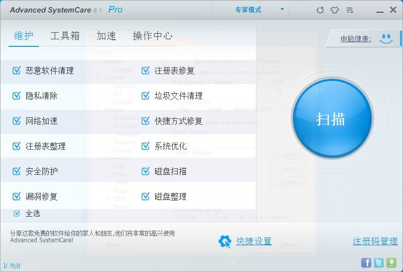

# 重装系统+常用软件清单


win7误操作造成系统文件丢失，没备份，懒得折腾了，干脆重装了。

没系统盘，箱子翻出一个u盘做了个u盘启动安装的，一开始在y480bios里还找不到第一启动设置，后来搜了下才知道开机按f12就直接选usb启动，不太喜欢这样的设定。

安装过程都是老套路一路下来。安装完成打补丁的等待过程过程就安装常用软件，记录一下吧，想到什么就写一下：

## altRun

**官方地址：**：[https://code.google.com/p/altrun/](https://code.google.com/p/altrun/ "altrun官方下载")

**使用教程可以去这里看：**[http://xbeta.info/altrun.htm](http://xbeta.info/altrun.htm "神逸之作：国产快速启动软件神品ALTRun（征求新版功能意见中）")（初阶使用就看前面几小节就可以了。）




开始不习惯，现在已经离不开了，以至于我在办公室的电脑上经常习惯按键盘上的alt+R。电脑里包括下面说的所有软件都是用它启动的。用惯了你就不喜欢鼠标双击图标运行了。几百k的软件大小，速度飞快。这里的截图里软件配置被我误删了，要不3个月以来肯定不止才用了55次快捷键。

这款快速启动软件作者好几年没更新了，虽然开源但是没人跟进，我使用这段时间偶尔会崩溃导致配置丢失，小众软件看见个批处理备份配置，记一下：

altrun软件目录新建`bak`文件夹~

新建个批处理`altrunbak.bat`，放在软件目录，添加到altrun运行就行。

 批处理如下：

**适用win7:**

```bash
@echo off
set a=%date:~0,4%date:~5,2%date:~8,2%
set b=%TIME:~0,2%TIME:~3,2%TIME:~6,2%
copy ShortCutList.txt .\bak\%a%_%b%.txt
echo 已经备份为文件%a%_%b%.txt
pause
```

**适用xp：**

```bash
@echo off
set a=%date%
set a=%a:-=%
set a=%a:~,8%
set b=%time%
set b=%b::=%
set b=%b:~,-5%
copy ShortCutList.txt .\bak\%a%_%b%.txt
echo 已经备份为文件%a%_%b%.txt
pause
```

## Goagent

**官方地址：**：[https://code.google.com/p/goagent/](https://code.google.com/p/goagent/ "goagent官方")

**使用教程：**和谐社会，善用搜索~

> 穿越神器，使用效果自行搜索。不多说，与下面的chrome扩展搭配使用效果好。



## Everything

**官方地址：**[http://www.voidtools.com/download.php](http://www.voidtools.com/download.php "Everything官方")

**使用教程也可以看善用佳软的文章：**[http://xbeta.info/everything-search-tool.htm](http://xbeta.info/everything-search-tool.htm "Everything使用教程")



Everything是voidtools（中文主页）开发的一款文件搜索工具，官网描述为“基于名称实时定位文件和目录（Locate files and folders by name instantly）”。它体积小巧，界面简洁易用，快速建立索引，快速搜索，同时占用极低的系统资源，实时跟踪文件变化，并且还可以通过http或ftp形式分享搜索。

## Putty

**官方地址：**[http://www.chiark.greenend.org.uk/~sgtatham/putty/download.html](http://www.chiark.greenend.org.uk/~sgtatham/putty/download.html "putty官方")



现在常用的管理vps的工具，软件免费，小巧，绿色，下载就能直接运行使用，操作简单。导入导出配置略繁琐，记录下：1.`开始`--`运行`-- 输入:`regedit `打开注册表。2\. 选择`HKEY_CURRENT_USER `>`Software`>`SimonTatham `3.右击`SimonTatham`，在弹出菜单中选择`导出`，保存成`puttyConf.reg`即完成。4.还原Putty设置:直接双击`puttyConf.reg`导入注册表。

## Xshell

> 同putty同类型，但是功能更加强大，标签式管理多台vps挺方便的。它的`Free For Home/Shcool`版本够用了

**官方地址：**[http://www.netsarang.com/download/down_xsh.html](http://www.netsarang.com/download/down_xsh.html "xshell官方")

**一些使用技巧~来自：**[挨个搞 [xshell十大技巧]](http://actgod.com/archives/86/ "xshell十大技巧")



## Chrome

主浏览器，偶尔会切换firefox用用，4个必备插件：

[Adblock Plus](https://chrome.google.com/webstore/detail/adblock-plus/cfhdojbkjhnklbpkdaibdccddilifddb "Adblock Plus ") 广告过滤

[Xmarks](https://chrome.google.com/webstore/detail/xmarks-bookmark-sync/ajpgkpeckebdhofmmjfgcjjiiejpodla "Xmarks")标签同步

[Lastpass](https://chrome.google.com/webstore/detail/lastpass/hdokiejnpimakedhajhdlcegeplioahd "Lastpass")密码管理

[SwitchySharp](https://chrome.google.com/webstore/detail/proxy-switchysharp/dpplabbmogkhghncfbfdeeokoefdjegm "SwitchySharp")代理切换，我是和上面说的goagent一起使用。

除了必备的，推荐个一个扩展

[Fatkun图片批量下载](https://chrome.google.com/webstore/detail/fatkun-batch-download-ima/nnjjahlikiabnchcpehcpkdeckfgnohf "Fatkun图片批量下载")，用这个批量下图谁用谁知道。

## Advanced SystemCare

**下载地址：**[点这里（度娘盘）](http://pan.baidu.com/share/link?shareid=273054&amp;uk=2603305005 "Advanced SystemCare Pro v6.1.9.220 官方中文注册版(SN) TTRAR.Com.rar")

> 这个是系统优化和清理的，比起360、X管家之类的我更喜欢用这个，虽然这类软件功能大同小异。压缩包里面有软件升级激活去广告的说明。



## 其它

截图太累，大致说说：

杀毒软件：我一直用微软自己MSE，以前小内存觉得它卡，现在无压力。

[Sublime text 2](http://www.sublimetext.com/2 "sublimetext下载页面") 性感的编辑器

下载歌曲酷狗，网上随便找的去广告版，听歌就用[Airplay](http://airplay3.com/ "airplay官方")

ftp工具是FileZilla，有时候又混着用flashfxp，这个比较随意。

极少聊天，聊天工具一般是企鹅（主要和朋友玩游戏时候语音），输入法一直是企鹅拼音纯净版。

下载工具迅雷+企鹅旋风。没离线下载真心下得慢。。。

大致就这些了，边写边下电影，差不多也下好了，看电影去，随带说下，现在播放器一般用的是射手影音，现在懒得去配置稀奇古怪的软件了，能用就行。


---

> 作者: Anonymous  
> URL: https://clearsky.me/reinstall-and-lists-of-software/  

