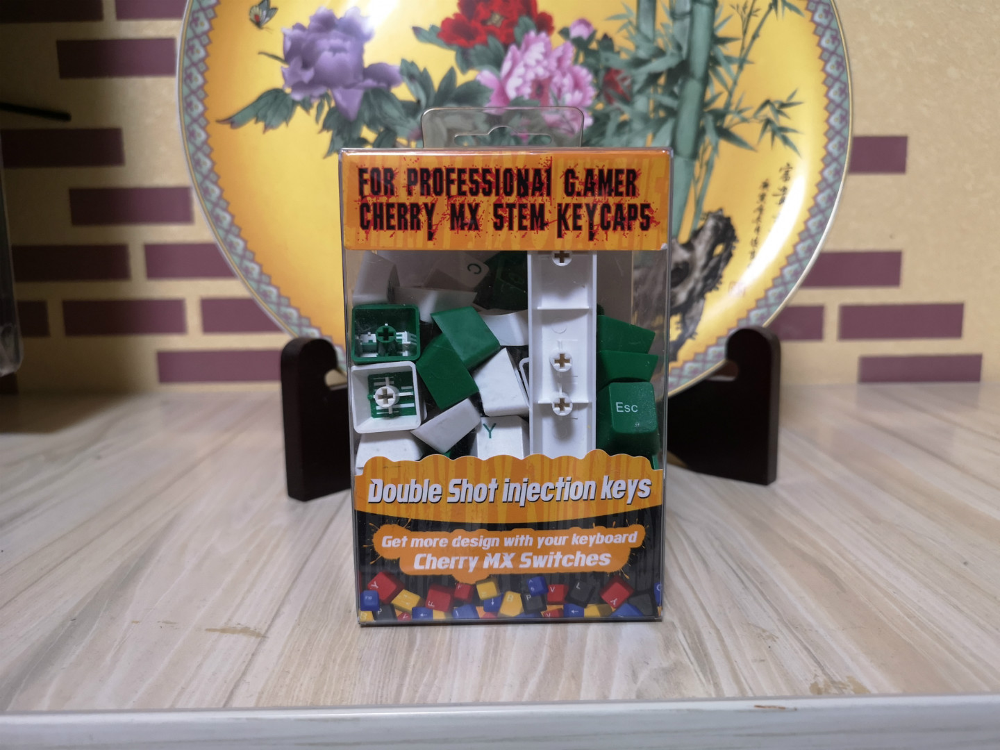
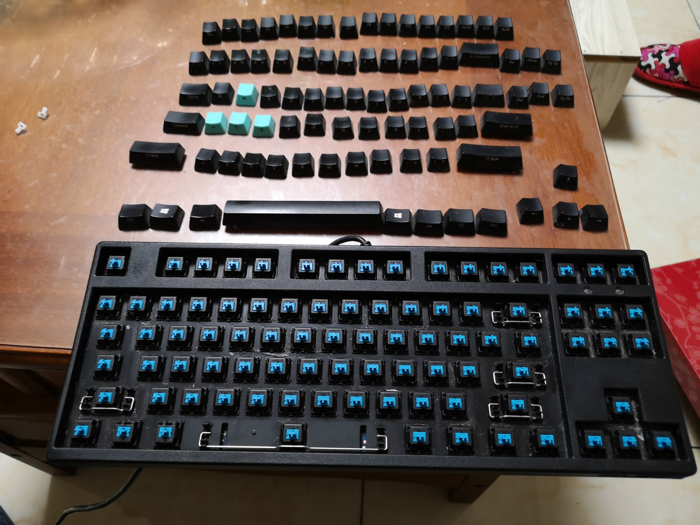
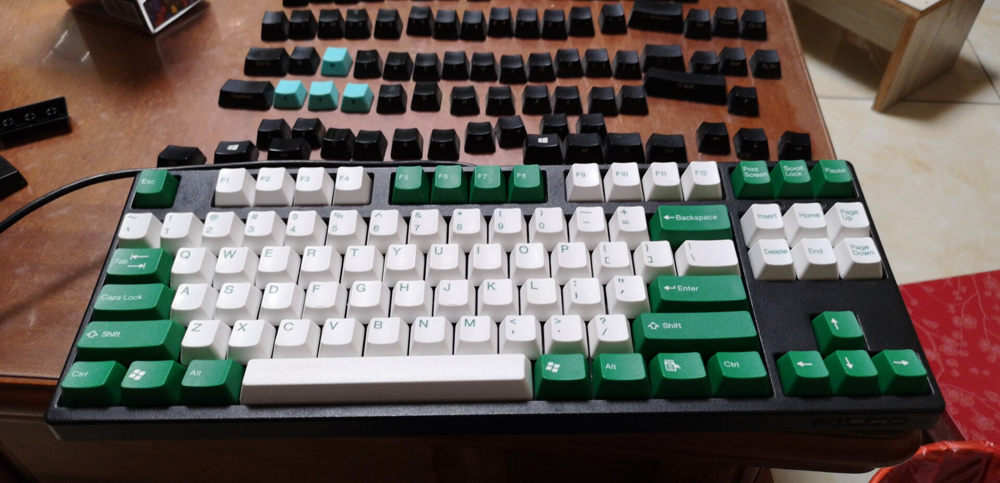
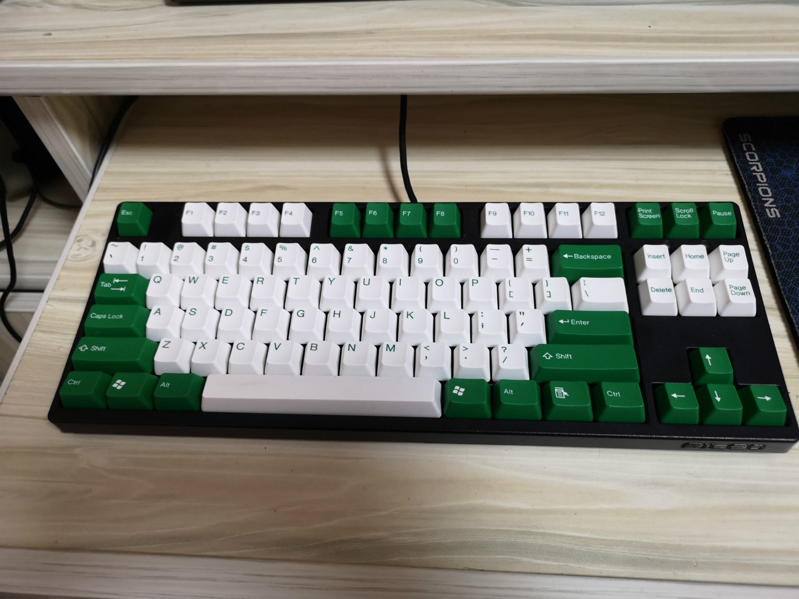
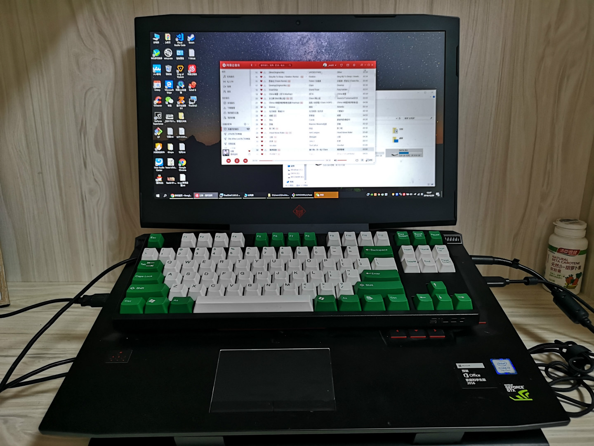

# 淘了一套太豪 PBT 奶酪绿键帽

## 起因

3 年前，买了一把 [Filco 忍者 87 二代侧刻青轴](https://clearsky.me/fkbn87mc-efb2.html) 键盘，这些年用下来打字真心舒服。发这篇文章的时候看了一下这把键盘的近期价格，好像都没怎么降价，甚至有点小涨，有点惊讶。不过原装键帽是 ABS 材质，长期使用打油是避免不了的。于是想着换一套 PBT 的。

## 关于键帽的材质

一般常用的有3种： ABS / PBT / POM


- ABS:丙烯腈(A)、丁二烯(B)、苯乙烯(S)三种单体的三元共聚物，比较常见的工程塑料。长期使用后磨损后表面会变得光滑，就是俗称的打油现场。
- PBT：聚对苯二甲酸丁二醇酯，质地较为坚硬，耐磨损，相对 ABS 表面有颗粒感，类磨砂的感觉但又不是，说不太清楚。
- POM：聚甲醛，质地也较为坚硬及耐磨，但是表面较为光滑，但是又不像 ABS 键帽打油了之后那种油腻的光滑。还是说不太清楚。


一般来说使用 POM 材质的键帽比较少，忽略掉。

ABS 为常用工程塑料，成本较 PBT 低，一般会便宜一点。但是也不是说 PBT 的一定好，原因我也说不清楚，说了半天都说不清楚不是我的问题，而是材质影响最大的手感，众所周知，而对机键盘来说：**手感是一门玄学！**

我个人喜好硬一点不油腻的带一点清脆的感觉，所以选择了 PBT。

##  平民的选择--太豪

我连入门都不算，各路高级货肯定不看了，就是换套键帽让自己打字舒服一点，再选个配色让自己心情好一点。

于是搜到了 [台灣太豪企業股份有限公司](http://www.tai-hao.com/tw/catalog/) 产的键帽，网上风评还不错，官网访问速度实在是太慢，于是转马爸爸家，看了一会，看了一会，PBT 价格都在 120-200之间，价格区间太大是因为键盘布局，61 键，87 键，104键和 108 键，而我的键盘是 87 键的，看了想要的几个配色，87 键的没货，买 104 键的来装剩下几个键帽又没什么用，于是转到某二手鱼搜了一下，刚好有一家和我的键盘是一模一样的，宝强绿（奶酪绿）配色我还很喜欢，相对素雅一点，卖家还是老乡，聊了一会，他就只拆了包装装上用了一小段时间，80 包邮，觉得还可以吧，于是买了。

## 太豪奶酪绿 87 键帽

今天下班拿到包裹，打开：

先把我原来的键盘键帽拆下来，顺便清洗一下，实在是有点脏，而且以前抽烟烫坏一个，所以 WSAD 那 4 个蓝色很突兀。

换上宝强绿（奶酪绿）舒服多了。

和3年前刚买键盘的时候做个对比：

---

> 作者: Anonymous  
> URL: https://clearsky.me/taihao-keycaps/  

