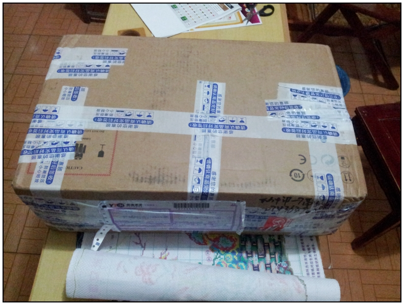
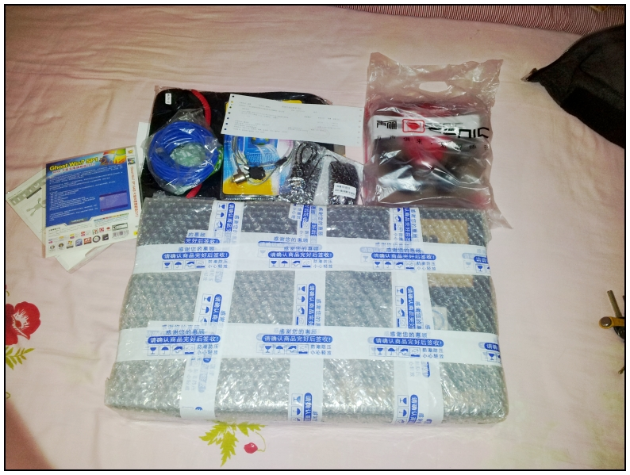
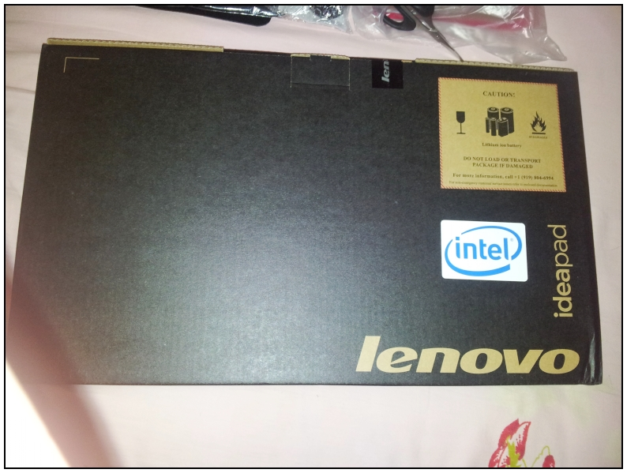
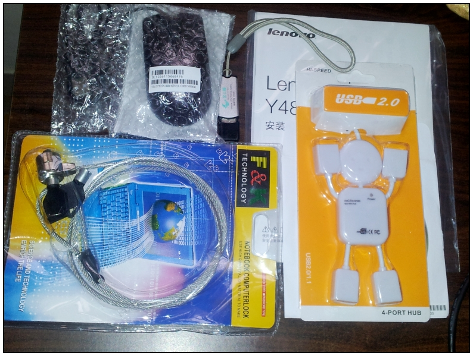
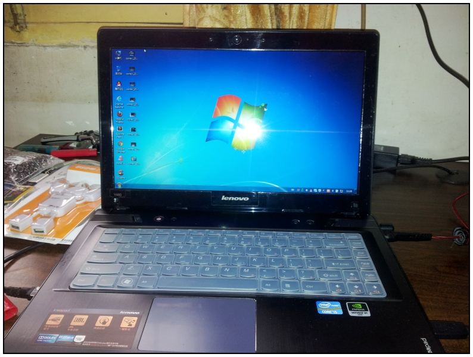
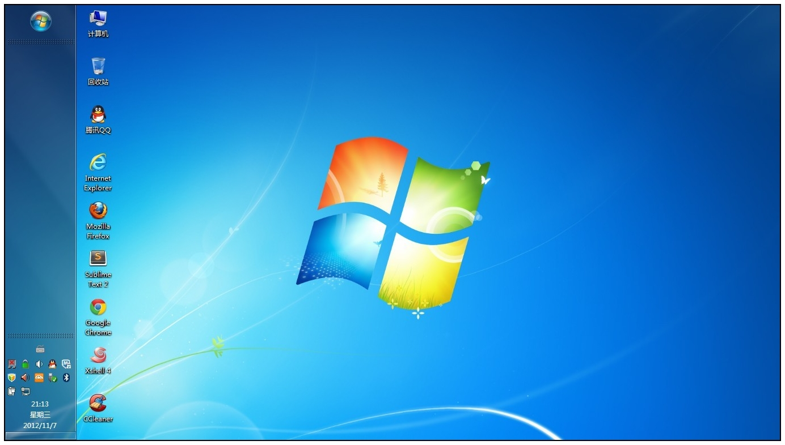

# Y480

前几天下单买的，今天到了，买这个的时候也没怎么挑，zol上直接点性价比最高的就买了。

个人觉得买这种东西，挑来挑去也没意思，除非你消费价位区间比较大。

所以直接买了个y480，配置还行，i53210，显卡GT650M，升级到8G内存，ssd太贵了没钱买。

人品不错，随机发货拿到了个LG完美屏。只是有点泛白，还得自己调颜色增强。

硬盘不给力，转速5400，要是7200就好了，还有联想不舍得用高分屏啊，不过这个价位也别想太多了。

**电脑概览**


CPU  (英特尔)Intel(R) Core(TM) i5-3210M CPU @ 2.50GHz(2501 MHz)

主板  联想 Product Name

内存  8.00 GB (   800 MHz)

主硬盘  1000 GB (希捷 ST1000LM024 HN-M101MBB ATA Device 已使用时间: 4小时)

显卡  NVIDIA GeForce GT 650M  

显示器  LG LG Display 32位真彩色 60Hz

声卡  Realtek ALC269 High Definition Audio (82801G)

网卡  Atheros AR8161/8165 PCI-E Gigabit Ethernet Controller


**留几个图，物流公司今天忘记送我的包裹了，自己去拿的：**

**拆开的所有配件：**

**主机包装：**

**其它配件：**

**真身：**

**桌面就几个常用软件，截图**

---

> 作者: [pagezen](http://clearsky.me/)  
> URL: https://clearsky.me/y480/  

